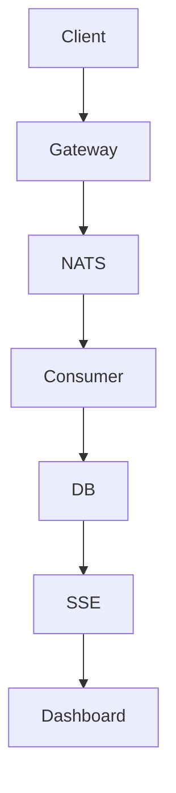

# Plan — SPEC-XXX: <Título>

## Meta

- **SPEC-ID**: SPEC-XXX
- **Spec**: `docs/specs/SPEC-XXX-<slug>/spec.md` (approved)
- **Autor**: <nombre>
- **Fecha**: YYYY-MM-DD
- **Estado**: draft | approved | implemented

## 1. Summary

Resume la estrategia técnica en 3-5 líneas: qué se construye, en qué componentes, con qué riesgos principales.

## 2. Specification Traceability

| Spec ID | Requirement / Use Case | Technical Change | Tests |
|---------|------------------------|------------------|-------|
| FR-001 (UC-001) | <requisito> | <componente/cambio> | TEST-001 (TS-001) |
| BR-001 (UC-001) | <regla> | <implementación> | TEST-002 (TS-002) |
| AC-001 (FR-001) | <criterio> | <validación> | TEST-001 |

> Ningún FR/BR/AC/TS debe quedar sin fila. Si hay gaps, marcar `SPEC GAP`.

## 3. Technical Context

Describe arquitectura existente relevante:

- Servicios y componentes actuales
- APIs, bases de datos (TimescaleDB hypertables), messaging (NATS JetStream)
- Dependencias, observability, infra (Docker Compose, Terraform)
- Restricciones heredadas de `docs/adr/*` y skills de dominio

Referencia explícita a ADRs y constraints de `nats-jetstream`, `timescaledb`, `genkit-agent`, etc.

## 4. Architecture Changes

Explica componentes nuevos/modificados/eliminados, nuevas dependencias/interacciones.



Incluye decisiones de particionado, scale-out, y justificación.

## 5. Detailed Technical Design

Para cada cambio relevante detalla:

- **Componente responsable**: <servicio/paquete>
- **Interfaces**: <ports definidos donde se consumen>
- **Responsabilidades**: <qué hace / qué no hace>
- **Flujo de datos**: <origen -> transformación -> destino>
- **Persistencia**: <tablas, hypertables, índices>
- **Transacciones / Concurrencia / Idempotencia**: <Nats-Msg-Id + ON CONFLICT, CopyFrom batch>
- **Retries / Timeouts / Circuit Breakers**: <gobreaker, AckWait, MaxDeliver>
- **Eventos**: <subjects, schemas, ordering>
- **Dependencias**: <qué necesita>

Identifica archivos concretos: `backend/internal/...`, `web/src/...`, `mobile/...`.

## 6. API Changes

| Endpoint | Método | Cambio | Compatibilidad | Validaciones |
|----------|--------|--------|----------------|--------------|
| `POST /api/telemetry` | POST | nuevo | backward compatible | <reglas> |

Handlers/controllers, request/response, errores, tests de contrato (OpenAPI).

## 7. Data Changes

Cuando aplique:

- Tablas/columnas/índices/particiones/hypertables
- Migraciones (`/docker-entrypoint-initdb.d` idempotente)
- Schemas, compresión, retention, continuous aggregates
- Backward compatibility

```sql
-- ejemplo
SELECT create_hypertable('telemetry','occurred_at', chunk_time_interval => INTERVAL '1 day');
```

## 8. Event / Messaging Changes

Cuando aplique:

- Producers/consumers, topics/queues (`telemetry.>`)
- Event schemas, serialization, ordering por `device_id`
- Delivery semantics (at-least-once), retries, dead-letter, idempotency

## 9. Observability

Logs, metrics, traces, alerts, dashboards, correlation IDs (`device_id`, `event_id`, `request_id`).

## 10. Security

Authentication, authorization, secrets (env vars), sensitive data (GPS/PII), input validation, hardening IaC/móvil.

## 11. Test Strategy

Convierte `TS-XXX` en tests técnicos. Clasifica: unit, integration, contract, component, e2e, performance, concurrency.

| Test ID | TS Relacionado | Nivel | Componente | Setup | Input | Expected | Mocks | Ubicación |
|---------|----------------|-------|------------|-------|-------|----------|-------|-----------|
| TEST-001 | TS-001 | integration | consumer | DB + NATS | <payload> | <assert> | <mocks> | `backend/..._test.go` |

Mantén trazabilidad `TS-001 -> TEST-001`. No inventes tests sin `TS` padre (o marca `SPEC GAP`).

## 12. Implementation Steps

### Step 1 — <name>

**Goal**: Qué se consigue.
**Spec References**: UC-001, FR-001, AC-001, TS-001
**Changes**: `backend/internal/...`, `contracts/...`
**Implementation**: Detalles técnicos.
**Tests**: TEST-001, TEST-002
**Dependencies**: Ninguna / Step N
**Validation**: Cómo comprobar (comando, query, curl).

### Step 2 — <name>

**Goal**: ...
**Spec References**: ...
**Changes**: ...
**Implementation**: ...
**Tests**: ...
**Dependencies**: Step 1
**Validation**: ...

> Pasos pequeños para PRs independientes. Ordenados por dependencias: dominio -> application -> adapters -> infra.

## 13. Rollout Strategy

Feature flags, migration strategy, deployment order, gradual rollout, monitoring, rollback plan. Omitir si no aplica y justificar.

## 14. Risks and Mitigations

| Riesgo | Probabilidad | Impacto | Mitigación |
|--------|--------------|---------|------------|
| <riesgo> | alta/media/baja | alto/medio/bajo | <acción> |

## 15. Technical Decisions and Trade-offs

Para cada decisión importante:

- **Problema**: <qué se decide>
- **Alternativas**: <opciones consideradas>
- **Decisión**: <elegida>
- **Razón**: <por qué, con números si es scalability>
- **Trade-offs**: <qué se sacrifica>

Link a ADR si aplica: `docs/adr/000X-...md`.

## 16. Definition of Done

- [ ] Todos los FR/BR relevantes implementados
- [ ] Todos los AC cubiertos con tests verdes que los citan
- [ ] Todos los TS tienen cobertura técnica o justificación
- [ ] `go vet` / lint / `docker compose config` en verde
- [ ] `reviewer` sin hallazgos altos; `db-auditor`/`quality-auditor`/`security`/`scalability` si aplican
- [ ] Observability implementada cuando corresponde
- [ ] Backward compatibility verificada
- [ ] Docs y `contracts/` actualizados
- [ ] Rollout/rollback definido cuando aplica
- [ ] Sin `SPEC GAP` abiertos

---

## SPEC GAPs (si los hay)

> SPEC GAP: <descripción de comportamiento necesario no definido en spec> — decisión requerida.

## Consistency Checks (pre-entrega)

- [ ] Cada UC tiene implementación definida
- [ ] Cada FR tiene cambios técnicos
- [ ] Cada BR relevante tiene implementación
- [ ] Cada AC tiene cobertura via tests
- [ ] Cada TS tiene test técnico o justificación
- [ ] No hay tests que agreguen requisitos nuevos sin SPEC GAP
- [ ] Dependencias entre Steps ordenadas
- [ ] Cambios compatibles con arquitectura existente
- [ ] Decisiones justificadas
- [ ] SPEC GAPs identificados
