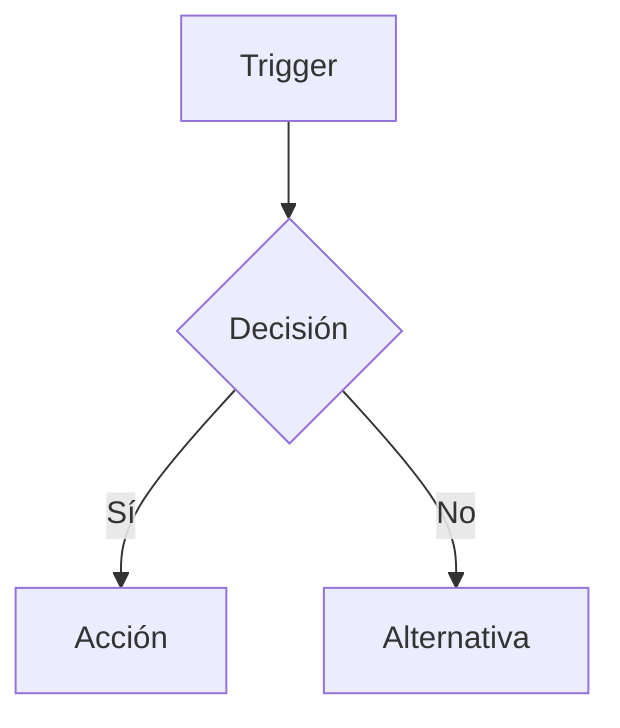
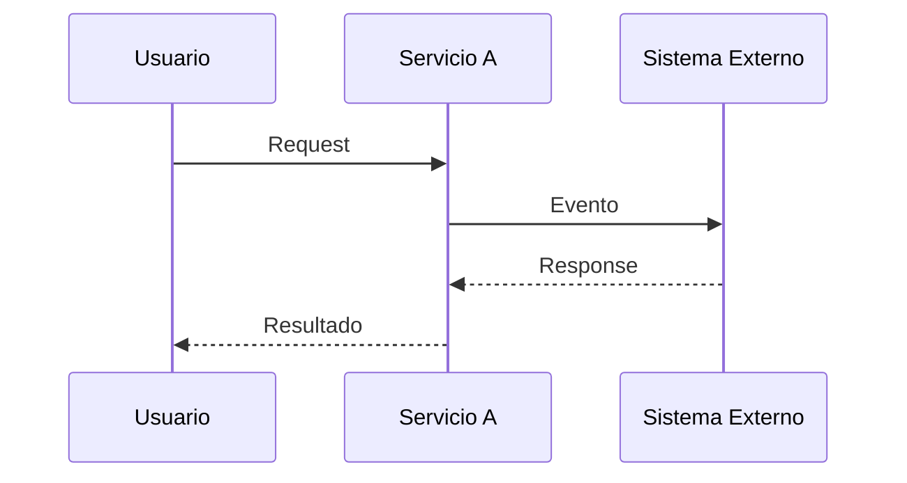
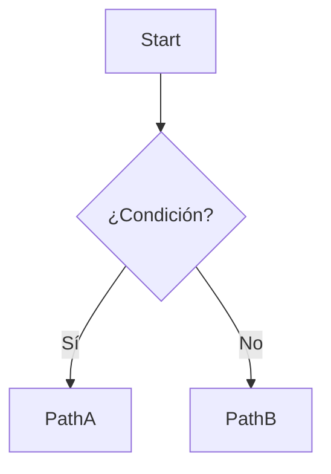

# SPEC-XXX: <Título>

## Meta

- **SPEC-ID**: SPEC-XXX
- **Título**: <Título corto>
- **Estado**: draft | approved | implemented
- **Backlog**: <tarea/épica relacionada>
- **Autor**: <nombre>
- **Fecha**: YYYY-MM-DD

## 1. Overview

Describe problema, contexto, objetivo y motivación del cambio. 3-6 líneas enfocadas en valor de negocio.

## 2. Scope

### In Scope

- <comportamiento incluido 1>
- <comportamiento incluido 2>

### Out of Scope

- <explícitamente no incluido 1>
- <explícitamente no incluido 2>

## 3. Actors and Systems

| Actor/Sistema | Tipo | Descripción | Dependencia |
|---------------|------|-------------|-------------|
| <Actor> | usuario/servicio/sistema externo | <rol> | <relevancia> |

## 4. Use Cases

### UC-001 — <Nombre>
- **Actor**: <quién>
- **Objetivo**: <qué quiere lograr>
- **Preconditions**: <estado necesario>
- **Trigger**: <qué inicia el caso>
- **Main Flow**:
  1. <paso 1>
  2. <paso 2>
- **Alternative Flows**:
  - 3a. <alternativa>
- **Error Flows**:
  - 4a. <error y qué debe pasar>
- **Postconditions**: <estado tras éxito>
- **Business Rules**: BR-001, BR-002

## 5. Functional Requirements

| ID | Descripción | UC Relacionado | Prioridad |
|----|-------------|----------------|-----------|
| FR-001 | <requisito específico, observable, verificable> | UC-001 | must |
| FR-002 | <requisito> | UC-001 | should |

## 6. Business Rules

| ID | Descripción | UC/FR Relacionado |
|----|-------------|-------------------|
| BR-001 | <condición o comportamiento de negocio verificable> | UC-001, FR-001 |
| BR-002 | <regla> | FR-002 |

## 7. Main Flows

Describe los flujos principales. Si es complejo, incluye Mermaid:



## 8. Alternative and Error Flows

Documenta QUÉ debe suceder (no cómo):

- Validaciones y datos inválidos
- Errores de negocio y temporales
- Dependencias no disponibles, timeouts
- Duplicados / operaciones repetidas
- Estados inválidos, escenarios límite

## 9. State and Transitions

Si aplica máquina de estados:

| Estado | Evento | Siguiente Estado | Condición |
|--------|--------|------------------|-----------|
| `IDLE` | `start` | `ACTIVE` | <cond> |

Transiciones inválidas: <listar>
Estados finales: <listar>

*Omitir esta sección si no hay estados.*

## 10. API / Interface Contracts

Cuando corresponda, describe desde punto de vista observable:

- **Endpoint**: `POST /api/...`
- **Method**: POST | GET | PUT | DELETE | SSE
- **Request**: schema / ejemplo
- **Response**: schema / ejemplo
- **Códigos HTTP**: 200, 400, 409, 500...
- **Errores**: código + mensaje observable
- **Validaciones**: <reglas>

Referencia a `contracts/http.openapi.yaml` y `contracts/events.asyncapi.yaml` cuando aplique.

## 11. Sequence Diagrams



Solo actores/sistemas/eventos/requests — sin clases/métodos.

## 12. Flow Diagrams



## 13. Non-Functional Requirements

Solo requisitos explícitos o necesarios. No inventes métricas.

| ID | Categoría | Descripción |
|----|-----------|-------------|
| NFR-001 | performance | <requisito si aplica> |
| NFR-002 | security | <requisito si aplica> |

Categorías: performance, availability, reliability, consistency, scalability, security, observability, backward compatibility.

## 14. Acceptance Criteria

Formato `Given/When/Then`, ID `AC-001`, relacionado a UC/FR.

```gherkin
AC-001 (UC-001, FR-001):
  Given <estado inicial>
  When <acción>
  Then <resultado observable y medible>

AC-002 (borde - UC-001, BR-001):
  Given <estado límite>
  When <acción>
  Then <resultado>

AC-003 (fallo - UC-001, FR-002):
  Given <estado>
  When <acción inválida>
  Then <error observable>
```

## 15. Functional Test Scenarios

Derivados de UC y AC. No son tests unitarios todavía.

| ID | UC/FR/AC | Preconditions | Input | Action | Expected Result |
|----|----------|---------------|-------|--------|-----------------|
| TS-001 | UC-001, FR-001, AC-001 | <estado> | <datos> | <acción> | <resultado> |
| TS-002 | UC-001, AC-002 | <estado borde> | <datos inválidos> | <acción> | <error> |

Incluir: happy paths, alternative paths, validation failures, business errors, dependency failures, edge cases, idempotency scenarios, retry scenarios cuando sean parte del comportamiento esperado.

## 16. Open Questions

- [ ] <ambigüedad 1 — bloquea approved>
- [ ] <ambigüedad 2>

## 17. Assumptions

- <suposición 1 — marcada explícitamente como tal>
- <suposición 2>

---

## Trazabilidad

```
UC-001 -> FR-001, BR-001 -> AC-001 -> TS-001
UC-001 -> FR-002          -> AC-002 -> TS-002
```

## Contratos

- HTTP/SSE: `contracts/http.openapi.yaml` (si aplica)
- Eventos NATS: `contracts/events.asyncapi.yaml` (subject, payload, headers, dedup con `Nats-Msg-Id`, reintentos)

## Validación (pre-entrega)

- [ ] Cada UC tiene flujo principal
- [ ] Cada UC contempla errores/alternativas relevantes
- [ ] Cada FR está relacionado a UC cuando corresponde
- [ ] Cada comportamiento importante tiene AC
- [ ] Cada AC tiene al menos un TS
- [ ] No hay TS que introduzcan requisitos inexistentes
- [ ] Diagramas representan comportamiento, no implementación
- [ ] No hay decisiones técnicas prematuras
- [ ] Ambigüedades en Open Questions
