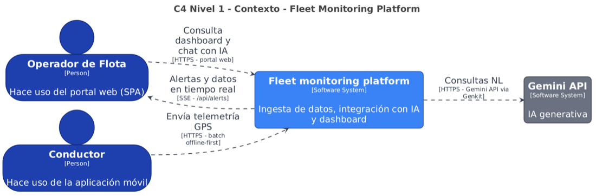
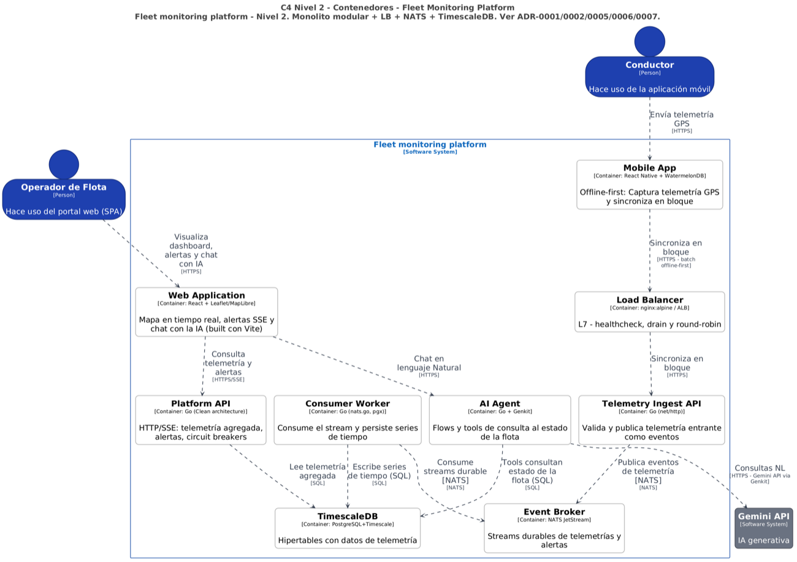

# fleet-monitoring-platform
Event-driven fleet monitoring platform with agentic AI telemetry analysis, reactive web portal, and offline-first mobile app.

## Arquitectura — C4

Fuente de verdad: `docs/c4/workspace.dsl` (Structurizr DSL). Ver detalle en [Nivel 1](docs/c4/01-context.md) y [Nivel 2](docs/c4/02-containers.md).

### Nivel 1 — Contexto



**Personas y sistema:** `Operador de Flota` visualiza el portal web, `Conductor` envía telemetría GPS, `Fleet monitoring platform` orquesta ingesta + IA + dashboard, `Gemini API` resuelve consultas en lenguaje natural (sec. 4.B).

### Nivel 2 — Contenedores



9 contenedores del monolito modular + LB + NATS + TimescaleDB. Ver detalle en [Nivel 2](docs/c4/02-containers.md).

```bash
# validar DSL
docker run --rm -v "$(pwd)/docs/c4:/work" structurizr/structurizr validate -workspace /work/workspace.dsl
# ver interactivo
docker compose --profile docs up structurizr  # http://localhost:8080 -> Contenedores_N2
```

## Requisitos

| Herramienta | Versión | Notas |
|---|---|---|
| Go | 1.25 | `backend/go.mod` — `go vet` / `golangci-lint` |
| Docker | ≥ 24 + Compose v2 | `docker compose config` debe validar |
| colima | recomendado macOS | `colima start --cpu 4 --memory 8 --arch x86_64` (máquina 16 GB, sin emulación amd64) |
| Node | ≥ 20 | solo para `newman` (Postman CLI) y lint de contratos |
| Make / Bash | - | helpers `infra/` |

> Secrets vía `.env` (nunca en git). Ver `.env.example`.

## Quickstart (SPEC-001)

```bash
cp .env.example .env
# editar .env si hace falta (POSTGRES_PASSWORD, GF_SECURITY_ADMIN_PASSWORD, GEMINI_API_KEY)

docker compose up --build --wait
docker compose ps
curl -s http://localhost:8080/healthz | jq
# {"status":"ok","breaker":"closed","jetstream":"connected"}

# smoke ingest -> NATS -> consumer -> TimescaleDB
curl -s -X POST http://localhost:8080/v1/telemetry \
  -H 'Content-Type: application/json' \
  -d '{"plate":"GTP890","speed":42,"lat":4.711,"lon":-74.072,"client_event_id":"'"$(uuidgen | tr '[:upper:]' '[:lower:]')"'","occurred_at":"2026-08-23T12:00:00Z"}' | jq

docker compose logs -f ingest consumer
docker compose down -v  # reset volúmenes pgdata/nats_data
```

Validación infra:

```bash
docker compose config        # válido sin warnings
docker compose --profile observability config  # valida prometheus/grafana/loki/tempo
```

## Puertos

| Puerto host | Servicio | Interno | Perfil | Descripción |
|---|---|---|---|---|
| 8080 | lb (nginx) | 80 | default | Punto de entrada único — `POST /v1/telemetry`, `GET /api/fleet/positions`, `/api/vehicles/{plate}/history`, `/healthz`, `/metrics` → `proxy_buffering off` para SSE |
| 8081 | ingest | 8080 | default | Directo a ingest (bypass LB, debug) |
| 127.0.0.1:8082 | consumer | 8081 | default | Health `GET /healthz` del consumer (solo loopback) |
| 127.0.0.1:8083 | api (BFF) | 8080 | default | Directo a api — `GET /api/fleet/positions`, `/healthz`, `/metrics` (bypass LB) |
| 127.0.0.1:4222 | nats | 4222 | default | NATS client |
| 127.0.0.1:8222 | nats | 8222 | default | NATS monitoring `/varz` |
| 127.0.0.1:7777 | nats-exporter | 7777 | default | `prometheus-nats-exporter` (`-varz http://nats:8222`) |
| 127.0.0.1:5432 | timescaledb | 5432 | default | TimescaleDB PG15 (`POSTGRES_PORT` env) + PostGIS condicional |
| 9090 | prometheus | 9090 | `observability` | Prometheus — scrapes `ingest`, `consumer`, `api`, `nats-exporter`, `nats:8222` |
| 3000 | grafana | 3000 | `observability` | Grafana (`GF_SECURITY_ADMIN_*`) — dashboards `Fleet Ingest` + `Fleet Read` |
| 3100 | loki | 3100 | `observability` | Loki |
| 3200 | tempo | 3200 | `observability` | Tempo + OTLP `4317`/`4318` |
| 8088 | structurizr | 8080 | `docs` | C4 DSL viewer |

> `prometheus`, `grafana`, `loki`, `tempo` solo levantan con `--profile observability`; `structurizr` con `--profile docs`.

## API — Ejemplos

Base URL local: `http://localhost:8080` (vía LB). Directo ingest: `http://localhost:8081`.

```bash
# health + breaker
curl -s http://localhost:8080/healthz | jq
curl -s http://localhost:8080/metrics | head -n 20

# single — 202 Accepted (retención durable JetStream, no implica persistencia DB aún)
curl -s -X POST http://localhost:8080/v1/telemetry \
  -H 'Content-Type: application/json' \
  -d '{"plate":"GTP890","speed":42,"lat":4.711,"lon":-74.072,"client_event_id":"550e8400-e29b-41d4-a716-446655440001","occurred_at":"2026-08-23T12:00:00Z"}'
# {"accepted":true}

# single — lat/lon null (fallo GPS) válido, speed 0 válido
curl -s -X POST http://localhost:8080/v1/telemetry \
  -H 'Content-Type: application/json' \
  -d '{"plate":"GTP890","speed":0,"lat":null,"lon":null,"client_event_id":"550e8400-e29b-41d4-a716-446655440002"}'
# {"accepted":true}

# batch 1-500 / 1 MB — offline-first (ej. 2 eventos, 245 al reconectar real)
curl -s -X POST http://localhost:8080/v1/telemetry/batch \
  -H 'Content-Type: application/json' \
  -d '{"events":[
    {"plate":"GTP890","speed":10,"lat":4.7,"lon":-74.072,"client_event_id":"550e8400-e29b-41d4-a716-446655440003"},
    {"plate":"TTY423","speed":20,"lat":4.71,"lon":-74.07,"client_event_id":"550e8400-e29b-41d4-a716-446655440004"}
  ]}'
# {"accepted":2,"rejected":0}

# validación -> 400 sin publicar (placa ^[A-Z]{3}[0-9]{3}$, speed int >=0, lat/lon rango)
curl -s -X POST http://localhost:8080/v1/telemetry -H 'Content-Type: application/json' -d '{"plate":"GTP89","speed":10,"lat":4.7,"lon":-74}'
curl -s -X POST http://localhost:8080/v1/telemetry -H 'Content-Type: application/json' -d '{"plate":"GTP890","speed":-1,"lat":4.7,"lon":-74}'
curl -s -X POST http://localhost:8080/v1/telemetry -H 'Content-Type: application/json' -d '{"plate":"GTP890","speed":42.5,"lat":4.7,"lon":-74}'

# dedup — mismo client_event_id -> 202 sin duplicar (Nats-Msg-Id + ON CONFLICT DO NOTHING)
curl -s -X POST http://localhost:8080/v1/telemetry -H 'Content-Type: application/json' -d '{"plate":"GTP890","speed":42,"lat":4.711,"lon":-74.072,"client_event_id":"550e8400-e29b-41d4-a716-446655440001"}'
# {"accepted":true}  # no duplica fila en telemetry

# rate limit por placa -> 429 Retry-After:5  |  backpressure infra -> 503 Retry-After (distintos)
```

Contratos: `docs/specs/SPEC-001-telemetry-ingest/contracts/http.openapi.yaml` (OpenAPI 3.1) y `events.asyncapi.yaml`.

## Cómo probar en Postman (desde levantamiento)

Requisitos: `Docker Desktop` + `Postman Desktop` (o `newman` CLI). `colima` en macOS 16GB recomendado.

### 1) Levantar contenedores

```bash
cp .env.example .env  # ajusta POSTGRES_PASSWORD, GF_SECURITY_ADMIN_PASSWORD si hace falta

# Build + espera a healthy (api, ingest, consumer, nats, timescaledb, lb). Primera vez ~40s por init + tune TimescaleDB
docker compose up --build --wait
docker compose ps
# fleet-monitoring-platform-api-1        Up (healthy)   127.0.0.1:8083->8080/tcp
# fleet-monitoring-platform-lb-1         Up (healthy)   0.0.0.0:8080->80/tcp
# fleet-monitoring-platform-ingest-1     Up (healthy)   0.0.0.0:8081->8080/tcp
# fleet-monitoring-platform-timescaledb-1 Up (healthy) 127.0.0.1:5432->5432/tcp
# fleet-monitoring-platform-nats-1       Up (healthy)   127.0.0.1:4222->4222/tcp

# Verificación rápida
curl -s http://localhost:8083/healthz | jq        # directo api
# {"breaker":"closed","db":"total=1 idle=1","nats":"connected","status":"ok"}
curl -s http://localhost:8080/api/healthz | jq    # vía LB (proxy_buffering off para SSE)
curl -s "http://localhost:8083/api/fleet/positions?limit=2" | jq
# {"next_cursor":null,"vehicles":[]}  # vacío antes de ingerir, normal
```

Si `api` queda `Restarting` con `subject overlaps`: actualiza `backend/internal/fleet/infra/nats/stream.go` a `["alerts.>"]` solo (ya corregido en `main`) y `docker compose build api && docker compose up -d`.

### 2) Importar colecciones

En Postman: `File → Import → Folder` `infra/postman/`:
* `Fleet.postman_collection.json` — **SPEC-001** ingest (LB → Ingest → NATS → Consumer → TimescaleDB)
* `Fleet.read.postman_collection.json` — **SPEC-002** read BFF (nueva, 10 requests)

Variables de colección: `baseUrl = http://localhost:8080` (usa LB, no `8083`). `apiBaseUrl = http://localhost:8083` solo debug directo.

### 3) Cargar datos (SPEC-001) — obligatorio antes del read

`telemetry` es hypertable vacía al inicio → `GET /api/fleet/positions` devuelve `[]`. Carga primero:

En Postman, colección **Fleet - SPEC-001**:
* Ejecuta `POST /v1/telemetry single GTP980 202` 2-3 veces (cambia `plate` a `GTP980`, `ABC123`, `TTY423` con `Send`; `{{$guid}}` genera `client_event_id` distinto). Cada `202 {"accepted":true}` pasa por NATS `telemetry.raw.{plate}` → `consumer` `CopyFrom` → TimescaleDB.
* Verifica `POST /v1/telemetry dedup same client_event_id 202` → también `202` pero no duplica (NATS `DuplicateWindow 2m` + `telemetry_dedup`).
* Verifica `POST /v1/telemetry invalid plate 400` → `400` (no publica).

Equivalente `curl`:
```bash
curl -X POST http://localhost:8080/v1/telemetry -H 'Content-Type: application/json' -d '{"plate":"GTP980","speed":42,"lat":4.711,"lon":-74.072,"client_event_id":"550e8400-e29b-41d4-a716-446655440001"}'
```

### 4) Probar read BFF (SPEC-002 Step2)

Colección **Fleet - SPEC-002 Read** (importada):

* `GET /api/fleet/positions?limit=2 (AC-001 keyset)` → `200` `{vehicles:[2], next_cursor:"Q..."}`
  Valida `pm.test`: `vehicles.length==2`, `next_cursor` base64 `plate|RFC3339Nano`, `plate ^[A-Z]{3}[0-9]{3}$`, `status` `moving|idle|alert`, `lat/lon` máx 6 dec, sin `client_event_id`, sin `OFFSET` (keyset `DISTINCT ON` + `ORDER BY plate ASC, received_at DESC`).

* `GET /api/fleet/positions page2 with cursor` → `GET /api/fleet/positions?limit=2&cursor={{fleet_next_cursor}}` (Postman guarda cursor automático) → `200` restante `1`, `next_cursor:null`.

* `GET /api/fleet/positions?plate=GTP980` → `200` solo `GTP980` (BR-012 `sin plate=todos, con plate=solo ese`). `GTP98` → `400`.

* `GET /api/vehicles/GTP890/history?from=2026-08-24T10:00:00Z&to=2026-08-24T11:00:00Z&limit=5` → `200` `{points:[5]}` `DESC`. Tests: `from>to` → `400`, `GTP89` → `400`.

* `GET /api/healthz y /api/metrics (AC-009)` → `200` `{"status":"ok","breaker":"closed","nats":"connected","db":"total=1 idle=1"}` y `text/plain` con `breaker_state`, `api_sse_connections`, `p95_latency_ms`.

SSE no se prueba en Postman (no soporta `EventSource`): usa `curl` como documenta la colección:
```bash
curl -N -H 'Accept: text/event-stream' http://localhost:8080/api/fleet/positions/stream
curl -N -H 'Accept: text/event-stream' 'http://localhost:8080/api/fleet/positions/stream?plate=GTP980' # solo ese, "Ver todos" reconecta sin plate
curl -N -H 'Accept: text/event-stream' http://localhost:8080/api/alerts # 4 tipos zone_enter/zone_exit/speeding_on/off cuando Step4 esté
```

### 5) CLI con newman

```bash
npm i -g newman
newman run infra/postman/Fleet.postman_collection.json --env-var baseUrl=http://localhost:8080 --reporters cli
newman run infra/postman/Fleet.read.postman_collection.json --env-var baseUrl=http://localhost:8080 --reporters cli
```

Incluye `pm.test` para `202/400`, `429/503 Retry-After`, `healthz breaker`, `metrics ingest_inflight`, `dedup`, `keyset` sin `OFFSET`.

---

## Observabilidad (Prometheus / Grafana / Loki / Tempo)

Stack opcional `--profile observability` (no carga RAM por defecto en 16GB; api + ingest + consumer + nats + timescaledb ≈ 6-9GB, observability añade ~2GB):

```bash
docker compose --profile observability up --build --wait
open http://localhost:9090  # Prometheus Targets: ingest:8080/metrics, api:8080/metrics, consumer:8081/metrics, nats-exporter:7777, nats:8222/varz
open http://localhost:3000  # Grafana admin / change-me (ver .env GF_SECURITY_ADMIN_*)
```

* `prometheus-nats-exporter` (`127.0.0.1:7777`) expone JetStream `nats-exporter:7777` + `nats:8222/varz`.
* `infra/prometheus/prometheus.yml` scrapea `ingest:8080/metrics`, `api:8080/metrics` (`breaker_state`, `api_sse_connections`, `p95_latency_ms`, `db_pool_inflight`), `consumer:8081/metrics`, `nats-exporter:7777`, `nats:8222`.
* Métricas clave SPEC-002:
  * `breaker_state` (`0 closed, 1 half-open, 2 open`) + `Retry-After:5` en `503` (NFR-003)
  * `api_sse_connections` gauge (NFR-005)
  * `p95_api_ms` histogram (NFR-001 p95 <150ms para `GET /fleet/positions?limit=100` con índice `(plate, received_at DESC)`)
  * `db_pool_inflight`, `nats_pending`, `jetstream_bytes` (alerta `>=80% max_bytes` → `discard old` perdería `alerts.critical`)
  * `ingest_inflight`, `nats_pending`/`num_ack_pending`, `db_lag`
* `loki:3100` (logs `slog` JSON `plate, zone_id, cursor, p95_ms`) y `tempo:3200` (OTLP `4317`/`4318`, gate `OTEL_ENABLED`) cableados; dashboards `Fleet Read` en `infra/observability/grafana/dashboards/fleet-read.json` (profile observability) muestran `p95`, `breaker`, `sse_clients`, `jetstream_bytes`.

Verifica métricas sin Grafana:
```bash
curl -s http://localhost:8083/metrics | grep -E 'breaker_state|api_sse|p95'
curl -s http://localhost:9090/api/v1/query?query=breaker_state | jq
docker compose logs -f api | grep -E 'plate|cursor|breaker'
```

* `loki:3100` y `tempo:3200` mantienen `slog` JSON y traces OTel; Grafana provisioning en `infra/observability/grafana/`.

## Contratos

```bash
# OpenAPI 3.1
npx @redocly/cli lint docs/specs/SPEC-001-telemetry-ingest/contracts/http.openapi.yaml
npx @readme/openapi-parser docs/specs/SPEC-001-telemetry-ingest/contracts/http.openapi.yaml

# AsyncAPI 2.x (telemetry.raw.{plate}, Nats-Msg-Id=client_event_id)
npx @asyncapi/cli validate docs/specs/SPEC-001-telemetry-ingest/contracts/events.asyncapi.yaml
```

CI valida `docker compose config` y lint de contratos en cada PR.

## Testing

```bash
# unit + handler (sin infra)
go test ./...                         # backend/  (vet incluido en CI)
go vet ./...

# con integración (requiere docker compose up --wait: NATS + TimescaleDB reales)
go test -tags=integration ./...       # incluye CopyFrom, DLQ, breaker, stream

# un paquete
go test -run TestPlate ./internal/shared/domain -v
go test -run TestHandler ./internal/telemetry/adapters/http -v

# lint clean architecture (domain/application stdlib-only)
golangci-lint run ./...
```

Tags: `//go:build integration` para tests que tocan NATS/TimescaleDB; sin tag corren offline.

## Decisiones (ADRs)

| ADR | Decisión | Tradeoff |
|---|---|---|
| [ADR-0001](docs/adr/0001-nats-jetstream-backbone.md) | **NATS JetStream** vs Kafka/RabbitMQ/Redis Streams | Un binario 50-150 MB, `storage=file`, `replicas 1 dev / 3 prod`, `max_bytes 5 GB dev`, `MaxDeliver 3 -> telemetry.dlq`, ~400k msg/s async (sobrado para 1-3k msg/s). Kafka descartado: ~100× RAM y operativa para mismo throughput; rompe límite 16 GB. At-least-once → idempotencia por `client_event_id` (MsgId + `ON CONFLICT DO NOTHING`). |
| ADR Timescale | **TimescaleDB** hypertable `telemetry` (`received_at` server time) | `chunk 1 día`, `PK(client_event_id, received_at)`, `index(plate, received_at DESC)`, `CopyFrom 500-1000`, `geom GEOGRAPHY(Point,4326) GENERATED` desde `lat/lon`. Compresión 5-15× futura. Single-writer 15-50k filas/s es cuello real, no el broker. |
| [ADR-0005](docs/adr/0005-modular-monolith-vs-microservices.md) | Monolito modular Go (`ingest` + `consumer` binarios) | Sin orquestador local; LB `nginx:alpine` round-robin. Particionado futuro por `telemetry.raw.{shard}` si >10k msg/s. |
| [ADR-0006](docs/adr/0006-ingest-load-balancer.md) | LB + rate limiting dual | `12 evt/min burst 20` online + `1 batch/5s 500/30s` offline → `429`; `PublishAsyncMaxPending` / `jetstream_bytes>=80%` / breaker → `503` distinto. |

Ver `docs/adr/` y `docs/PRUEBA-TECNICA.md` sec. 4.A.

## Auditoría de IA — Exoesqueleto, no muleta

> Requisito del entregable: al menos 2 decisiones donde la IA sugirió un enfoque deficiente y se forzó el estándar. Bitácora completa en [`docs/IAUDIT.md`](docs/IAUDIT.md).

### Caso 1 — Polígono sin cierre obligatorio y sin límite de vértices [SPEC-002]

**Hallazgo IA:** el asistente generó `PolygonGeometry` con `coordinates` sin validar `first==last`, aceptando 3 posiciones para triángulo (`[[a,b],[c,d],[e,f]]`) y sin tope de vértices ni `ST_Area>0`. El `CHECK` de `critical_zones` era solo `ST_IsValid(geom)`.

**Por qué falla:** GeoJSON RFC 7946 exige LinearRing cerrado `first==last` y `>=4` posiciones; una línea degenerada `[[0,0],[1,0],[0,0]]` con área 0 es `ST_IsValid=true` pero no es zona. Sin `ST_NPoints<=101` un polígono de 10k coords es DoS para `GIST` y `ST_Within` (O(n) por punto) y rompe NFR-001.

**Decisión forzada (architect):** `BR-002` reescrita a `first==last, 4..101 coords (<=100 vértices), SRID 4326, ST_Area>0, ST_IsValid`. Contrato OpenAPI `minItems:4 maxItems:101` + `CHECK(ST_Area>0 AND ST_NPoints BETWEEN 4 AND 101)` + validación Go en 2 capas (`ST_Area==0 ->400` antes de SQL). Mermaid y `AC-003/TS-003` ahora cubren `>101 coords ->400` y `área 0 colineal ->400`. Ver `docs/IAUDIT.md#2026-08-24-poligono`.

### Caso 2 — Detector `stopped >20m in zone` como ticker del dashboard [SPEC-002 → SPEC-003]

**Hallazgo IA:** el asistente propuso `FR-005` como detector continuo `ticker 30s -> SELECT ST_Within ... speed=0 >20m -> Publish alerts.critical` y lo modeló como `Flow 2` de `SPEC-002` con `Nats-Msg-Id=plate:zone:bucket`.

**Por qué falla:** `PRUEBA-TECNICA.md sec 4.B` formula `¿vehículos >20m en zonas críticas?` como **consulta del chat** (Genkit tool bajo demanda), no como alerta push del dashboard. Acoplarlo al `SSE /api/alerts` crea una regla de negocio que parece endpoint, duplica la fuente de verdad (mapa vs agente) y obliga a retener `hour` de histórico para cada tick.

**Decisión forzada (architect):** eliminado `Flow 2` de `SPEC-002`; `SSE /api/alerts` queda genérico (`alerts.critical {plate, alert_type}`) con `dedup Nats-Msg-Id` de 2m. La evaluación `ST_Within + >20m` se mueve a `SPEC-003` como tool read-only `findVehiclesStoppedInCriticalZones(durationMin, zoneId)` que consulta `GET /api/zones` canónico. `BR-001/BR-004` y `AC-005` reescritos a alerta genérica. Ver `docs/IAUDIT.md#2026-08-24-detector`.

Ver `docs/adr/` y `docs/PRUEBA-TECNICA.md` sec. 4.A.
