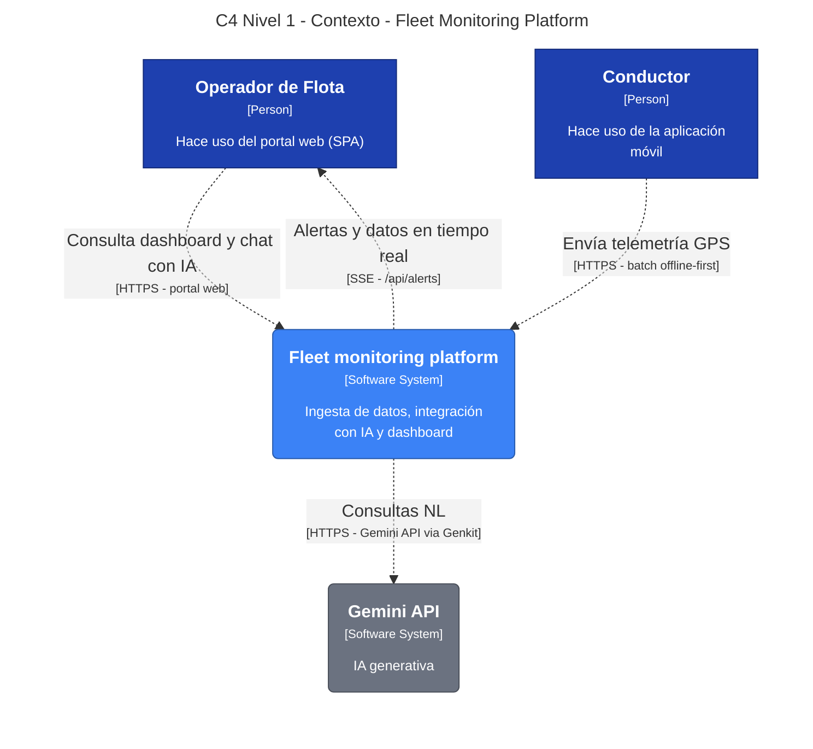

# C4 Nivel 1 — Contexto

> Fuente canónica: `docs/PRUEBA-TECNICA.md` sec. 4.A-D + ADR-0001 (NATS JetStream) + ADR-0003 (Genkit/Gemini) + ADR-0002/0005 (monolito modular).

## Diagrama

**Fuente de verdad:** `docs/c4/workspace.dsl` (Structurizr DSL). Renderiza con Structurizr.

```bash
# 1. levantar docs (perfil docs, no afecta `compose up` normal)
docker compose --profile docs up structurizr
# 2. abrir http://localhost:8080 -> Contexto_N1
# 3. exportar PNG/SVG desde la UI para README/video

# Validar y regenerar exports sin levantar UI:
docker run --rm -v "$(pwd)/docs/c4:/work" structurizr/structurizr validate -workspace /work/workspace.dsl
docker run --rm -v "$(pwd)/docs/c4:/work" structurizr/structurizr export -workspace /work/workspace.dsl -format mermaid -output /work/mermaid
docker run --rm -v "$(pwd)/docs/c4:/work" structurizr/structurizr export -workspace /work/workspace.dsl -format plantuml -output /work/plantuml
```

Fallback Mermaid (compatible GitHub, regenerado desde `workspace.dsl` — no editar a mano):



## Elementos

| Elemento | Tipo C4 | Origen | Descripción |
|---|---|---|---|
| **Operador de Flota** | Person | `PRUEBA-TECNICA.md sec. 4.C` | Back-office que usa el Portal (SPA React + SSE + mapa + chat IA). |
| **Conductor** | Person | `sec. 4.D` | Usuario de campo que envía telemetría GPS desde la app Expo offline-first (SQLite/WatermelonDB, sync batch). |
| **Fleet monitoring platform** | Software System | Sistema en scope | Capta ingesta event-driven, persiste en TimescaleDB y expone dashboard + IA. Internamente son 4 bins Go (`ingest/consumer/api/agent`) + NATS JetStream — detalle Nivel 2. |
| **Gemini API** | Software System (External) | `sec. 4.B` + `ADR-0003` | IA generativa externa invocada vía Genkit (`genkit-go`) con `GEMINI_API_KEY`. Free tier Flash; tools read-only con scope por JWT. |

## Relaciones (C4)

| Origen -> Destino | Label | Protocolo | ADR / Spec |
|---|---|---|---|
| `Conductor -> Fleet platform` | `Envía telemetría GPS` | `POST /v1/telemetry/batch` (100-500 events, 1 MB max) + jitter 0-60s | ADR-0001 cond. 3-4, ADR-0006 |
| `Operador -> Fleet platform` | `Consulta dashboard y chat con IA` | `HTTPS` `POST /api/chat`, `GET /api/*` | sec. 4.C, ADR-0003 cond. 9 (BFF `cmd/api`) |
| `Fleet platform -> Operador` | `Alertas y datos en tiempo real` | `SSE /api/alerts` (push) | sec. 4.C |
| `Fleet platform -> Gemini API` | `Consultas NL` | `HTTPS` via Genkit flows + gobreaker + timeout 15s | ADR-0003 cond. 2,5 |

## Qué NO va en Nivel 1 (y por qué)

*   **Proveedor de mapas (OSM/Mapbox):** Va directo `web SPA -> Map Provider` en Nivel 2 (contenedores). Backend nunca proxea tiles — violaría ADR-0003 cond. 9 (aislamiento front↔agente). Añadirlo aquí ensucia el contexto de negocio.
*   **AWS / Terraform / ALB / NATS / TimescaleDB:** Son contenedores/infra interna. Aparecen en Nivel 2 + deployment view. `AGENTS.md` fija Terraform como entregable pero no es interacción runtime sistema→sistema en Nivel 1.
*   **Admin / DevOps:** Persona operativa, no usuario del portal. Aparece solo en vista de despliegue si hace falta.

## Validación

*   `docker compose config` válido (Structurizr con `profiles: ["docs"]` no levanta en `compose up` normal, no afecta 16GB).
*   `workspace.dsl` parsea en Structurizr Lite (theme default, autoLayout lr).
*   Trazable a `PRUEBA-TECNICA.md` y ADRs — sin dependencias nuevas.

## Siguiente

Nivel 2 — Contenedores: descomponer `Fleet monitoring platform` en `lb (nginx/ALB) -> cmd/ingest -> NATS JetStream (TELEMETRY/ALERTS) -> cmd/consumer -> TimescaleDB`, `cmd/api (SSE)`, `cmd/agent (Genkit)`, `web (Vite)`, `mobile (Expo + SQLite)`.
