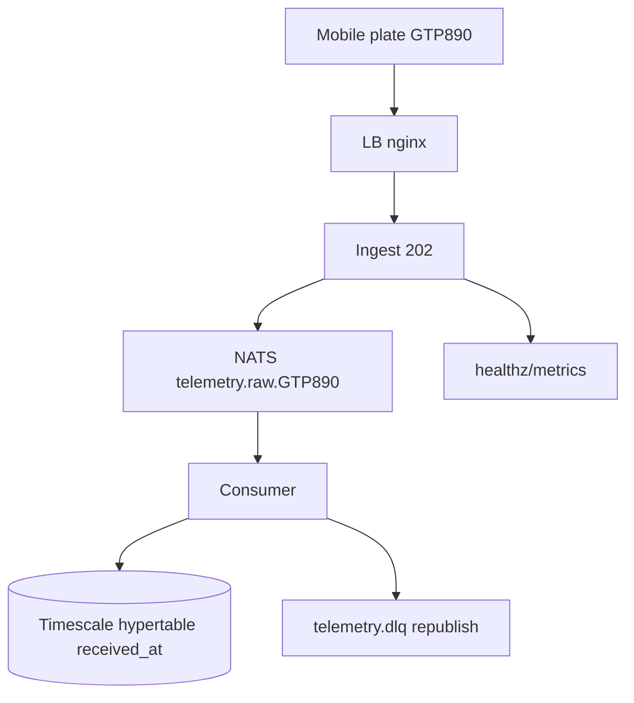

# Plan — SPEC-001: Ingesta de telemetría batch + persistencia durable

## Meta

- **SPEC-ID**: SPEC-001
- **Spec**: `docs/specs/SPEC-001-telemetry-ingest/spec.md` (approved)
- **Autor**: architect
- **Fecha**: 2026-08-23
- **Estado**: approved

## 1. Summary

Construir write path E2E `LB -> Ingest (Plate, 202) -> NATS telemetry.raw.{plate} -> Consumer CopyFrom -> TimescaleDB (received_at)` con batch variable 1-500 (ej. 245 offline), placa colombiana, speed int, lat/lon nullable, DLQ reintentable y `docker compose up` probado por Postman. Riesgos: disco es cuello 15-50k filas/s, herd offline y distinción `429` vs `503`.

## 2. Specification Traceability

| Spec ID | Requirement / Use Case | Technical Change | Tests |
|---------|------------------------|------------------|-------|
| FR-001 (UC-001) | POST 1 placa/speed/latlon -> 202 | `cmd/ingest` handler + `domain/Plate` + `PublishAsyncComplete` | TEST-001 (TS-001) AC-001 |
| FR-002 (UC-001) | POST batch 1-500/1MB 202 | mismo handler batch | TEST-002 (TS-002) AC-002 |
| FR-003 (UC-002) | JetStream `telemetry.raw.{plate}` MsgId | `infra/nats` stream `TELEMETRY` | TEST-003 (TS-003) AC-003 |
| FR-004 (UC-002) | 400 validación sin publish | `domain/Plate` regex, `speed` int check | TEST-004 (TS-004) AC-004 |
| FR-005 (UC-001) | lat/lon null valido | `GeoPoint` nullable -> DB NULL | TEST-004 (TS-004) AC-004 |
| FR-006 (UC-004) | 12/min burst 20 ->429 | `golang.org/x/time/rate` por plate | TEST-005 (TS-005) AC-005 |
| FR-007 (UC-004) | batch 1/5s 500/30s ->429 | bucket batch separado | TEST-006 (TS-006) AC-006 |
| FR-008 (UC-004) | MaxPending/bytes/breaker ->503 | `gobreaker` + `PublishAsyncMaxPending` | TEST-007 (TS-007) AC-007 |
| FR-009 (UC-003) | durable MaxDeliver 3 -> DLQ republish | `consumer` durable + `telemetry.dlq` | TEST-008 (TS-008) AC-008 |
| FR-010 (UC-003) | CopyFrom 500-1000 ON CONFLICT | `adapters/pg` CopyFrom, hypertable `received_at`, index `(plate, received_at)` | TEST-009 (TS-009) AC-009 |
| NFR-002 (UC-002/003) | replay 5min sin pérdida | retention `limits` + `prometheus-nats-exporter` | TEST-010 (TS-010) AC-010 |
| FR-011 (UC-004) | healthz/metrics + compose Postman | `docker-compose.yml` + `/healthz` + `/metrics` | TEST-011 (TS-011) AC-011 |
| BR-001..010 | todas | dominio + infra coherente | cubiertas vía AC/TS |

## 3. Technical Context

- Servicios actuales: `nats -js file`, `timescaledb`, `backend` monorepo 4 bins (`cmd/ingest, consumer, api, agent`) — ADR-0002
- APIs: `POST /v1/telemetry` y `/batch` nuevos (OpenAPI 3.1), `GET /healthz`, `GET /metrics`
- DB: TimescaleDB hypertable `telemetry` nueva, chunk 1 día, `PK(client_event_id, received_at)`
- Messaging: NATS JetStream `TELEMETRY` `telemetry.raw.{plate}` sin región, `MaxAckPending 10k`, `MaxDeliver 3`
- Observability: `prometheus-nats-exporter` obligatorio (ADR-0001 cond.5), `slog` JSON `plate, client_event_id`
- Infra: `docker-compose.yml` + `lb nginx:alpine` + `profiles: observability` para Grafana/Loki/Tempo (opcional)
- Restricciones: `nats.go`, `jackc/pgx`, `sony/gobreaker`, clean architecture domain->application->adapters->infra, `depguard`, env vars, 16GB

## 4. Architecture Changes

Nuevos: `cmd/ingest` + `cmd/consumer` + `internal/telemetry` BC + `migrations/0001` + `infra/nats` + `contracts/*`
Modificados: `docker-compose.yml` (añade nats, db, lb, ingest, consumer), `.env.example`
Eliminados: nada



Particionado futuro >10k msg/s por `plate` hash, no ahora.

## 5. Detailed Technical Design

- **Componente `Ingest`** (`backend/cmd/ingest`, `internal/telemetry/domain`):
  - Interfaces: `Publisher` port en `application` (`Publish(ctx, plate, event) error`), `RateLimiter` port
  - Responsabilidades: valida `Plate` regex `^[A-Z]{3}[0-9]{3}$` (`shared/domain/Plate`), `speed int>=0`, `lat/lon nullable` -> `GeoPoint{Lat *float64}`, asigna `received_at=time.Now()`, `client_event_id` UUID si no viene, `PublishAsync` + `PublishAsyncComplete 2-5s`, breaker `gobreaker` con 50% errors 30s -> open 30s
  - Flujo: HTTP -> domain -> application -> nats adapter
  - Idempotencia: `Nats-Msg-Id = client_event_id`
- **Componente `Consumer`** (`backend/cmd/consumer`, `internal/telemetry/adapters/pg`):
  - Interfaces: `TelemetryWriter` port
  - Responsabilidades: Pull durable `AckExplicit`, batch 500-1000, `CopyFrom` Tx (solo `lat/lon` double, `geom` se genera), `ON CONFLICT (client_event_id, received_at) DO NOTHING`, `Nak` backoff, `Term` si inválido, `DLQ` republish endpoint `POST /internal/dlq/republish`
  - Persistencia: hypertable `received_at`, `occurred_at` opcional, `lat/lon DOUBLE NULL` + `geom GEOGRAPHY(Point) GENERATED`, `geom NULL` si GPS falla
  - Concurrencia: `MaxAckPending 10k` backpressure
- **Componente `LB/Compose`** (`docker-compose.yml`, `infra/nginx.conf`):
  - `healthz` drain `15-30s`, `depends_on: service_healthy`
- **Dependencias**: `nats.go 1.37`, `pgx/v5`, `gobreaker`, `x/time/rate`
- Archivos: `backend/internal/telemetry/domain/plate.go`, `event.go`, `application/ingest.go`, `adapters/nats/publisher.go`, `adapters/http/handler.go`, `adapters/pg/writer.go`, `migrations/0001_telemetry.sql`, `cmd/ingest/main.go`, `cmd/consumer/main.go`

## 6. API Changes

| Endpoint | Método | Cambio | Compatibilidad | Validaciones |
|----------|--------|--------|----------------|--------------|
| `POST /v1/telemetry` | POST | nuevo | backward compatible | plate regex, speed int>=0, lat/lon nullable/range, occurred_at futuro 5min |
| `POST /v1/telemetry/batch` | POST | nuevo | backward compatible | 1-500, 1MB, misma por evento, all-or-nothing |
| `GET /healthz` | GET | nuevo | - | expone breaker, jetstream |
| `GET /metrics` | GET | nuevo | - | Prometheus |

Handlers: `adapters/http/handler.go` traduce domain errors `400/429/503` sin stack. Tests contrato `vacuum` OpenAPI.

## 7. Data Changes

```sql
CREATE EXTENSION IF NOT EXISTS postgis;

CREATE TABLE telemetry (
  client_event_id UUID NOT NULL,
  plate TEXT NOT NULL CHECK (plate ~ '^[A-Z]{3}[0-9]{3}$'),
  received_at TIMESTAMPTZ NOT NULL,
  occurred_at TIMESTAMPTZ,
  lat DOUBLE PRECISION CHECK (lat BETWEEN -90 AND 90),
  lon DOUBLE PRECISION CHECK (lon BETWEEN -180 AND 180),
  speed INT NOT NULL CHECK (speed >= 0),
  geom GEOGRAPHY(Point,4326) GENERATED ALWAYS AS (
    CASE WHEN lat IS NULL OR lon IS NULL THEN NULL
    ELSE ST_SetSRID(ST_MakePoint(lon, lat), 4326)::geography END
  ) STORED,
  PRIMARY KEY (client_event_id, received_at)
);
SELECT create_hypertable('telemetry','received_at', chunk_time_interval => INTERVAL '1 day');
CREATE INDEX ON telemetry (plate, received_at DESC);
-- GIST opcional para SPEC-002: CREATE INDEX ON telemetry USING GIST (geom);
-- IF NOT EXISTS, pg_advisory_lock en migrador, CopyFrom manda solo lat/lon (geom se genera)
```

Sin `fuel_pct`, sin `region`, `lat/lon` `DOUBLE` nullable + `geom` generada (`NULL` si GPS falla). Compresión/continuous no MVP; `geom` lista para `ST_Within` en SPEC-002.

## 8. Event / Messaging Changes

- Stream `TELEMETRY`: `storage=file`, `retention=limits`, `discard=old`, `max_age 24h dev / 72h prod`, `max_bytes 5GB dev / 50-100GB prod`, replicas `1 dev / 3 prod`
- Producers: `ingest` -> `telemetry.raw.{plate}` `Nats-Msg-Id=client_event_id`, `PublishAsyncMaxPending 512-1024`
- Consumers: durable `fleet-consumer`, `AckExplicit`, `AckWait 30-60s`, `MaxDeliver 3 -> telemetry.dlq`, `MaxAckPending 10k`
- Delivery: at-least-once, `CopyFrom` idempotente,DLQ republish `nats.Request` manual
- Schemas: AsyncAPI `TelemetryPayload` plate, speed int, lat/lon nullable, received_at, occurred_at

## 9. Observability

- Logs `slog` JSON `plate, client_event_id, received_at`, level env
- Metrics `/metrics`: `ingest_inflight`, `nats_pending`, `p95_ingest_ms`, `db_lag_s`, `jetstream_bytes`, `breaker_state`, `dlq_depth`
- Traces OTel gate `OTEL_ENABLED=false` default -> Tempo/Jaeger si `true` (profile observability)
- Alerts `p95>200ms` o `pending>5k` >2min, `bytes>=80%`
- Dashboards Grafana opcionales en `infra/observability/grafana/*` (profile)

## 10. Security

- Validación input estricta plate regex, speed int, lat/lon range, `occurred_at` futuro
- Sin auth MVP (plate no es secreto), `healthz/metrics` sin auth local, env vars para secrets futuros `NATS_URL`, `DATABASE_URL`
- No secretos en git, `.env.example` contrato
- WatermelonDB local no expone GPS fuera de batch enviado

## 11. Test Strategy

| Test ID | TS Relacionado | Nivel | Componente | Setup | Input | Expected | Mocks | Ubicación |
|---------|----------------|-------|------------|-------|-------|----------|-------|-----------|
| TEST-001 | TS-001 | integration | ingest | NATS+DB | `{GTP890, speed 42, lat 4.7}` | 202 + retained + DB received_at | - | `backend/internal/telemetry/adapters/http/*_test.go` |
| TEST-002 | TS-002 | integration | ingest | NATS | 245 eventos | 202 {245} | - | same |
| TEST-003 | TS-003 | integration | consumer | NATS+DB | dup X | 1 fila | - | `adapters/pg/*_test.go` |
| TEST-004 | TS-004 | unit | domain | - | `{GTP89, speed -1}` | 400 no publish | mock publisher | `domain/plate_test.go` |
| TEST-005 | TS-005 | integration | ingest | rate limiter | 21 evt/min | 429 | - | `handler_test.go` |
| TEST-006 | TS-006 | integration | ingest | rate limiter | 2nd batch <5s | 429 | - | same |
| TEST-007 | TS-007 | integration | ingest | MaxPending lleno | POST | 503 vs 429 | stub NATS | same |
| TEST-008 | TS-008 | integration | consumer | DB down | x3 fail | DLQ + republish | test DB | `consumer_test.go` |
| TEST-009 | TS-009 | integration | consumer | DB | 1000 | CopyFrom 1000 | - | `pg/writer_test.go` |
| TEST-010 | TS-010 | component | consumer | NATS | down 5m | drena backlog | - | `compose` chaos |
| TEST-011 | TS-011 | e2e | compose | docker | curl + Postman | 200/202 + metrics | - | `infra/postman/*` |

Trazabilidad `TS -> TEST` 1:1, no inventar tests sin TS. Postman collection genera smoke E2E.

## 12. Implementation Steps

### Step 1 — Dominio Plate + Event + migraciones

**Goal**: Value objects y schema
**Spec References**: UC-001, FR-001, BR-001/002/003, TS-001, TS-004
**Changes**: `shared/domain/plate.go`, `internal/telemetry/domain/event.go`, `migrations/0001.sql`
**Implementation**: `Plate` regex Colombia, `TelemetryEvent{Plate, Speed int, Lat *float64, Lon *float64, ReceivedAt, OccurredAt *time.Time, ClientEventID uuid}`, `GeoPoint` nullable, `create_hypertable(received_at)`
**Tests**: TEST-004 (unit placa/speed)
**Dependencies**: Ninguna
**Validation**: `go vet ./...`, `psql \d telemetry`

### Step 2 — Ingest API 202 + validación + rate limit + breaker

**Goal**: Write edge stateless 202
**Spec References**: UC-001/002, FR-001/002/003/004/006/007/008, AC-001/002/004/005/006/007
**Changes**: `cmd/ingest/main.go`, `adapters/http/handler.go`, `adapters/nats/publisher.go`, `application/ingest.go`, `infra/config`
**Implementation**: `PublishAsync telemetry.raw.{plate} MsgId`, `Complete 2-5s`, `x/time/rate` por plate 2 buckets, `gobreaker` 50% 30s, `healthz/metrics`, `slog` plate
**Tests**: TEST-001,002,005,006,007
**Dependencies**: Step 1
**Validation**: `curl -X POST /v1/telemetry {GTP890} -> 202`, `POST /batch 245 -> 202`, `curl /healthz`

### Step 3 — Consumer durable + CopyFrom + DLQ republish

**Goal**: Persistencia batch idempotente
**Spec References**: UC-003, FR-009/010, BR-004/008/009/010, AC-008/009
**Changes**: `cmd/consumer/main.go`, `adapters/pg/writer.go`, `internal/dlq`
**Implementation**: durable `fleet-consumer` `AckExplicit`, `CopyFrom 500-1000` `ON CONFLICT`, `Nak` backoff, `DLQ telemetry.dlq`, `POST /internal/dlq/republish` para reintento
**Tests**: TEST-003,008,009,010
**Dependencies**: Step 1,2
**Validation**: `go test -tags integration`, `SELECT count(*) FROM telemetry WHERE plate='GTP890'`

### Step 4 — Compose LB + Postman + observability profile

**Goal**: `docker compose up` E2E Postman ready
**Spec References**: UC-004, FR-011, AC-011, NFR-004/005
**Changes**: `docker-compose.yml` (nats -js, timescaledb, ingest, consumer, lb nginx), `infra/observability/*`, `infra/postman/Fleet.postman_collection.json`
**Implementation**: `depends_on healthy`, `profiles: ["observability"]` para prom/grafana/loki/tempo, `prometheus.yml` scrape `/metrics`, `open http://localhost:3000`
**Tests**: TEST-011 (e2e curl + Postman newman)
**Dependencies**: Step 2,3
**Validation**: `docker compose config -q`, `docker compose up --wait`, `newman run infra/postman/*`, `curl /metrics`

## 13. Rollout Strategy

No feature flag (nuevo servicio). Orden: `migrations` con `pg_advisory_lock` -> `nats` -> `ingest` -> `consumer` -> `lb`. Rollback: revertir imagen, stream retenido drena. Monitor `jetstream_bytes`, `p95`, `dlq_depth` en `metrics`.

## 14. Risks and Mitigations

| Riesgo | Probabilidad | Impacto | Mitigación |
|--------|--------------|---------|------------|
| Placa con formato no colombiano | media | medio | `Plate` regex estricta + normaliza mayúsculas, 400 |
| Disco single-writer 15-50k filas/s satura | media | alto | CopyFrom 500-1000, MaxAckPending 10k, alerta bytes>=80% |
| Herd offline 245 + 500 drena lento | media | medio | jitter 0-60s, bucket 1/5s, buffer WatermelonDB |
| Pérdida R1 2min sync_interval | baja | medio | declarado demo, prod R3, DLQ republish |
| Breaker mal calibrado | baja | medio | umbrales 50% 30s, estado en healthz/metrics |
| Lat/lon null rompe queries | baja | bajo | persiste NULL, queries filtran `WHERE lat IS NOT NULL` |

## 15. Technical Decisions and Trade-offs

- **Placa vs device_id**: Problema identidad estable ante cambio celular. Alternativas: UUID device, placa. Decisión: placa `^[A-Z]{3}[0-9]{3}$` (Colombia). Razón: placa no cambia, device sí. Trade-off: placa prestable implica validación regex país-específica.
- **received_at vs occurred_at**: Alternativas: hypertable `occurred_at` (device). Decisión: `received_at` server. Razón: evita skew reloj y batches históricos no alteran orden realtime. Trade-off: `occurred_at` preservado pero no indexado como time.
- **Subject sin región**: Alternativas: `telemetry.raw.{region}.{plate}`. Decisión: `telemetry.raw.{plate}`. Razón: no necesario MVP, reduce cardinalidad. Trade-off: shard futuro requiere migración subject.
- **Speed int vs float**: Alternativas: `fuel_pct`. Decisión: `int >=0` sin fuel. Razón: fuel no requerido prueba, int simplifica. Trade-off: pierde precisión decimal si luego se necesita.
- **DLQ republish manual**: Alternativas: auto-retry infinito. Decisión: manual `POST /internal/dlq/republish`. Razón: evita loop infinito con mensajes poison. Trade-off: operador reintenta.

Links: ADR-0001 (JetStream 202, file, 5GB), ADR-0002 (monorepo, migrations lock), ADR-0005 (monolito modular, breakers), ADR-0006 (LB, rate dual).

## 16. Definition of Done

- [ ] Todos los FR/BR relevantes implementados
- [ ] Todos los AC cubiertos con tests verdes que los citan (TEST-001..011)
- [ ] Todos los TS tienen cobertura técnica o justificación
- [ ] `go vet` / lint / `docker compose config` + `docker compose up --wait` healthy + Postman 202 en verde
- [ ] `reviewer` sin hallazgos altos; `db-auditor` (hypertable/index/CopyFrom nullable) ; `scalability` refrendo ADR-0005 cond.8; `quality-auditor` si refactor
- [ ] Observability `healthz/metrics` + `prometheus-nats-exporter` implementada
- [ ] Backward compatibility: ambos POST coexisten, batch 1-500 variable
- [ ] Docs y `contracts/` actualizados (OpenAPI 3.1, AsyncAPI 3)
- [ ] Rollout/rollback definido
- [ ] Sin SPEC GAP abiertos
- [ ] DLQ republish probado

---

## SPEC GAPs (si los hay)

No hay GAPs abiertos. Si surge placa formato extranjero, abrir SPEC GAP y ADR.

## Consistency Checks (pre-entrega)

- [ ] Cada UC tiene implementación definida (UC-001->Step2, UC-002->Step2, UC-003->Step3, UC-004->Step4)
- [ ] Cada FR tiene cambios técnicos (tabla trazabilidad completa)
- [ ] Cada BR relevante tiene implementación (Plate, speed int, nullable, dedup, rate, backpressure)
- [ ] Cada AC tiene cobertura via tests (AC-001..011 -> TEST-001..011)
- [ ] Cada TS tiene test técnico o justificación (tabla Test Strategy)
- [ ] No hay tests que agreguen requisitos nuevos sin SPEC GAP
- [ ] Dependencias entre Steps ordenadas (1->2->3->4 dominio -> infra)
- [ ] Cambios compatibles con arquitectura existente (monolito modular, NATS, Timescale)
- [ ] Decisiones justificadas (placa, received_at, subject sin región)
- [ ] SPEC GAPs identificados (ninguno)
