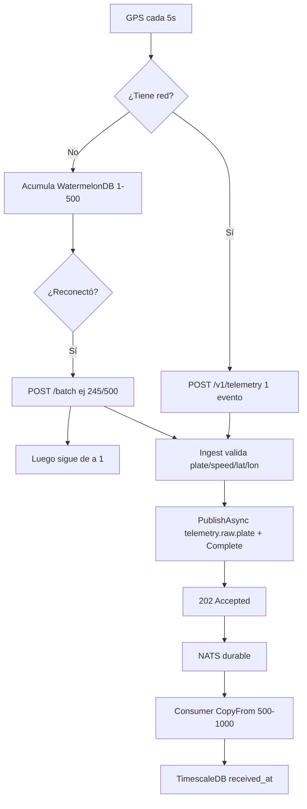
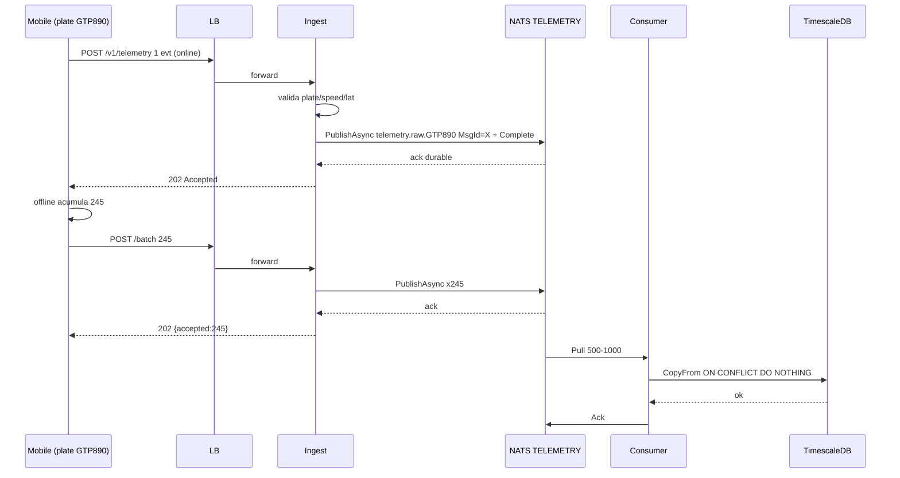
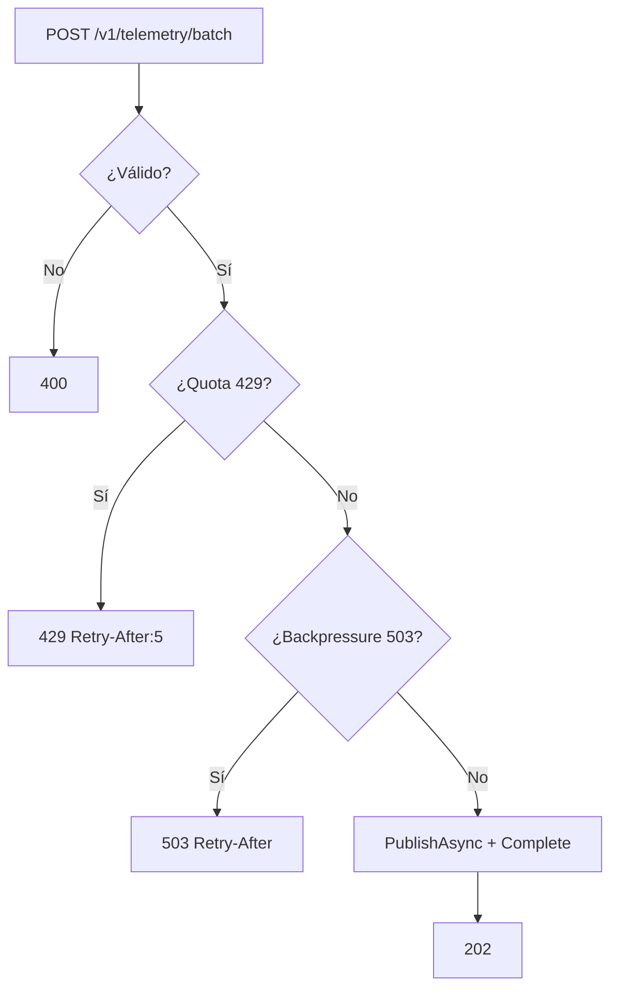

# SPEC-001: Ingesta de telemetría batch + persistencia durable

## Meta

- **SPEC-ID**: SPEC-001
- **Título**: Ingesta de telemetría batch + persistencia durable (write path `Mobile -> LB -> Ingest -> NATS -> Consumer -> TimescaleDB`) — E2E
- **Estado**: approved
- **Backlog**: Portal Corporativo sec 4.A (Stream + Persistencia + Resiliencia)
- **Autor**: architect
- **Fecha**: 2026-08-23

## 1. Overview

La flota debe enviar telemetría a alta frecuencia (1 evt/5s por vehículo, 1k msg/s picos 3k) con móviles offline-first que acumulan y drenan en bloque. El write path es async event-driven: `Ingest` valida y retiene durable en NATS JetStream antes de responder `202 Accepted`; `Consumer` persiste en TimescaleDB en batches idempotentes. La placa colombiana (`^[A-Z]{3}[0-9]{3}$`) es el ID estable ante cambio de celular. El primer slice debe levantar con `docker compose up` y ser probado por Postman E2E.

## 2. Scope

### In Scope

- `POST /v1/telemetry` de a 1 (online) y `POST /v1/telemetry/batch` 1-500 / 1MB (offline, ej. 245 al reconectar, luego sigue de a 1)
- Validación por placa, `speed` entero `>=0`, `lat/lon` nullable, `received_at` server time como hypertable time, `occurred_at` opcional preservado
- Retención durable JetStream `telemetry.raw.{plate}` + dedup `Nats-Msg-Id=client_event_id` + DLQ reintentable
- Persistencia batch `CopyFrom 500-1000` con `ON CONFLICT DO NOTHING`, índice `(plate, received_at DESC)`
- Rate limiting dual por placa y backpressure distinguido `429` vs `503` con `Retry-After`
- `GET /healthz` + `GET /metrics` y `docker compose up` healthy para Postman

### Out of Scope

- `GET /api/*` dashboard, `SSE /api/alerts`, `POST /api/chat` y Genkit/Gemini (SPEC-002/003)
- Zonas críticas `ST_Within`, continuous aggregates de lectura, `ALERTS` stream
- Auth JWT / scopes, TLS detallado (solo `healthz` sin auth)
- Mobile SQLite/WatermelonDB completa (solo contrato batch; capacidad de buffer depende de WatermelonDB)
- `fuel_pct` y `region` en subject (no requeridos MVP; región vuelve solo si >10k msg/s)
- k6 10% dup / 5% err completo y Terraform prod (solo dup/inválido mínimo aquí)
- Grafana/Loki/Tempo dashboards (solo `/metrics` + `prometheus-nats-exporter` obligatorio; resto en `profile: observability`)

## 3. Actors and Systems

| Actor/Sistema | Tipo | Descripción | Dependencia |
|---------------|------|-------------|-------------|
| Conductor | usuario | Envía de a 1 si tiene red, acumula batches 1-500 si offline (245 ej.) y drena al reconectar | Mobile SDK offline-first |
| Ingest API | servicio | `cmd/ingest` stateless valida -> `PublishAsync` + `PublishAsyncComplete` 2-5s antes de `202` | NATS JetStream |
| NATS JetStream | sistema | Stream `TELEMETRY` file, `LimitsPolicy`, `max_age 24h dev`, `max_bytes 5GB dev`, `discard old` | - |
| Consumer Worker | servicio | `cmd/consumer` durable `AckExplicit`, `MaxDeliver 3 -> telemetry.dlq` reintentable | TimescaleDB |
| TimescaleDB | sistema | Hypertable `telemetry` chunk 1 día, `PK(client_event_id, received_at)`, `index(plate, received_at DESC)` | - |
| LB | sistema | `nginx:alpine` / ALB round-robin, `healthz`, `drain 15-30s` | Ingest |
| Operador/Tester | usuario | Verifica `429` vs `503`, `healthz/metrics` y prueba E2E por Postman | - |

## 4. Use Cases

### UC-001 — Envío de telemetría (online 1 y offline batch variable)
- **Actor**: Conductor
- **Objetivo**: Enviar posición sin perder datos ni saturar backend
- **Preconditions**: Placa válida `^[A-Z]{3}[0-9]{3}$`, `speed` int >=0
- **Trigger**: Generación de punto GPS (cada 5s) o reconexión tras offline
- **Main Flow**:
  1. Si online -> `POST /v1/telemetry` con 1 evento
  2. Si offline -> acumula local (WatermelonDB) y al reconectar -> `POST /v1/telemetry/batch` con 1-500 (ej. 245)
  3. Luego sigue de a 1
- **Alternative Flows**:
  - 2a. Batch 245 <500 -> aceptado igual, no exige 500 fijos
  - 2b. Siguiente batch <5s -> `429` y reencola local
- **Error Flows**:
  - 4a. Placa inválida / `speed` negativo / `lat` fuera rango -> `400` sin publicar
  - 5a. `429` quota por placa -> `Retry-After:5`, móvil reencola
  - 6a. `503` infra saturada -> `Retry-After`, móvil reencola
- **Postconditions**: Evento(s) aceptados `202` y retenidos durable; móvil borra solo tras `202/429/503` manejado
- **Business Rules**: BR-001, BR-002, BR-003, BR-005, BR-006

### UC-002 — Ingesta y retención durable
- **Actor**: Ingest API
- **Objetivo**: Desacoplar write path del disco y garantizar replay
- **Preconditions**: JetStream `TELEMETRY` existe
- **Trigger**: `POST /v1/telemetry` o `/batch`
- **Main Flow**:
  1. Valida payload por placa/speed/lat/lon
  2. Asigna `received_at` server time
  3. `PublishAsync(subject=telemetry.raw.{plate}, MsgId=client_event_id)` + `PublishAsyncComplete()`
  4. Responde `202`
- **Alternative Flows**: -
- **Error Flows**:
  - 3a. `PublishAsyncMaxPending 512-1024` lleno o `jetstream_bytes>=80%` o breaker abierto -> `503`
  - 2a. Validación falla -> `400`
- **Postconditions**: Evento durable en JetStream, pend. de consumer
- **Business Rules**: BR-004, BR-005, BR-006, BR-007

### UC-003 — Persistencia batch idempotente + DLQ reintentable
- **Actor**: Consumer Worker
- **Objetivo**: Persistir 15-50k filas/s sin duplicar y sin bloquear stream
- **Preconditions**: Consumer durable registrado
- **Trigger**: Mensajes en `TELEMETRY`
- **Main Flow**:
  1. Pull `MaxAckPending 10k`
  2. Batch 500-1000 -> `CopyFrom` + `ON CONFLICT DO NOTHING`
  3. `Ack` por lote
- **Alternative Flows**:
  - 2a. `lat/lon null` -> persiste `NULL`
  - 2b. Duplicado `client_event_id` -> `DO NOTHING`
- **Error Flows**:
  - 3a. DB transitoria falla -> `Nak` backoff, reintento hasta 3
  - 3b. 3er fallo -> `telemetry.dlq`, no bloquea; republish manual disponible
- **Postconditions**: Filas en hypertable con `received_at` como time, `occurred_at` preservado
- **Business Rules**: BR-004, BR-008, BR-009

### UC-004 — Control de carga y observabilidad
- **Actor**: Operador/Tester
- **Objetivo**: Distinguir quota vs infra y verificar stack levantado
- **Preconditions**: `docker compose up` healthy
- **Trigger**: `GET /healthz`, `GET /metrics`, `POST` por Postman
- **Main Flow**:
  1. `healthz` expone `breaker_state`, `jetstream`
  2. `metrics` expone `ingest_inflight, nats_pending, p95, db_lag, jetstream_bytes`
- **Error Flows**:
  - 2a. `p95>200ms` o `pending>5k` >2min -> alerta escala a 2 réplicas
- **Postconditions**: Observabilidad mínima verificable sin Grafana
- **Business Rules**: BR-005, BR-006, BR-010

## 5. Functional Requirements

| ID | Descripción | UC Relacionado | Prioridad |
|----|-------------|----------------|-----------|
| FR-001 | Aceptar `POST /v1/telemetry` 1 evento con `plate ^[A-Z]{3}[0-9]{3}$`, `speed int >=0`, `lat/lon nullable`, `occurred_at` opcional; asignar `received_at` y responder `202` tras `PublishAsyncComplete` | UC-001, UC-002 | must |
| FR-002 | Aceptar `POST /v1/telemetry/batch` 1-500 eventos / 1MB (ej. 245) con misma validación; responder `202 {accepted:N}` | UC-001, UC-002 | must |
| FR-003 | Retener en JetStream `telemetry.raw.{plate}` con `Nats-Msg-Id=client_event_id` para dedup ventana ~2min | UC-002 | must |
| FR-004 | Validar y rechazar `400` sin publicar: placa inválida, `speed` no int/negativo, `lat/lon` fuera rango si presentes, `occurred_at` futuro >5min | UC-002 | must |
| FR-005 | Permitir `lat/lon null` (fallo GPS) y `speed=0` como válidos | UC-001, UC-003 | must |
| FR-006 | Rate limit online por placa 12 evt/min burst 20 -> `429 Retry-After:5` sin publicar, móvil reencola | UC-004 | must |
| FR-007 | Rate limit batch por placa 1 req/5s + 500 evt/30s sliding -> `429` y reencola; buffer offline limitado por WatermelonDB | UC-004 | must |
| FR-008 | Backpressure infra `PublishAsyncMaxPending 512-1024` lleno o `jetstream_bytes>=80%` o breaker abierto -> `503 Retry-After` distinto de `429` | UC-004 | must |
| FR-009 | Consumer durable `AckExplicit, AckWait 30-60s, MaxAckPending 10k, MaxDeliver 3 -> telemetry.dlq` con republish manual reintentable | UC-003 | must |
| FR-010 | Persistir batch `CopyFrom 500-1000` idempotente `ON CONFLICT (client_event_id, received_at) DO NOTHING`, hypertable `received_at` time, `index(plate, received_at DESC)`, `lat/lon DOUBLE PRECISION nullable` + `geom GEOGRAPHY(Point,4326) GENERATED ALWAYS AS (ST_MakePoint(lon,lat)) STORED` | UC-003 | must |
| FR-011 | Exponer `GET /healthz` (breaker, jetstream) y `GET /metrics` (ingest_inflight, nats_pending, p95, db_lag, jetstream_bytes) y `docker compose up` healthy probado por Postman | UC-004 | must |

## 6. Business Rules

| ID | Descripción | UC/FR Relacionado |
|----|-------------|-------------------|
| BR-001 | Placa es ID canónico estable ante cambio de celular; regex `^[A-Z]{3}[0-9]{3}$` (GTP890, TTY423), normalizada mayúsculas. `shared/domain/Plate` | UC-001, FR-001 |
| BR-002 | `speed` entero `>=0`, `0` válido (detenido); `fuel_pct` no requerido MVP | UC-001, FR-004 |
| BR-003 | `lat/lon` nullable; si presente debe estar en `[-90,90]/[-180,180]`; `NULL` persiste como NULL | UC-001, FR-005 |
| BR-004 | Idempotencia por `client_event_id` UUID: JetStream `MsgId` dedup 2min + `ON CONFLICT DO NOTHING`; móvil no necesita conocer `event_id` MVP | UC-002, UC-003, FR-003 |
| BR-005 | Quota por placa 12/min burst 20 y batch 1/5s 500/30s -> `429` con reencole local | UC-004, FR-006, FR-007 |
| BR-006 | `503` infra vs `429` quota son distintos y ambos con `Retry-After`; `503` no bloquea handler | UC-004, FR-008 |
| BR-007 | `received_at` server time es `time` de hypertable; `occurred_at` device preservado opcional no usado para partición | UC-003, FR-010 |
| BR-008 | Hypertable chunk 1 día, `PK(client_event_id, received_at)`, `index(plate, received_at DESC)`, `CREATE EXTENSION postgis` + `geom` generada desde `lat/lon` (NULL si GPS falla) | UC-003, FR-010 |
| BR-009 | `CopyFrom` batch 500-1000 en Tx, no 1 INSERT por evento | UC-003, FR-010 |
| BR-010 | DLQ `telemetry.dlq` no bloquea; existe job republish manual para reintento | UC-003, FR-009 |

## 7. Main Flows

Mobile online de a 1 y offline batch variable:



## 8. Alternative and Error Flows

- Validación inválida (placa `GTP89`, `speed -1`, `lat 100`) -> `400` sin publicar (BR-001..003)
- `lat/lon null` -> `202` válido, persiste `NULL`
- Duplicado `client_event_id` -> `202` sin duplicar (BR-004)
- Quota 12/min excedida -> `429` reencola (BR-005)
- Batch 500 + segundo <5s -> `429` reencola (BR-005)
- `MaxPending` lleno / `bytes>=80%` / breaker abierto -> `503` (BR-006)
- DB transitoria falla -> `Nak` backoff x3; 3º -> `telemetry.dlq` + republish manual (BR-010)
- Consumer caído 5min -> replay sin pérdida (R1 2min declarado)

## 9. State and Transitions

No hay máquina de estados de negocio para ingesta (stateless). Consumer durable: `IDLE -> ACTIVE -> NAK_RETRY -> DLQ` según `Ack/Nak/Term`. Omitido detalle por ser infra NATS.

## 10. API / Interface Contracts

- **Endpoint**: `POST /v1/telemetry`
  - Request: `{plate, speed int>=0, lat nullable, lon nullable, occurred_at optional, client_event_id optional}`
  - Response `202 {accepted:true}`, `400`, `429`, `503`
  - Validaciones: BR-001..003
- **Endpoint**: `POST /v1/telemetry/batch`
  - Request: `{events: [1..500]}` total 1MB, ej. 245
  - Response `202 {accepted:N}`, mismo errores. Batch all-or-nothing (1 inválido -> `400` lote)
- **Endpoint**: `GET /healthz` -> `{status, breaker, jetstream}`
- **Endpoint**: `GET /metrics` -> Prometheus `ingest_inflight, nats_pending, p95, db_lag, jetstream_bytes`
- Referencia: `contracts/http.openapi.yaml` (OpenAPI 3.1) y `contracts/events.asyncapi.yaml`

## 11. Sequence Diagrams



## 12. Flow Diagrams



## 13. Non-Functional Requirements

| ID | Categoría | Descripción |
|----|-----------|-------------|
| NFR-001 | performance | 1k msg/s sostenido, 3k pico, CopyFrom 500-1000, `MaxAckPending 10k` |
| NFR-002 | reliability | At-least-once, replay 5min backlog sin pérdida, R1 2min declarado |
| NFR-003 | scalability | Single-writer 15-50k filas/s, shard `telemetry.raw.{plate}` futuro >10k msg/s |
| NFR-004 | availability | Stateless ingest + LB round-robin, `drain 15-30s`, `docker compose up` healthy |
| NFR-005 | observability | `healthz/metrics` + `prometheus-nats-exporter`, `p95>200ms` alerta, profile observability opcional |
| NFR-006 | consistency | Idempotencia `MsgId + ON CONFLICT`, `received_at` server time para hypertable |
| NFR-007 | backward compatibility | `POST /v1/telemetry` y `/batch` coexisten; batch variable 1-500 aceptado |

## 14. Acceptance Criteria

```gherkin
AC-001 (UC-001/002, FR-001, BR-001/002/003):
  Given evento válido {plate GTP890, speed int>=0, lat nullable, lon nullable, occurred_at opcional}
  When POST /v1/telemetry
  Then 202 Accepted {accepted:true} tras PublishAsyncComplete 2-5s y retenido en telemetry.raw.GTP890

AC-002 (UC-001, FR-002):
  Given lote 1-500 (ej. 245) <=1MB válido
  When POST /v1/telemetry/batch {245}
  Then 202 {accepted:245} y 245 MsgId en JetStream; luego sigue de a 1

AC-003 (UC-002/003, FR-003, BR-004):
  Given evento X ya aceptado
  When reenvío mismo client_event_id
  Then 202 sin duplicar; DB 1 fila ON CONFLICT DO NOTHING

AC-004 (UC-002, FR-004/005):
  Given placa inválida / speed negativo-no-int / lat fuera rango
  When POST 1 inválido
  Then 400 sin publicar; lat/lon null y speed=0 son válidos

AC-005 (UC-004, FR-006, BR-005):
  Given placa GTP890 con 20 evt/<60s
  When evt 21
  Then 429 Retry-After:5 sin publicar, móvil reencola

AC-006 (UC-004, FR-007, BR-005):
  Given batch 500 luego otro <5s
  When segundo batch
  Then 429 Retry-After:5; buffer WatermelonDB drena respetando bucket

AC-007 (UC-004, FR-008, BR-006):
  Given MaxPending 512-1024 lleno o bytes>=80% o breaker abierto
  When POST
  Then 503 Retry-After distinto de 429, healthz muestra breaker

AC-008 (UC-003, FR-009, BR-010):
  Given consumer durable AckExplicit MaxDeliver 3
  When DB falla 3 veces
  Then va a telemetry.dlq sin bloquear y hay republish manual

AC-009 (UC-003, FR-010, BR-008/009):
  Given 500-1000 eventos
  When CopyFrom
  Then Tx con ON CONFLICT DO NOTHING, PK(client_event_id, received_at), index(plate, received_at DESC), lat/lon null => NULL

AC-010 (UC-002/003, NFR-002):
  Given consumer caído 5min a 1k msg/s
  When vuelve
  Then drena backlog sin pérdida, alerta discard old, R1 2min aceptado

AC-011 (UC-004, FR-011, NFR-004/005):
  Given docker compose up default
  When curl /healthz y POST por Postman
  Then 200 y 202, metrics expone ingest_inflight etc., p95>200ms alerta
```

## 15. Functional Test Scenarios

| ID | UC/FR/AC | Preconditions | Input | Action | Expected Result |
|----|----------|---------------|-------|--------|-----------------|
| TS-001 | UC-001, FR-001, AC-001 | JetStream up | `{plate:GTP890, speed:42, lat:4.7, lon:-74}` | POST /v1/telemetry 1 | 202 + retained + received_at en DB |
| TS-002 | UC-001, FR-002, AC-002 | offline 245 | `events[245]` 1MB | POST /batch | 202 {245}, luego 1 |
| TS-003 | UC-003, FR-003, AC-003 | X aceptado | mismo X | re-POST | 202, DB 1 fila |
| TS-004 | UC-002, FR-004, AC-004 | - | `{plate:GTP89, speed:-1}` | POST | 400 no publish |
| TS-005 | UC-004, FR-006, AC-005 | 20 evt/60s | evt 21 | POST | 429 |
| TS-006 | UC-004, FR-007, AC-006 | batch 500 | segundo <5s | POST /batch | 429 |
| TS-007 | UC-004, FR-008, AC-007 | MaxPending lleno | POST | POST | 503 distinto 429 |
| TS-008 | UC-003, FR-009, AC-008 | DB down | mensaje x3 | consume | DLQ + republish ok |
| TS-009 | UC-003, FR-010, AC-009 | 1000 evt | batch 1000 | CopyFrom | Tx 1000 ON CONFLICT |
| TS-010 | UC-002, FR-010, AC-010 | consumer down 5m | backlog 300k | restart | drena sin pérdida |
| TS-011 | UC-004, FR-011, AC-011 | compose up | curl | GET /healthz, POST | 200/202, metrics visibles |

## 16. Open Questions

- [x] Placa colombiana estable `^[A-Z]{3}[0-9]{3}$` — resuelto 2026-08-23
- [x] Región en subject — resuelto: no MVP, `telemetry.raw.{plate}`
- [x] `received_at` vs `occurred_at` — resuelto: hypertable `received_at` server, `occurred_at` opcional
- [x] `speed` int, `fuel` no, `lat/lon` nullable — resuelto
- [x] Ambos endpoints — resuelto: `1` online, `batch` offline variable

## 17. Assumptions

- Capacidad WatermelonDB limita buffer offline (no 720 fijo)
- R1 2min pérdida aceptada demo; prod R3
- Postman es smoke test E2E suficiente para SPEC-001 sin móvil real
- DLQ republish manual es suficiente MVP (no auto-retry infinito)

---

## Trazabilidad

```
UC-001 -> FR-001, FR-002, BR-001/002/003 -> AC-001, AC-002 -> TS-001, TS-002
UC-002 -> FR-003, FR-004, FR-005 -> AC-003, AC-004 -> TS-003, TS-004
UC-004 -> FR-006, FR-007, FR-008, BR-005/006 -> AC-005, AC-006, AC-007 -> TS-005, TS-006, TS-007
UC-003 -> FR-009, FR-010, BR-004/008/009/010 -> AC-008, AC-009 -> TS-008, TS-009
UC-002/003 -> NFR-002 -> AC-010 -> TS-010
UC-004 -> FR-011, NFR-004/005 -> AC-011 -> TS-011
```

## Contratos

- HTTP/SSE: `contracts/http.openapi.yaml` (OpenAPI 3.1, 202, plate, speed int, lat/lon nullable)
- Eventos NATS: `contracts/events.asyncapi.yaml` (subject `telemetry.raw.{plate}`, headers `Nats-Msg-Id`, `MaxDeliver 3 -> telemetry.dlq`)

## Validación (pre-entrega)

- [ ] Cada UC tiene flujo principal
- [ ] Cada UC contempla errores/alternativas relevantes
- [ ] Cada FR está relacionado a UC cuando corresponde
- [ ] Cada comportamiento importante tiene AC
- [ ] Cada AC tiene al menos un TS
- [ ] No hay TS que introduzcan requisitos inexistentes
- [ ] Diagramas representan comportamiento, no implementación
- [ ] No hay decisiones técnicas prematuras
- [ ] Ambigüedades en Open Questions resueltas
