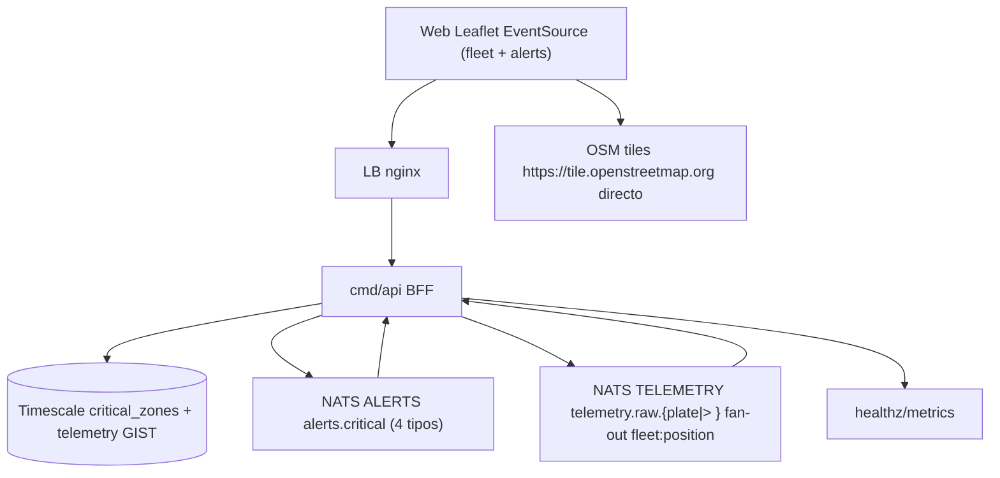

# Plan — SPEC-002: Lectura de flota, zonas críticas y alertas SSE

## Meta

- **SPEC-ID**: SPEC-002
- **Spec**: `docs/specs/SPEC-002-fleet-read-zones/spec.md` (approved)
- **Autor**: architect
- **Fecha**: 2026-08-24
- **Estado**: approved

## 1. Summary

Construir read path BFF `cmd/api`: query snapshot `GET /fleet/positions?plate` + SSE `fleet:position` todos vs. solo `?plate=GTP980` (toggle "Ver todos"), tabla `critical_zones` Polygon 4..101 coords + GIST, stream NATS `ALERTS` `alerts.critical` con 4 tipos `zone_enter|zone_exit|speeding_on|speeding_off (>80km/h)`, SSE `GET /alerts` con `Last-Event-ID` replay y mapa Leaflet/OSM clustering. Riesgos: scan hypertable sin índice, OFFSET lento, import `web->db`, y NATS replay fuera de retention.

## 2. Specification Traceability

| Spec ID | Requirement / Use Case | Technical Change | Tests |
|---------|------------------------|------------------|-------|
| FR-001 (UC-001) | GET /fleet/positions?plate snapshot + keyset 100/500 | `fleet/adapters/http` + `QueryService` + `pg` keyset `WHERE plate?` `(plate, received_at DESC)` | TEST-001 (TS-001) AC-001 |
| FR-011 (UC-001) | SSE GET /fleet/positions/stream?plate `fleet:position` todos vs. solo GTP980 | `fleet/adapters/sse.FleetStream` + `nats.TelemetrySubscriber` fan-out `telemetry.raw.{plate\|>}` | TEST-001 (TS-001) AC-001 |
| FR-002 (UC-001) | GET /vehicles/{plate} + /history from/to keyset | mismo QueryService history | TEST-002 (TS-002) AC-002 |
| FR-003 (UC-002) | CRUD /api/zones GeoJSON Polygon 4..101 coords valid | `fleet/domain.Zone` VO + `ZoneRepository` pg + HTTP POST/PUT/DELETE | TEST-003/004 (TS-003/004) AC-003/004 |
| FR-004 (UC-002) | critical_zones table + GIST geom | `migrations/0002_zones.sql` + `telemetry GIST` | TEST-003 AC-003 |
| FR-005 (UC-003) | alertas 4 tipos zone_enter/zone_exit/speeding_on/off -> alerts.critical | `fleet/application.AlertService` + `nats.AlertPublisher` MsgId `plate:alert_type:bucket` | TEST-005/010 (TS-005/010) AC-005 |
| FR-006 (UC-003) | SSE GET /api/alerts Last-Event-ID replay con 4 tipos | `fleet/adapters/sse.AlertHandler` + `nats.AlertSubscriber` durable api-sse | TEST-005/006 (TS-005/006) AC-005/006 |
| FR-007 (UC-003) | Stream ALERTS 7d 1GB | `infra/nats/stream.go EnsureStream ALERTS` | TEST-005 AC-005 |
| FR-008 (UC-001..004) | BFF isolation ADR-0003 cond9, rate 10/min IP, breaker/timeout | `cmd/api` composition root, `shared/breaker`, `x/time/rate`, depguard | TEST-008 (TS-008) AC-008 |
| FR-009 (UC-001/003) | healthz/metrics api | `adapters/http/ops.go` | TEST-009 (TS-009) AC-009 |
| FR-010 (UC-004) | mapa tiles OSM directo + cluster >500 | `web/src/map/*` Leaflet markercluster + API /zones | TEST-007 (TS-007) AC-007 |
| BR-001..012 | reglas de negocio | domain VO, pagination keyset, filtro PII, speeding 80, filtro ?plate | cubiertas vía AC/TS |

## 3. Technical Context

- Servicios actuales (SPEC-001): `nats` JS file `TELEMETRY telemetry.raw.{plate}` DuplicateWindow 2m, `timescaledb` hypertable `telemetry(received_at)` PK `(client_event_id, received_at)` + `telemetry_dedup` + `CopyFrom 500-1000`, `cmd/ingest` + `cmd/consumer` + `lb nginx` + `prometheus-nats-exporter`. `docker-compose.yml` ya expone 8080 LB, 5432 pg, 4222 nats.
- Nuevo servicio: `cmd/api` (Platform API BFF, stateless, Go net/http) — ADR-0002 monorepo 1 módulo 4 bins, ADR-0005 modular monolith. `web/` SPA Vite React + Leaflet (ADR-0007) existe como stub o se crea en este slice.
- DB: TimescaleDB+PostGIS 15, `shared/domain/Plate` VO, `telemetry.geom` GENERATED; falta `critical_zones` + `GIST(geom)` + índice `critical_zones GIST`. Continuous aggregate opcional no bloqueante.
- Messaging: NATS JetStream, nuevo stream `ALERTS` `alerts.critical` (alerts.* wildcard), `MaxDeliver` no aplica a SSE (fanout), retention 7d.
- Observability: `prometheus-nats-exporter` ya; añadir `api_sse_clients`, `db_pool_inflight`, `p95_api_ms` en `/metrics`. `slog` JSON con `plate, zone_id, event_id`.
- Seguridad: ADR-0003 cond.9 BFF obligatoria, ADR-0004 secrets env, depguard `web !-> pgx/nats/genkit`.
- Infra: `docker-compose.yml` + `lb nginx` ya; añadir `api` service, update `infra/nginx.conf` `/api -> api:8080`, `healthcheck api`. `profiles observability` intacto.

## 4. Architecture Changes

Nuevos: `cmd/api` (bootstrap, server, runner), `internal/fleet/{domain,application,adapters/{http,pg,nats,sse},infra}` BC fleet, `migrations/0002_fleet_zones.sql`, `web/src/{map,sse,hooks}` si no existe, `infra/nats/stream.go` ALERTS.

Modificados: `docker-compose.yml` (añade `api` + env `DATABASE_URL,NATS_URL`), `infra/nginx/nginx.conf` (`/api/` proxy), `backend/internal/telemetry/infra/nats/stream.go` (refactor para multi-stream), `backend/.golangci.yml` (depguard web), `.env.example` (`API_PORT`).

Eliminados: nada.



Particionado futuro >10k msg/s por `plate` hash ya documentado ADR-0001 cond.7; hasta entonces mononodo R1 para ALERTS.

## 5. Detailed Technical Design

- **Componente `Platform API` (`backend/cmd/api`, `internal/fleet`)**:
  - Interfaces (ports en `fleet/application`, consumer side): `FleetReader { LastPositions(ctx, plate *Plate, limit, cursor) ([]VehiclePos, string, error); LastPosition(ctx, plate Plate) (VehiclePos, error); History(ctx, plate, from, to, limit, cursor) }`, `FleetPositionSubscriber { SubscribePositions(ctx, plate *Plate, lastSeq) (<-chan PosMsg) }`, `ZoneRepository { List(ctx) ([]Zone); Create(ctx, Zone) (Zone,error); Update/Delete }`, `AlertSubscriber { SubscribeAlerts(ctx, lastSeq) (<-chan AlertMsg) }`
  - Responsabilidades: valida `Plate` regex `^[A-Z]{3}[0-9]{3}$`, `limit 1..500`, `from/to RFC3339`, `geojson Polygon` (cierre 4..101, ST_Area>0, ST_IsValid), asigna `id UUID`, filtra `client_event_id` de salida, aplica `x/time/rate` 10/min IP para POST/PUT/DELETE /zones, breaker `gobreaker` 50% 30s sobre `pgxpool` y `nats` sub, timeout `context.WithTimeout 2s` DB, `15s` SSE, SSE `Content-Type: text/event-stream`, `Cache-Control: no-cache`, `Connection: keep-alive`, `X-Accel-Buffering: no`
  - Flujo: HTTP `-> domain VO -> application service -> pg/nats adapter -> http response/SSE`; `GET /fleet/positions?plate` añade `WHERE plate=$1` opcional; `stream?plate` filtra en NATS `telemetry.raw.GTP980` vs `telemetry.raw.>`
  - Paginación keyset: `cursor = base64(plate|received_at)` ; query `SELECT DISTINCT ON (plate) ... WHERE (plate, received_at) > ($1,$2) ORDER BY ...` con `WHERE plate=$1` si filtro; prohibido OFFSET
  - SSE fleet:position: `fleet/adapters/sse.FleetHandler` subscribe `TELEMETRY` (`telemetry.raw.{plate| >}`) y mapea a `event: fleet:position id:seq data:{plate,lat,lon,speed,received_at}`; SSE alerts: `fleet/adapters/sse.AlertHandler` subscribe `ALERTS` durable `api-sse` y mapea `event: alert:critical` con `alert_type` 4 tipos; ambos `Last-Event-ID` replay, `:ping` 15s, `retry:5000`
  - Config: `DATABASE_URL, NATS_URL, API_PORT=8080, SSE_HEARTBEAT=15s, DB_TIMEOUT=2s, ZONE_RATE=10/min, SPEEDING_THRESHOLD=80`

- **Componente `critical_zones` + `telemetry GIST`** (`backend/migrations/0002_fleet_zones.sql`, `fleet/adapters/pg/zone.go`):
  - Tabla `CREATE TABLE critical_zones (id UUID PRIMARY KEY, name TEXT NOT NULL CHECK(length(name) BETWEEN 1 AND 100), geom geometry(Polygon,4326) NOT NULL CHECK(ST_IsValid(geom) AND ST_GeometryType(geom)='ST_Polygon' AND ST_Area(geom) > 0 AND ST_NPoints(geom) BETWEEN 4 AND 101), created_at TIMESTAMPTZ NOT NULL DEFAULT now())`; `CREATE INDEX critical_zones_geom_gist ON critical_zones USING GIST (geom)`; `CREATE INDEX IF NOT EXISTS telemetry_geom_idx ON telemetry USING GIST (geom)` donde `geom` es `GEOGRAPHY(Point,4326)` generated — usar `geom::geometry` para `ST_Within` o crear índice funcional `USING GIST ((geom::geometry))` si geografía no soporta Polygon directo; documentado en migration con comentario
  - Validación en 2 capas: Go `first==last`, `4<=len(coords)<=101` (<=100 vértices distintos), `ST_Area>0` vía `ST_Area(ST_GeomFromGeoJSON)==0 -> 400` (línea degenerada) antes de SQL para 400 rápido; DB `CHECK(ST_Area(geom)>0 AND ST_NPoints BETWEEN 4 AND 101)` como candado duro anti-bypass; `ST_IsValid`, `ST_SRID=4326`
  - Lat/lon en API 6 decimales max (`math.Round(lat*1e6)/1e6`)

- **Componente `Alertas 4 tipos`** (`fleet/application/alert.go`, `fleet/adapters/nats/publisher.go`):
  - Detección `zone_enter/zone_exit`: `ST_Within(geom::geometry, zone.geom)` cambio de estado vs. última posición cacheada; `speeding_on` cuando `speed>80` tras `<=80`, `speeding_off` cuando `speed<=80` tras `>80` (BR-011, umbral 80 km/h)
  - Dedup: `zone_*` bucket por `plate:zone:bucket` (20m), `speeding_*` por `plate:bucket` 5m; `msgId = fmt.Sprintf("%s:%s:%d", plate, alertType, bucket)`; `PublishAsync` con `Nats-Msg-Id=msgId` + `alert_dedup` genérico `PK(plate, alert_type, bucket)` si publish duplica
  - Payload `alerts.critical`: `{event_id, plate, alert_type: zone_enter|zone_exit|speeding_on|speeding_off, zone_id?, zone_name?, lat, lon, speed, created_at}`; front traduce a `"GTP980 entra en zona Norte"` etc.
  - Stream `ALERTS`: `storage=file, retention=limits, discard=old, max_age 7d, max_bytes 1GB dev /10GB prod, replicas 1 dev/3 prod, subjects=["alerts.critical","alerts.>"]`, consumer `api-sse` `AckNone`

- **Componente `NATS ALERTS infra`** (`backend/internal/fleet/infra/nats/stream.go` refactor):
  - `EnsureStream(ctx, js, cfg ALERTS)` idempotente con `CreateOrUpdateStream`; `EnsureConsumer` para `api-sse`; `infra/env/env.go` añade `NATS_ALERTS_MAX_AGE`, `NATS_ALERTS_MAX_BYTES`

- **Componente `Web SPA` (`web/src/`)**:
  - `web/src/hooks/useSSE.ts` con `EventSource`, `onerror backoff 0.5s*2 cap 30s`, `onopen reset`, `Last-Event-ID` implícito por browser, cleanup `es.close()` en unmount
  - `web/src/map/Map.tsx` `lazy(() => import('./Map'))` (ADR-0007 cond.5), `MapContainer` + `TileLayer url=https://{s}.tile.openstreetmap.org/{z}/{x}/{y}.png` + `MarkerClusterGroup` + `<GeoJSON data={zones} style={{color:'red',fillOpacity:0.2}}/>`
  - Estado global `Zustand` o `TanStack Query` para `fleetPositions` + `zones`; `queryKey ['positions', cursor]` con `fetchNextPage`
  - Build `npm run build && lint` en verde, `VITE_API_BASE_URL` env

- **Dependencias**: `nats.go`, `jackc/pgx/v5/pgxpool`, `sony/gobreaker`, `golang.org/x/time/rate`, `postgis`, `leaflet`, `react-leaflet`, `leaflet.markercluster`
- Archivos concretos: `backend/internal/fleet/domain/{vehicle,zone,alert}.go`, `application/{query,detector}.go`, `adapters/pg/{reader,zone}.go`, `adapters/http/{handler,zone,ops}.go`, `adapters/sse/handler.go`, `adapters/nats/{publisher,subscriber}.go`, `infra/breaker/breaker.go` reuse shared, `cmd/api/{main,bootstrap,runner,server}.go`, `migrations/0002_fleet_zones.sql`, `web/src/map/Map.tsx`, `web/src/hooks/useSSE.ts`

## 6. API Changes

| Endpoint | Método | Cambio | Compatibilidad | Validaciones |
|----------|--------|--------|----------------|--------------|
| `GET /api/fleet/positions` | GET | nuevo BFF | backward compatible (nuevo prefix /api) | limit 1..500 default 100, cursor base64 plate|received_at, status derived |
| `GET /api/vehicles/{plate}/history` | GET | nuevo | backward compatible | plate ^[A-Z]{3}[0-9]{3}$, from/to RFC3339, limit 1..500 |
| `GET /api/zones` | GET | nuevo canónico | estable | GeoJSON FeatureCollection |
| `POST /api/zones` | POST | nuevo | - | name 1..100, Polygon cerrado >=4, ST_IsValid, rate 10/min IP |
| `PUT /api/zones/{id}` | PUT | nuevo | - | id UUID, mismo geo valid |
| `DELETE /api/zones/{id}` | DELETE | nuevo | - | id UUID, 404 si no existe |
| `GET /api/alerts` | GET | nuevo SSE | - | Accept text/event-stream, Last-Event-ID replay, timeout 15s heartbeat |
| `GET /healthz` | GET | existe en ingest, añadir en api | - | breaker, nats, db |
| `GET /metrics` | GET | añadir api_sse_clients etc. | - | Prometheus |

Handlers: `fleet/adapters/http/handler.go` traduce domain errors a `400/404/429/503` con `Retry-After:5` para 429/503, sin stack.

## 7. Data Changes

```sql
CREATE EXTENSION IF NOT EXISTS postgis;

CREATE TABLE IF NOT EXISTS critical_zones (
  id UUID PRIMARY KEY,
  name TEXT NOT NULL CHECK (char_length(name) BETWEEN 1 AND 100),
  geom geometry(Polygon,4326) NOT NULL CHECK (ST_IsValid(geom) AND ST_GeometryType(geom) = 'ST_Polygon' AND ST_Area(geom) > 0 AND ST_NPoints(geom) BETWEEN 4 AND 101),
  created_at TIMESTAMPTZ NOT NULL DEFAULT now()
);
CREATE INDEX IF NOT EXISTS critical_zones_geom_gist ON critical_zones USING GIST (geom);

CREATE INDEX IF NOT EXISTS telemetry_geom_idx ON telemetry USING GIST ((geom::geometry));

CREATE TABLE IF NOT EXISTS alert_dedup (
  plate TEXT NOT NULL,
  zone_id UUID NOT NULL,
  bucket BIGINT NOT NULL,
  created_at TIMESTAMPTZ NOT NULL DEFAULT now(),
  PRIMARY KEY (plate, zone_id, bucket)
);
-- retention dedup 7d like ALERTS: DELETE FROM alert_dedup WHERE created_at < now() - interval '7 days';

SELECT create_hypertable('telemetry','received_at', if_not_exists=>TRUE, migrate_data=>TRUE);
-- no continuous aggregate obligatorio MVP; opcional:
-- CREATE MATERIALIZED VIEW IF NOT EXISTS telemetry_hourly WITH (timescaledb.continuous) AS SELECT time_bucket('1 hour', received_at) bucket, plate, count(*), avg(speed) FROM telemetry GROUP BY bucket, plate;
```

`pg_advisory_lock` en migrador, `IF NOT EXISTS` idempotente. `geom::geometry` cast necesario porque `telemetry.geom` es `GEOGRAPHY(Point)` mientras `zones.geom` es `geometry(Polygon)`; `ST_Within(geography, geography)` también soporta pero GIST geography vs geometry requiere cast coherente — elegir `geometry` para GIST común.

## 8. Event / Messaging Changes

- Nuevo stream `ALERTS`: `name=ALERTS, subjects=["alerts.critical","alerts.>"], storage=file, retention=limits, discard=old, max_age 7d, max_bytes 1GB dev /10GB prod, replicas 1/3, DuplicateWindow 2m` (dedup bucket 20m usa MsgId)
- Producers: `consumer detector` (o `api cron`) -> `alerts.critical` `Nats-Msg-Id=plate:zone:bucket:20m`, `PublishAsync` + `PublishAsyncComplete 2s`
- Consumers: `api-sse` `durable=api-sse, DeliverPolicy All/LastSequence según Last-Event-ID, AckNone (o AckExplicit con Ack tras SSE flush), MaxAckPending 1k, InactiveThreshold 5m`
- Delivery: at-least-once con dedup bucket, `AlertDedup` tabla evita spam mismo vehículo/zona/bucket; no `MaxDeliver 3` para SSE fanout (no DLQ para alerts)
- Schemas: `contracts/events.asyncapi.yaml` define `AlertCritical {plate pattern ^[A-Z]{3}[0-9]{3}$, zone_id uuid, zone_name, stopped_since RFC3339, duration_min int >=20, lat nullable, lon nullable, event_id uuid, created_at}`

## 9. Observability

- Logs `slog` JSON keys `plate, zone_id, bucket, event_id, nats_seq, cursor, p95_ms` level env `LOG_LEVEL`
- Metrics `/metrics` `api_sse_clients gauge, api_http_requests_total counter, p95_api_ms histogram, db_pool_inflight, nats_pending, breaker_state{db,nats} gauge, alert_published_total`
- Traces OTel gate `OTEL_ENABLED=false` default -> Tempo; spans `fleet.lastPositions`, `fleet.history`, `fleet.zones`, `sse.publish`
- Alerts `p95_api>150ms 2m`, `breaker_state open >2m`, `ALERTS jetstream_bytes >=80%`
- Dashboards Grafana opcionales en `infra/observability/grafana fleet-read.json` (profile observability)

## 10. Security

- Validación input estricta: `plate` regex, `limit` range, `geojson` closure+ST_IsValid, `id` UUID, `from/to` parse RFC3339, `Accept` header
- BFF ADR-0003 cond.9: `web` sin `pgx/nats/genkit`, sin `DATABASE_URL/NATS_URL/GEMINI_API_KEY`, `VITE_API_BASE_URL` público solo; `depguard` en `backend/.golangci.yml` bloquea `web -> shared/domain` y `fleet/domain -> adapters`
- Rate limit `POST/PUT/DELETE /zones` 10/min por IP (`x/time/rate` + `limit_req_zone` en nginx 10r/m burst 20 nodelay), `429 Retry-After:5`
- Sin PII: filtrado `client_event_id` en `FleetReader` adapter, `geom` precisión 6 dec, logs sin contenido `geojson` crudo >1KB
- No secretos en git: `DATABASE_URL` y `NATS_URL` solo env vars, `.env.example` contrato; `GEMINI_API_KEY` no usado en este SPEC pero tampoco en `api`
- TLS LB `https` externo, `api` داخلی `http` en compose, `stop_grace 20s`, `USER app` non-root

## 11. Test Strategy

| Test ID | TS Relacionado | Nivel | Componente | Setup | Input | Expected | Mocks | Ubicación |
|---------|----------------|-------|------------|-------|-------|----------|-------|-----------|
| TEST-001 | TS-001 | integration | fleet pg reader | NATS+DB 3 plates 5 rows | `GET /fleet/positions?limit=2` + cursor | 200 2+1 keyset, no OFFSET explain | - | `fleet/adapters/pg/*_test.go` `//go:build integration` |
| TEST-002 | TS-002 | integration | fleet history | DB GTP890 10 pts | `GET /vehicles/GTP890/history?from/to` | 200 5 DESC, 400 GTP89/from>to | - | `fleet/adapters/http/*_test.go` |
| TEST-003 | TS-003 | integration | zones | DB empty | `POST /zones Polygon cerrado` valid + invalid 3pts | 201 + ST_IsValid true, 400 validation | - | `fleet/adapters/pg/zone_test.go` |
| TEST-004 | TS-004 | integration | zones crud | zona abc-123 | `PUT/DELETE` + random UUID | 200/204, 404, 400 invalid geo | - | same |
| TEST-005 | TS-005 | integration | detector + SSE | DB speed0 25m inside zona + NATS ALERTS + EventSource | tick 30s + GET /alerts | 1 publish MsgId dedup, SSE event:alert:critical <2s, :ping 15s | mock clock ticker | `fleet/application/detector_test.go` + `sse/*_test.go` |
| TEST-006 | TS-006 | integration | SSE reconnect | NATS seq 100..102 | Last-Event-ID:100 + bad Accept + NATS down | replay 101..102, 400, 503 retry:5000 backoff | stub NATS | `sse/handler_test.go` |
| TEST-007 | TS-007 | component | web map | Node vite build stub | render Map 600 markers | tiles OSM 200 direct, no /api/tiles, cluster active | msw | `web/src/map/Map.test.tsx` |
| TEST-008 | TS-008 | unit+CI | BFF isolation | repo scan | grep web imports + payload check | depguard fail if pgx/nats/genkit in web, no client_event_id | - | `backend/.golangci.yml` + `handler_test.go` |
| TEST-009 | TS-009 | e2e | compose api | docker compose up --wait | curl /healthz + /metrics | 200 breaker closed, metrics present | - | `infra/postman/Fleet.read.postman_collection.json` |
| TEST-010 | TS-010 | integration | detector edge | DB speed0 19m59s inside zona | tick | no alert | - | `detector_test.go` |

Trazabilidad `TS -> TEST` 1:1, `//go:build integration` gate, `go test ./... -race` unit, `go test -tags=integration -run Integration` con NATS+DB.

## 12. Implementation Steps

### Step 1 — Migraciones + Domain fleet
**Goal**: VO Zone/VehiclePos/Alert + schema GIST sin app
**Spec References**: UC-002, FR-003/004, BR-002, TS-003
**Changes**: `migrations/0002_fleet_zones.sql`, `internal/fleet/domain/{zone,vehicle,alert}.go`, `shared/domain/plate.go` reuse
**Implementation**: `Zone{ID uuid, Name string, Geom GeoJSON validate closed >=4, ST_IsValid}`, `VehiclePos{Plate, Lat *float64, Lon *float64, Speed int, ReceivedAt time.Time, Status enum}`, `Alert{Plate, ZoneID, StoppedSince, DurationMin, EventID}` ; `geom` CHECK, `GIST` cast geometry, `HasPrefix` validation 6 dec
**Tests**: TEST-003 unit domain validation (3pts -> error, closed true, ST_IsValid via 400), TEST-001 setup DB
**Dependencies**: SPEC-001 done
**Validation**: `psql \d critical_zones`, `go vet`, `\d telemetry_geom_idx` exists

### Step 2 — Platform API read handlers + pg reader
**Goal**: `GET /fleet/positions` y `/vehicles/{plate}/history` keyset BFF
**Spec References**: UC-001, FR-001/002/008/009, AC-001/002, TS-001/002, BR-001/003/007/010
**Changes**: `cmd/api/{main,bootstrap,server,runner}.go`, `internal/fleet/application/query.go`, `adapters/pg/{reader,zone}.go`, `adapters/http/{handler,zone,ops}.go`, `infra/env/env.go`, `infra/nats/stream.go` ALERTS stub
**Implementation**: `QueryService` con `FleetReader` port, `pgxpool` query `DISTINCT ON` keyset, filtro PII, 6 dec, breaker 50% 30s, `x/time/rate` no para reads (solo writes), timeout 2s, `slog` plate cursor, `depguard` BFF, `GET /healthz` breaker/nats/db
**Tests**: TEST-001, TEST-002 (keyset pagination 2+1, 400 plate invalid)
**Dependencies**: Step 1
**Validation**: `curl /api/fleet/positions?limit=2 | jq`, `curl /api/vehicles/GTP890/history?from=... | jq`, `curl /healthz`, `go test ./internal/fleet/...`

### Step 3 — Zones CRUD + GeoJSON canonical
**Goal**: `POST/PUT/DELETE /zones` validación polygon
**Spec References**: UC-002, FR-003/004, AC-003/004, TS-003/004, BR-002/005
**Changes**: `adapters/http/zone.go`, `adapters/pg/zone.go` updated
**Implementation**: `ST_GeomFromGeoJSON($1)` con `ST_IsValid` check, `ST_SRID 4326`, `GIST` overlay, `429 10/min IP` bucket zones, `422` vs `400` mapping validation, GeoJSON `FeatureCollection` marshal `ST_AsGeoJSON(geom)::json`
**Tests**: TEST-003, TEST-004 (closed false 400, 404 random UUID)
**Dependencies**: Step 2
**Validation**: `curl -X POST /api/zones -d '{"name":"Norte","geojson":{"type":"Polygon","coordinates":[[[-74.07,4.71],[-74.05,4.71],[-74.05,4.73],[-74.07,4.73],[-74.07,4.71]]]}}' | jq`

### Step 4 — Stream ALERTS + detector stopped>20m
**Goal**: Detectar y publicar `alerts.critical` idempotente bucket 20m
**Spec References**: UC-003, FR-005/007, AC-005/010, TS-005/010, BR-004
**Changes**: `infra/nats/stream.go EnsureStream ALERTS`, `fleet/application/detector.go`, `adapters/pg/reader.go ST_Within query`, `adapters/nats/publisher.go`
**Implementation**: ticker 30s `SELECT plate, ST_Within(geom::geometry, zone.geom) ... WHERE speed=0 AND now - received_at >=20m` + `JOIN critical_zones` + `alert_dedup` PK plate/zone/bucket, `PublishAsync alerts.critical Nats-Msg-Id=plate:zone:bucket` + `PublishAsyncComplete 2s`, `slog` bucket
**Tests**: TEST-005, TEST-010 (19m59 no alert, 20m01 sí, dedup same bucket no duplica)
**Dependencies**: Steps 1-3, NATS up
**Validation**: `npx nats stream view ALERTS`, `npx nats sub alerts.critical --js`, insert GTP890 speed0 inside zone 25m -> expect 1 msg

### Step 5 — SSE /api/alerts + heartbeat + Last-Event-ID
**Goal**: Fanout NATS ALERTS -> SSE con reconexión y :ping
**Spec References**: UC-003, FR-006, AC-005/006, TS-005/006, BR-006, NFR-001/003
**Changes**: `fleet/adapters/sse/handler.go`, `fleet/adapters/nats/subscriber.go`, `fleet/infra/breaker`
**Implementation**: `GET /api/alerts` handler checks `Accept: text/event-stream` 400 else, `w.Header Set text/event-stream`, `Flusher`, `js.Subscribe(ALERTS, DeliverPolicy: startSequence(curLast+1) if Last-Event-ID else LastPerSubject)`, loop `select { case msg: fmt.Fprintf(w, "id: %d\nevent: alert:critical\ndata: %s\n\n", msg.Sequence, json); Flusher.Flush(); breaker.RecordSuccess(); case <-ticker.C 15s: fmt.Fprintf(w, ":ping\n\n") }`, `r.Context.Done()` unsubscribe, `retry: 5000` header, breaker 50% -> 503
**Tests**: TEST-005 SSE event <2s, TEST-006 reconnect replay 101..102, bad Accept 400, NATS down 503+retry
**Dependencies**: Step 4
**Validation**: `curl -N -H "Accept: text/event-stream" http://localhost:8080/api/alerts` -> expect `event: alert:critical`, `curl -H "Last-Event-ID: 100" -H "Accept: text/event-stream" http://localhost:8080/api/alerts` -> replay

### Step 6 — Compose LB + SPA map + observability
**Goal**: `docker compose up` con `api` + `web` OSM directo + LB /api proxy
**Spec References**: UC-004, FR-010, AC-007, TS-007, FR-009
**Changes**: `docker-compose.yml` (service `api` build backend --target api, `depends_on nats:healthy db:healthy`, `environment DATABASE_URL NATS_URL`), `infra/nginx/nginx.conf` `location /api/ { proxy_pass http://api:8080; proxy_buffering off; } location /api/alerts { proxy_buffering off; chunked_transfer_encoding on; }`, `web/src/map/Map.tsx` + `hooks/useSSE.ts`, `web/.env.example`
**Implementation**: `TileLayer` OSM direct, `MarkerClusterGroup` threshold 500, `useSSE('/api/alerts')` backoff 0.5*2 cap 30s, `dynamic/lazy` import Map (SSR safe), `infra/prometheus/prometheus.yml` scrape `api:8080/metrics`, `depguard` rule `web !allow pgx/nats/genkit`
**Tests**: TEST-007 map 600 markers cluster, TEST-009 healthz/metrics, `docker compose config -q`, `npm run build`
**Dependencies**: Steps 2-5
**Validation**: `docker compose up --build --wait && curl /api/fleet/positions && curl -N /api/alerts & open http://localhost:5173`, `npx @redocly/cli lint docs/specs/SPEC-002-fleet-read-zones/contracts/http.openapi.yaml`

## 13. Rollout Strategy

No feature flag (nuevo servicio `api` + stream `ALERTS`). Orden: `migrations 0002` con `pg_advisory_lock` -> `nats EnsureStream ALERTS` -> `consumer detector` deploy -> `api` -> `lb reload` -> `web` . Rollback: revert imagen `api`/`consumer`, stream `ALERTS` retenido 7d drena; `critical_zones` drop migration revert no destructiva (tabla vacía). Monitor `jetstream_bytes ALERTS >=80%`, `p95_api`, `sse_clients`.

## 14. Risks and Mitigations

| Riesgo | Probabilidad | Impacto | Mitigación |
|--------|--------------|---------|------------|
| Scan hypertable sin índice / OFFSET lento en /fleet/positions | media | alto | Keyset `(plate, received_at DESC)` + `DISTINCT ON` + `EXPLAIN` sin Seq Scan; prohibido OFFSET |
| `web` importa `pgx/nats/genkit` rompe BFF ADR-0003 cond.9 | media | alto | `depguard` en CI bloquea imports, `web` solo `VITE_API_BASE_URL`, tests TS-008 |
| Alerta spam mismo plate/zone cada 30s | media | medio | Dedup bucket 20m MsgId + `alert_dedup` PK, una alerta por bucket |
| SSE disconnect LB timeout 60s sin heartbeat | media | medio | `:ping 15s` + `retry: 5000` + `Last-Event-ID` replay 7d |
| `ST_Within` lento sin GIST geography cast | media | medio | `GIST ((geom::geometry))` + índice zones GIST, query `ST_Within` con `::geometry` coherente |
| OSM tiles rate limit / CORS | baja | bajo | Direct `web->OSM` cache browser, degradado lista/alertas sin mapa |

## 15. Technical Decisions and Trade-offs

- **Keyset vs OFFSET**: Problema paginación fleet 5k plates. Alternativas OFFSET 0..N. Decisión keyset `base64(plate|received_at)` DESC. Razón NFR-001 p95 <150ms y db-auditor prohíbe OFFSET para paginación estable. Tradeoff cursor opaque vs page numbers.
- **`ALERTS` stream separado vs reutilizar `TELEMETRY`**: Alternativas publicar alertas en mismo TELEMETRY. Decisión stream `ALERTS` dedicado `alerts.critical`. Razón aislar retention 7d vs 24h, backpressure independiente, SSE no consume backlog telemetría. Tradeoff un stream más (footprint <10MB).
- **Detector en `consumer` vs `api` cron**: Alternativas api cron. Decisión detector en `consumer` ticker 30s (misma PG). Razón reutiliza `pgxpool` y job write path, no expone DB desde api ticker. Tradeoff `api` tendría otro pool si se extrae después.
- **`geom geography vs geometry`**: Alternativas todo geography. Decisión `telemetry.geom geography(Point)` + `critical_zones.geom geometry(Polygon)` + `ST_Within(geom::geometry, geom)`. Razón GRAPH generado geography para distancia, pero GIST geography/polygon mix requiere cast; GIST sobre `geometry` es estable y ST_Within funciona. Tradeoff cast por query.
- **SSE AckNone vs AckExplicit**: Alternativas AckExplicit con Ack tras flush. Decisión AckNone para fanout SSE (no reintento). Razón SSE es broadcast, no job queue; NATS replay vía `Last-Event-ID` es suficiente. Tradeoff pérdida R1 2min aceptada demo.
- **Leaflet raster vs MapLibre vector**: Ya resuelto ADR-0007: Leaflet raster costo 0, 40KB, markercluster para 500+ markers; vector reservado >10k markers.
  Links: ADR-0001 (streams, backpressure, retention), ADR-0002 (monorepo BC fleet + migrations lock), ADR-0003 cond.9 (BFF isolation), ADR-0005 (monolito modular + breaker), ADR-0007 (Leaflet OSM + GeoJSON canónico).

## 16. Definition of Done

- [ ] FR-001..010 implementados con FR/BR->AC trazable
- [ ] AC-001..009 cubiertos con tests verdes que los citan (TEST-001..010)
- [ ] TS-001..010 tienen cobertura o justificación
- [ ] `go vet` / `golangci-lint` / `docker compose config` + `docker compose up --wait` healthy + `npm run build`/`lint` en verde
- [ ] `reviewer` sin hallazgos altos; `db-auditor` (keyset vs OFFSET, GIST, ST_Within) ; `scalability` refrendo si >5k devices; `security` BFF/PII check; `quality-auditor` si refactor hot path
- [ ] Observability `healthz/metrics` + `prometheus-nats-exporter` sigue, `api_sse_clients` expuesta
- [ ] Backward compatibility: `/api/zones` FeatureCollection estable, cursor opaque
- [ ] Docs y `contracts/` actualizados (OpenAPI 3.1, AsyncAPI 3) y linteados
- [ ] Rollout/rollback definido
- [ ] Sin SPEC GAP abiertos (auth JWT anotado no bloqueante)
- [ ] DLQ no aplica para ALERTS pero dedup bucket probado

---

## SPEC GAPs (si los hay)

No hay GAP bloqueante. Enh no bloqueante: continuous aggregate `telemetry_hourly` para historial agregado (no exigido AC-002), y auth JWT scopes por flota para `POST /zones` (reservado `bearerAuth` pero MVP 429/IP).

## Consistency Checks (pre-entrega)

- [ ] Cada UC tiene implementación definida (UC-001->Step2, UC-002->Step3, UC-003->Step4/5, UC-004->Step6)
- [ ] Cada FR tiene cambios técnicos (tabla trazabilidad completa)
- [ ] Cada BR relevante tiene implementación (Plate regex, keyset, ST_Within, BFF, tiles directo)
- [ ] Cada AC tiene cobertura via tests (AC-001..009 -> TEST-001..010)
- [ ] Cada TS tiene test técnico o justificación (tabla Test Strategy)
- [ ] No hay tests que agreguen requisitos nuevos sin SPEC GAP
- [ ] Dependencias entre Steps ordenadas (1->2->3->4->5->6 dominio->infra->map)
- [ ] Cambios compatibles con arquitectura existente (monolito modular NATS Timescale)
- [ ] Decisiones justificadas (keyset, ALERTS dedicado, detector en consumer, geom cast, AckNone, Leaflet)
- [ ] SPEC GAPs identificados (continuos aggregate y JWT anotados)
