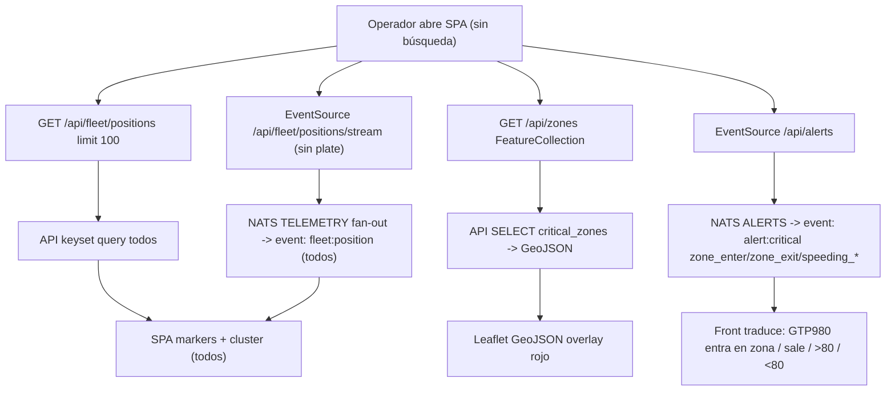
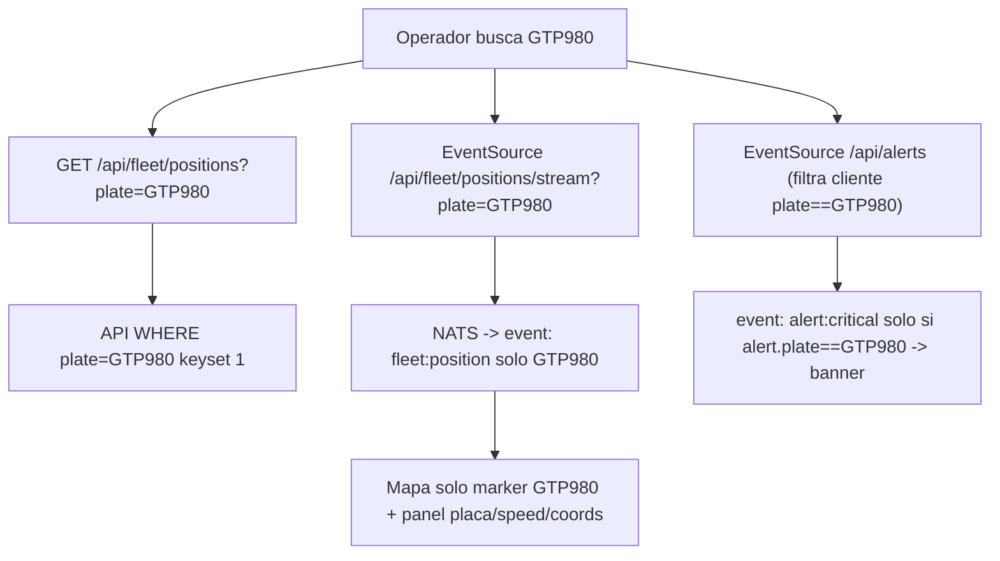
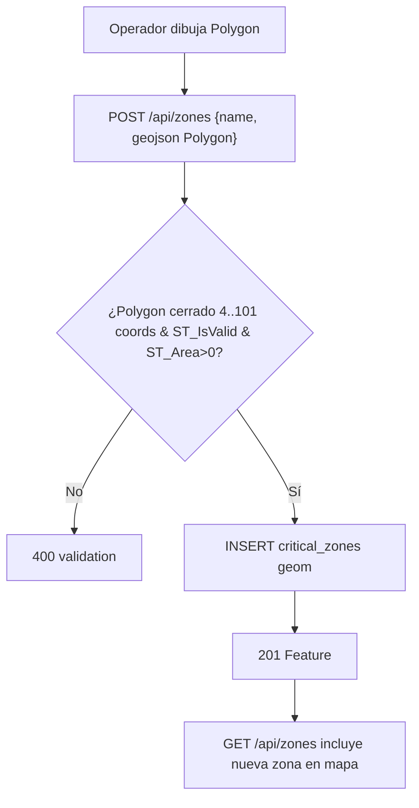
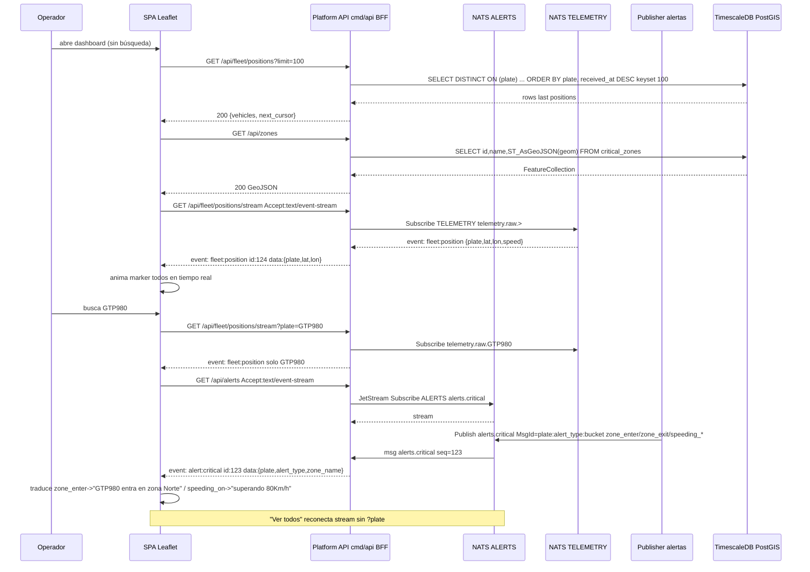
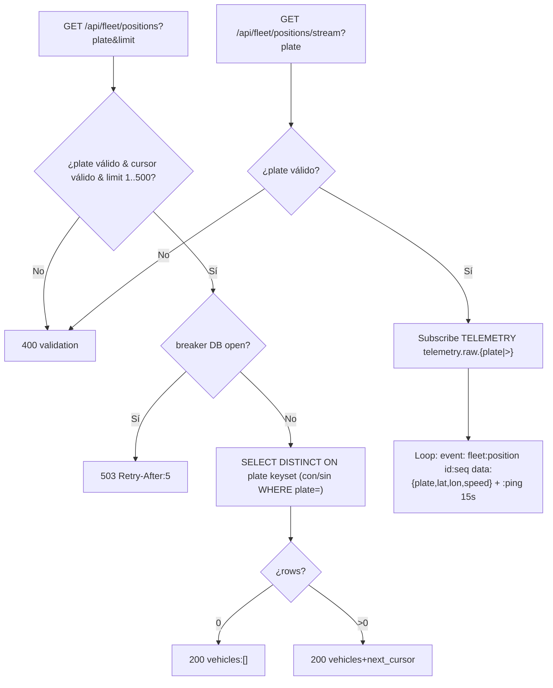
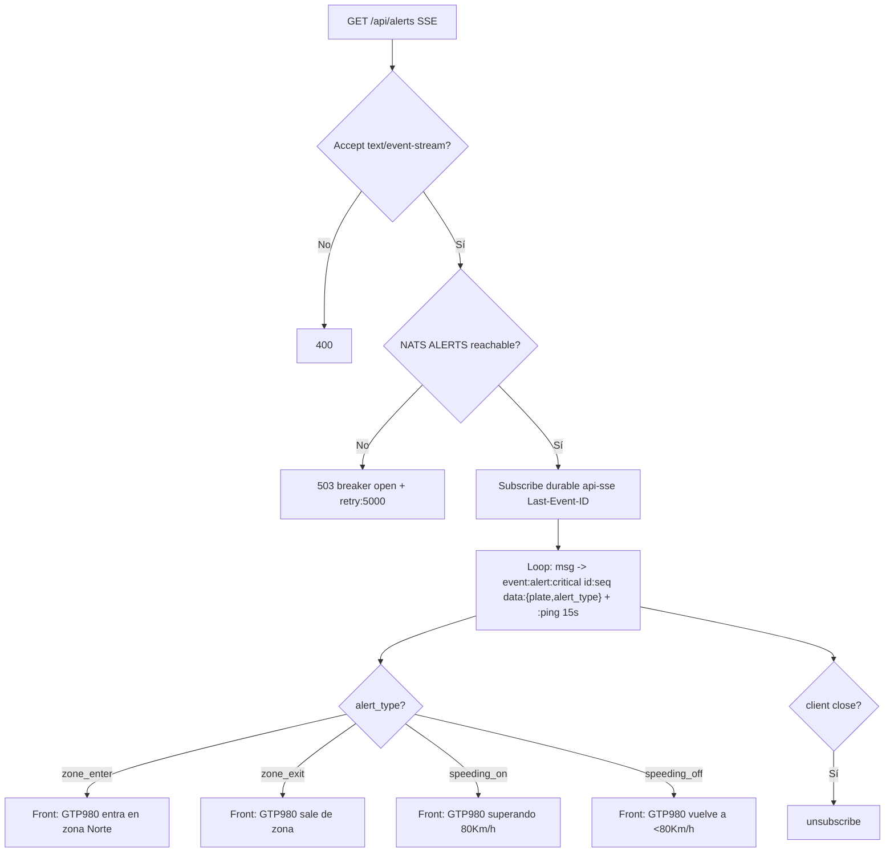

# SPEC-002: Lectura de flota, zonas críticas y alertas SSE (read path `DB/NATS -> API -> Web mapa`)

## Meta

- **SPEC-ID**: SPEC-002
- **Título**: Lectura de flota, zonas críticas y alertas en tiempo real (SSE + mapa Leaflet/OSM)
- **Estado**: approved
- **Backlog**: Portal Corporativo sec 4.C (Dashboard Reactivo: mapa, alertas SSE) + sec 4.B query canónica zonas críticas
- **Autor**: architect
- **Fecha**: 2026-08-24

## 1. Overview

SPEC-001 cerró el write path (`Mobile -> LB -> Ingest -> NATS -> Consumer -> TimescaleDB`). Falta el read path: el operador de flota debe consultar posiciones agregadas, ver en tiempo real todos los carros o solo uno al buscar por placa, ver vehículos en mapa Leaflet/OSM con clustering y zonas críticas GeoJSON, y recibir 4 alertas tipadas (`zone_enter/zone_exit/speeding_on/speeding_off >80km/h`) vía SSE. La query canónica *“¿Qué vehículos llevan detenidos más de 20 minutos en zonas críticas?”* ata mapa y agente IA a la misma fuente de verdad (`GET /api/zones` + `ST_Within`) pero vive como tool de `SPEC-003`. Este spec define el BFF `cmd/api` (cond. 9 ADR-0003: SPA nunca toca DB/NATS/Genkit), el modelo `critical_zones` + GIST, los streams `ALERTS` + fan-out `TELEMETRY → fleet:position`, y SSE `fleet:position` + `alert:critical` con `Last-Event-ID` y `:ping 15s`. Sin este slice, la telemetría queda escrita pero invisible.

## 2. Scope

### In Scope

- Read API `cmd/api` (BFF): `GET /api/fleet/positions?plate&limit&cursor` (snapshot última posición por placa, sin `plate` = flota completa) + `GET /api/fleet/positions/stream?plate` SSE `fleet:position` en tiempo real (sin `plate` = todos los carros, con `plate` = solo ese; toggle "Ver todos"), `GET /api/vehicles/{plate}/history`, `GET /api/zones` + `POST/PUT/DELETE /api/zones` GeoJSON, `GET /api/alerts` SSE, `GET /healthz` + `GET /metrics` del api
- Persistencia lectura: tabla `critical_zones(id, name, geom geometry(Polygon,4326) CHECK ST_NPoints 4..101)` + `telemetry` GIST `geom`, índice `(plate, received_at DESC)` ya en SPEC-001, continuous aggregate opcional `telemetry_hourly` no bloqueante
- Alertas SSE con 4 tipos tipados `alert_type: zone_enter | zone_exit | speeding_on (>80km/h) | speeding_off (<80km/h tras >80)`: backend publica `alerts.critical {plate, alert_type, zone_id/zone_name?, lat, lon, speed, created_at}` con `Nats-Msg-Id` dedup; front traduce a `"Carro GTP980 entra en zona crítica"` etc. La consulta `stopped >20m en zona` con `ST_Within` es tool del chat en `SPEC-003`, no detector continuo aquí
- SSE `text/event-stream`: `event: fleet:position` (posiciones) + `event: alert:critical` (alertas), `Last-Event-ID` reconexión, heartbeat `:ping`, breaker/timeout contra DB/NATS
- Mapa SPA contrato: tiles OSM directos `web -> OSM`, clustering `leaflet.markercluster` si >500 markers, consumo `GET /api/zones` GeoJSON para overlay; sin búsqueda muestra todos en tiempo real vía SSE, con `?plate` solo ese (filtro cliente o stream filtrado), "Ver todos" reconecta sin filtro
- Validación, paginación keyset, rate limit y aislamiento front↔agente (ADR-0003 cond. 9)

### Out of Scope

- `POST /api/chat` y flows/tools Genkit/Gemini (SPEC-003, ADR-0003) — incluye `stopped >20m en zona` como tool
- Auth JWT completa / scopes por flota (solo `401` reservado y `bearerAuth` en OpenAPI; healthz/metrics sin auth local)
- Placas activas/inactivas (alta/baja cuenta) y carros conectados/desconectados (app abierta/cerrada) — complejidad extra fuera del MVP de la prueba
- Mobile offline-first Expo/WatermelonDB y sync batch (SPEC-004, ya cubierto contrato batch en SPEC-001)
- Escritura telemetría `POST /v1/telemetry` y DLQ (SPEC-001)
- Terraform prod, k6 caos con 10% dup / 5% err, Grafana/Loki dashboards (perfil observability existente, no nuevo)
- Compresión/retention Timescale y vector tiles MapLibre (reservado >10k markers, ADR-0007 cond.6)

## 3. Actors and Systems

| Actor/Sistema | Tipo | Descripción | Dependencia |
|---------------|------|-------------|-------------|
| Operador de Flota | usuario | Consulta mapa, filtra flota, recibe alertas, define zonas críticas | SPA Web |
| Web SPA | sistema | React Vite + Leaflet + EventSource SSE, mapa + alertas + lista flota | Platform API |
| Platform API (`cmd/api`) | servicio | BFF HTTP/SSE, única superficie pública para SPA (ADR-0003 cond.9) | TimescaleDB, NATS ALERTS |
| Consumer Worker | servicio | Existe en SPEC-001; ampliado para evaluar alertas y publicar `ALERTS` | TimescaleDB, NATS |
| NATS JetStream | sistema | Streams `TELEMETRY` (existente) + `ALERTS` nuevo; subject `alerts.critical` | - |
| TimescaleDB + PostGIS | sistema | Hypertable `telemetry` + tabla `critical_zones` + GIST `geom` | - |
| OSM Tile Provider | sistema externo | Raster `https://{s}.tile.openstreetmap.org/{z}/{x}/{y}.png` directo `web->OSM` (ADR-0007) | - |
| AI Agent (`cmd/agent`) | sistema | Consumidor futuro de `GET /api/zones` y `alerts.critical` vía BFF (SPEC-003) | Platform API |

## 4. Use Cases

### UC-001 — Consultar estado actual de la flota (todos vs. una placa)
- **Actor**: Operador de Flota
- **Objetivo**: Sin búsqueda ver en tiempo real todos los carros; con búsqueda `GTP980` ver solo ese; poder volver a "Ver todos"
- **Preconditions**: `telemetry` con al menos 1 row por plate, `plate ~ ^[A-Z]{3}[0-9]{3}$`, `received_at` server time
- **Trigger**: `GET /api/fleet/positions` (snapshot) + `GET /api/fleet/positions/stream` SSE al cargar dashboard; `GET /api/vehicles/{plate}` o `GET ...?plate=GTP980` al buscar
- **Main Flow** (sin búsqueda — todos en tiempo real):
  1. SPA hace `GET /api/fleet/positions?limit=100` snapshot inicial
  2. Abre `EventSource /api/fleet/positions/stream` sin `plate` → recibe `event: fleet:position {plate, lat, lon, speed, received_at}` por cada telemetría
  3. Pinta `MarkerCluster` con todos y anima `marker.setLatLng([lat,lon])`; panel lateral muestra `plate/speed/coords` del seleccionado
- **Alternative Flows**:
  - 2a. Con búsqueda `GTP980` → `GET /api/fleet/positions?plate=GTP980` o `GET /api/vehicles/GTP980` + `EventSource /api/fleet/positions/stream?plate=GTP980` → solo `fleet:position` con `plate==GTP980`; o filtro cliente `if(e.data.plate===search)`; "Ver todos" reconecta sin `plate`
  - 2b. `limit` ausente -> 100 por defecto, cap 500; `cursor` inválido -> `400`
  - 2c. `plate` inválida `GTP98` -> `400`
- **Error Flows**:
  - 3a. DB caída/timeout 2s -> `503` con breaker `open`, SPA muestra stale/cache + reconnect
  - 3b. Sin datos -> `200 {vehicles:[]}` y SSE sin eventos hasta haber telemetría
- **Postconditions**: SPA renderiza markers en Leaflet clusterizados (todos) o marker único (filtrado)
- **Business Rules**: BR-001, BR-003, BR-007, BR-012

### UC-002 — Gestionar zonas críticas (GeoJSON canónico)
- **Actor**: Operador de Flota
- **Objetivo**: CRUD de zonas que alimentan simultáneamente el overlay del mapa y la tool del agente (misma fuente de verdad, ADR-0007 cond.4)
- **Preconditions**: `critical_zones` existe (`id UUID, name TEXT, geom geometry(Polygon,4326) CHECK ST_NPoints<=101`)
- **Trigger**: `GET/POST/PUT/DELETE /api/zones`
- **Main Flow**:
  1. Operador dibuja polígono en mapa y POST `/api/zones {name, geojson: Polygon closed}`
  2. API valida GeoJSON: tipo Polygon, anillo cerrado `first===last`, >=4 y <=101 coords (<=100 vértices distintos), SRID 4326, área >0
  3. Convierte a `ST_GeomFromGeoJSON` y persiste `geom`
  4. Responde `201 {id, name, geojson}`; `GET /api/zones` devuelve `FeatureCollection` canónica
- **Alternative Flows**:
  - 2a. `PUT /api/zones/{id}` actualiza `name/geom` -> `200`
  - 2b. `DELETE /api/zones/{id}` -> `204`
 - **Error Flows**:
   - 2c. Polígono no cerrado / <4 puntos / self-intersecting inválido -> `400 {error:validation, details:[...]}` sin persistir
   - 2d. `name` duplicado (case-insensitive `lower(name)`) -> `409 Conflict {error:"zone name already exists"}` (unique `critical_zones_name_unique`, migración `0003`)
   - 3a. `id` inexistente -> `404`
- **Postconditions**: `GET /api/zones` alimenta `<GeoJSON />` en Leaflet y `findVehiclesStoppedInCriticalZones` futuro
- **Business Rules**: BR-002, BR-005, BR-007

### UC-003 — Recibir alertas en tiempo real por SSE (mensajes traducidos en front)
- **Actor**: Operador de Flota
- **Objetivo**: Recibir `alert:critical` tipadas sin polling; el front traduce a `"Carro GTP980 entra en zona crítica"`, `"sale..."`, `"superando 80Km/h"`, `"vuelve a <80Km/h"`
- **Preconditions**: Stream NATS `ALERTS` existe (`storage=file, retention=limits, max_age 7d`), publisher publica `alerts.critical` con `alert_type`
- **Trigger**: `GET /api/alerts` con `Accept: text/event-stream`
- **Main Flow**:
  1. SPA abre `EventSource('/api/alerts', {headers:{'Last-Event-ID': id}})` 
  2. API suscribe JetStream `ALERTS` (durable `api-sse`) y hace `w.Write event: alert:critical\ndata: {...}\n\n`
  3. Backend publica `alerts.critical {plate, alert_type: zone_enter|zone_exit|speeding_on|speeding_off, zone_id?, zone_name?, lat, lon, speed, created_at, event_id}` con `Nats-Msg-Id=plate:alert_type:bucket` dedup
     * `zone_enter` = `ST_Within` true tras estar fuera → front `"entra en zona crítica Norte"`
     * `zone_exit` = `ST_Within` false tras estar dentro
     * `speeding_on` = `speed>80` tras `<=80`
     * `speeding_off` = `speed<=80` tras `>80`
  4. SPA recibe `data` y pinta banner/lista con mensaje traducido + highlight marker
- **Alternative Flows**:
  - 1a. Reconexión con `Last-Event-ID` -> API replay desde sequence NATS si dentro de retention
  - 1b. Heartbeat `:ping` cada 15s para mantener conexión
- **Error Flows**:
  - 2a. NATS/DB caída -> breaker `open`, `event: error` + `retry: 5000`, cliente hace backoff 0.5s->1s->2s cap 30s
  - 3a. Cliente sin `Accept: text/event-stream` -> `400`
- **Postconditions**: Alerta visible con timestamp de evento (`created_at`), no timestamp del cliente
- **Business Rules**: BR-004, BR-006, BR-007, BR-011, BR-012

### UC-004 — Visualizar flota en mapa Leaflet/OSM con clustering
- **Actor**: Operador de Flota
- **Objetivo**: Ver vehículos como markers coloreados por estado y zonas como overlay rojo semitransparente
- **Preconditions**: `GET /api/fleet/positions` y `GET /api/zones` responden, OSM tiles accesibles directo `web->OSM`
- **Trigger**: Carga de `Web Application` (Vite SPA)
- **Main Flow**:
  1. SPA fetchea posiciones + zonas en paralelo
  2. Renderiza `MapContainer` Leaflet con `TileLayer https://{s}.tile.openstreetmap.org/{z}/{x}/{y}.png`
  3. Pinta `MarkerClusterGroup` por vehículo (`color moving=blue idle=yellow alert=red`) y `<GeoJSON data={zones} style={{color:'red',fillOpacity:0.2}}/>`
  4. Click marker -> panel detalle `{plate, speed, received_at, status}`
- **Alternative Flows**:
  - 2a. >500 markers visibles -> cluster obligatorio (ADR-0007 cond.3)
  - 2b. OSM tiles fallan -> lista/alertas siguen funcionales, mapa muestra placeholder
- **Error Flows**:
  - 1a. `/api/fleet/positions` 503 -> muestra stale + banner "reconectando..."
- **Postconditions**: Mapa interactivo, sin `import leaflet` en backend, sin proxy `GET /api/tiles`
- **Business Rules**: BR-005, BR-008, BR-009

## 5. Functional Requirements

| ID | Descripción | UC Relacionado | Prioridad |
|----|-------------|----------------|-----------|
| FR-001 | Exponer `GET /api/fleet/positions?plate&limit&cursor` snapshot última posición por placa (sin `plate`=flota completa, con `plate`=solo ese; filtro `?plate=GTP980` validado `^[A-Z]{3}[0-9]{3}$`) con paginación keyset `(plate, received_at DESC)` cap 500, default 100; orden estable | UC-001 | must |
| FR-011 | Exponer `GET /api/fleet/positions/stream?plate` SSE `text/event-stream` `event: fleet:position` en tiempo real (sin `plate`=todos, con `plate`=solo ese; toggle "Ver todos" reconecta sin filtro), `id: nats-seq`, `retry:5000`, `:ping` 15s, `Last-Event-ID` replay | UC-001 | must |
| FR-002 | Exponer `GET /api/vehicles/{plate}` última posición de una placa (atajo a `fleet/positions?plate=`) y `GET /api/vehicles/{plate}/history?from&to&limit&cursor` historial ordenado `received_at DESC` con filtros `from/to` ISO8601, `lat/lon` pueden ser null | UC-001 | must |
| FR-003 | Exponer `GET /api/zones` -> GeoJSON `FeatureCollection` (Polygon, SRID 4326) + `POST /api/zones` + `PUT /api/zones/{id}` + `DELETE /api/zones/{id}`; validar polígono cerrado >=4 y <=101 coords (<=100 vértices), área>0, `409 Conflict` si `name` duplicado case-insensitive (`UNIQUE lower(name)`, `0003`) | UC-002 | must |
| FR-004 | Persistir `critical_zones(id UUID PK, name TEXT NOT NULL, geom geometry(Polygon,4326) NOT NULL, created_at TIMESTAMPTZ)` con `GIST(geom)` y `telemetry` con `GIST(geom)` | UC-002 | must |
| FR-005 | Publicar `alerts.critical` tipadas `alert_type: zone_enter | zone_exit | speeding_on | speeding_off` en NATS para SSE (`{plate, alert_type, zone_id?, zone_name?, lat, lon, speed, created_at, event_id}`) con `Nats-Msg-Id=plate:alert_type:bucket` dedup; front traduce a `"GTP980 entra en zona..."`, `"sale..."`, `"superando 80Km/h"`, `"vuelve a <80"`; `stopped >20m en zona` es tool de `SPEC-003` | UC-003 | must |
| FR-006 | Exponer `GET /api/alerts` SSE `text/event-stream` con `event: alert:critical`, `id: <nats-sequence>`, `retry: 5000`, `data: JSON`, soporte `Last-Event-ID` replay, heartbeat `:ping` 15s | UC-003 | must |
| FR-007 | Stream NATS `ALERTS` con `storage=file, retention=limits, discard=old, max_age 7d, max_bytes 1GB dev / 10GB prod`, subjects `alerts.critical`, durable `api-sse`, replicas 1 dev / 3 prod | UC-003 | must |
| FR-008 | Aislamiento BFF (ADR-0003 cond.9): SPA nunca importa `pgx/nats.go/genkit`, nunca llama Gemini/DB directo; todo pasa por `cmd/api` que valida input, aplica rate limit `10 req/min` por IP para writes zones, timeout 2s DB / 15s SSE, breaker `gobreaker` y filtra salida sin PII | UC-001..004 | must |
| FR-009 | `GET /healthz` y `GET /metrics` en `cmd/api` (breaker_state, nats_connected, db_pool, sse_clients, p95) | UC-001, UC-003 | must |
| FR-010 | Contrato mapa SPA: tiles OSM directo `https://{s}.tile.openstreetmap.org/{z}/{x}/{y}.png`, `leaflet.markercluster` obligatorio si >500 markers, `GET /api/zones` única fuente GeoJSON para mapa y futuro agente | UC-004 | must |

## 6. Business Rules

| ID | Descripción | UC/FR Relacionado |
|----|-------------|-------------------|
| BR-001 | `status` derivado: `speed>0 -> moving`, `speed=0 && now - received_at <20m -> idle`, `alert` cuando `alerts.critical` recibido por SSE (color rojo); `ST_Within && >20m` es tool de `SPEC-003` | UC-001, FR-001 |
| BR-002 | `critical_zones.geom` Polygon cerrado: primer y último coord idénticos, >=4 y <=101 posiciones (<=100 vértices distintos), winding válido, SRID 4326; área>0; `ST_IsValid(geom)` debe ser true; `name` único case-insensitive `UNIQUE lower(name)` → `409` (0003) | UC-002, FR-003/004 |
| BR-003 | Paginación keyset obligatoria: `cursor = base64(plate|received_at)`, orden `(plate ASC, received_at DESC)`; prohibido `OFFSET` para fleet/history (db-auditor) | UC-001, FR-001/002 |
| BR-004 | Idempotencia alerta SSE: dedup por `Nats-Msg-Id = {plate}:{alert_type}:{bucket}` (bucket `zone_enter/zone_exit` por `plate:zone:bucket`, `speeding_*` por `plate:bucket`); no repetir misma alerta en ventana dedup JetStream 2m | UC-003, FR-005 |
| BR-005 | GeoJSON canónico: `GET /api/zones` es única fuente para `<GeoJSON />` y para tool `findVehiclesStoppedInCriticalZones`; prohibido duplicar definición zona en frontend | UC-002/004, FR-003/010 |
| BR-006 | SSE reconexión: cliente respeta `retry: 5000` y envía `Last-Event-ID`; servidor replay desde sequence si dentro de `ALERTS.max_age 7d`; heartbeat `:ping` evita timeout LB/ALB (60s) | UC-003, FR-006 |
| BR-007 | Validación estricta: `plate ^[A-Z]{3}[0-9]{3}$` en history path, `limit 1..500`, `from/to` RFC3339, `lat/lon null` preservado, `speed int >=0` | UC-001/002/003, FR-001/002/003 |
| BR-008 | Tiles nunca por backend: prohibido `GET /api/tiles/*` proxy; `web` hace fetch directo OSM (ADR-0007 cond.1) | UC-004, FR-010 |
| BR-009 | Clustering desde 500 markers: `leaflet.markercluster` obligatorio si flota visible >500 para no matar DOM | UC-004, FR-010 |
| BR-010 | BFF filtra PII: respuestas sin `client_event_id` crudo ni trazas LLM/SQL; precisión lat/lon máx 6 decimales en API pública | UC-001..004, FR-008 |
| BR-011 | Umbral velocidad: `speeding_on` cuando `speed>80` tras `<=80`, `speeding_off` cuando `speed<=80` tras `>80` (km/h, `speed` int) | UC-003, FR-005 |
| BR-012 | Filtro flota en tiempo real: sin `plate` en `/fleet/positions(.stream)` = todos; con `?plate=GTP980` = solo ese; "Ver todos" reconecta sin filtro o filtra en cliente | UC-001, FR-001/011 |

## 7. Main Flows

#### Flow A — Carga inicial del dashboard (todos en tiempo real)

Sin búsqueda: snapshot `GET /fleet/positions` + `EventSource /fleet/positions/stream` (todos) + `EventSource /alerts`:



#### Flow A2 — Búsqueda por placa (solo ese carro)

Con `?plate=GTP980`: snapshot filtrado + stream filtrado; "Ver todos" reconecta sin filtro:



#### Flow B — CRUD de zona crítica (validación geométrica)

Operador dibuja polígono → validación cierre + ST_IsValid + ST_Area>0 → persistencia:



## 8. Alternative and Error Flows

- `GET /fleet/positions` sin cursor -> first page 100; cursor malformado/base64 inválido -> `400` con details; `?plate=GTP98` inválida -> `400`; `GET /fleet/positions/stream?plate=GTP98` inválida -> `400`; `GET /fleet/positions/stream` sin `Accept: text/event-stream` -> `400`; NATS `TELEMETRY` caído -> `503` con `retry:5000`
- `GET /vehicles/{plate}/history` plate `GTP89` (formato inválido) -> `400`; `from` después de `to` -> `400`
- `POST /zones` Polygon no cerrado (`first != last`) / <4 puntos / >101 coords (>100 vértices) / área 0 -> `400` sin INSERT, no publica evento
- `PUT /zones/{id}` id inexistente -> `404`; `DELETE` id inexistente -> `404` (idempotente opcional `204` si se prefiere)
- `GET /alerts` sin `Accept: text/event-stream` -> `400`; `Last-Event-ID` fuera de retention 7d -> replay desde último disponible + `event: snapshot`
- NATS `ALERTS` lleno (`max_bytes 1GB`) discard old -> alerta pérdida silenciosa mitigada por `jetstream_bytes >=80%` métrica (ADR-0001 cond.5)
- DB timeout >2s / breaker open -> `503 Retry-After:5`, SSE envía `event: error retry: 5000`
- OSM tiles `429` rate limit -> mapa degradado, alertas/lista siguen operativas
- PII: cualquier intento de exponer `client_event_id` crudo en `GET /fleet/positions` -> filtrado en adapter HTTP (BR-010)

## 9. State and Transitions

Estados de `api-sse` client + breaker DB (aplica a `fleet:position` y `alert:critical`; dos instancias del mismo FSM por stream):

| Estado | Evento | Siguiente Estado | Condición |
|--------|--------|------------------|-----------|
| `IDLE` | `subscribe` (`/fleet/positions/stream` o `/alerts`) | `CONNECTED` | NATS `TELEMETRY`/`ALERTS` reachable, DB pool healthy (para snapshot) |
| `CONNECTED` | `nats msg fleet:position` o `alerts.critical` | `CONNECTED` | `w.Write event: fleet:position|alert:critical id:seq data:{...}` |
| `CONNECTED` | `heartbeat 15s` | `CONNECTED` | `:ping` keepalive |
| `CONNECTED` | `db timeout / NATS disconnect` | `HALF_OPEN` | breaker `open`, SSE `event: error retry:5000` |
| `HALF_OPEN` | `probe success <2s` | `CONNECTED` | breaker `half-open -> closed` |
| `CONNECTED` | `client close / context cancel` | `IDLE` | `EventSource.close()` + `r.Context().Done()` |

Transiciones inválidas: `IDLE -> HALF_OPEN` sin subscribe. Estados finales: `IDLE`.

## 10. API / Interface Contracts

- **Endpoint**: `GET /api/fleet/positions`
  - Query: `plate string ^[A-Z]{3}[0-9]{3}$ opcional (sin plate=todos, con plate=solo ese)`, `limit int 1..500 default 100`, `cursor string base64(plate|received_at)` opcional
  - Response `200 {vehicles:[{plate, lat nullable, lon nullable, speed int, received_at RFC3339, status enum[moving|idle|alert], zone_id nullable}], next_cursor string|null}`
  - Errores: `400` cursor/plate inválido, `429` rate 10/min IP (writes only), `503` breaker open `Retry-After:5`
  - Auth: `bearerAuth` reservado, `security: []` en MVP (BR-007/BR-012)
- **Endpoint**: `GET /api/fleet/positions/stream` SSE
  - Query: `plate string ^[A-Z]{3}[0-9]{3}$ opcional (sin plate=todos en tiempo real, con plate=solo ese)`; Header `Accept: text/event-stream` + `Last-Event-ID` opcional
  - Response `200 text/event-stream` con `event: fleet:position\ndata: {plate, lat, lon, speed, received_at}\n\n` por cada telemetría + `:ping` 15s + `retry:5000`
  - Errores: `400` plate inválido, `503` NATS no disponible
- **Endpoint**: `GET /api/vehicles/{plate}` (atajo) + `GET /api/vehicles/{plate}/history`
  - Path: `plate ^[A-Z]{3}[0-9]{3}$`
  - Query `GET /vehicles/{plate}` → `200 VehiclePosition` última pos; `GET /history` Query: `from, to RFC3339 opcional, limit 1..500 default 100, cursor`
  - Response `200 {points:[{lat,lon,speed,received_at,occurred_at}], next_cursor}` + `200 VehiclePosition` para single
  - Errores: `400` plate inválido / from>to, `404` plate sin datos -> `200 {points:[]}` (no 404), `503`
- **Endpoint**: `GET /api/zones`
  - Response `200 GeoJSON FeatureCollection {type:FeatureCollection, features:[{type:Feature, id:UUID, properties:{name}, geometry:{type:Polygon, coordinates:[[[lon,lat]...]]}}]}`
 - **Endpoint**: `POST /api/zones`
  - Request `{name string 1..100, geojson: {type:Polygon, coordinates:[[[lon,lat]...]]}}`
  - Response `201 Feature` / `400 validation` / `409 duplicate name (lower(name))` / `429` / `503`
 - **Endpoint**: `PUT /api/zones/{id}` + `DELETE /api/zones/{id}` similares (`200`/`204`, `400`/`404`/`409` para PUT duplicado/`503`)
- **Endpoint**: `GET /api/alerts` SSE
  - Request header `Accept: text/event-stream` + `Last-Event-ID` opcional
  - Response `200 text/event-stream` con `event: alert:critical\ndata: {plate, alert_type: zone_enter|zone_exit|speeding_on|speeding_off, zone_id?, zone_name?, lat, lon, speed, created_at, event_id}\n\n` + `:ping` cada 15s + `retry: 5000`
  - Front traduce: `zone_enter`→`"Carro GTP980 entra en zona crítica Norte"`, `zone_exit`→`"sale..."`, `speeding_on`→`"superando 80Km/h"`, `speeding_off`→`"vuelve a <80Km/h"` (BR-011)
  - Errores: `400` Accept inválido, `503` NATS no disponible
- **Endpoints ops**: `GET /healthz` `{status, breaker, nats, db}` y `GET /metrics` Prometheus (`api_sse_clients, db_pool_inflight, p95_api_ms, breaker_state, nats_pending`)

Referencia: `contracts/http.openapi.yaml` (OpenAPI 3.1) y `contracts/events.asyncapi.yaml` (AsyncAPI 3, `alerts.critical`, `Nats-Msg-Id` dedup bucket)

## 11. Sequence Diagrams



## 12. Flow Diagrams

#### Flow 1 — `GET /api/fleet/positions` + `stream` (todos vs. una placa)

Snapshot keyset + SSE `fleet:position` filtrado por `?plate` (sin `plate`=todos, con `plate`=solo ese):



#### Flow 2 — `GET /api/alerts` SSE con 4 tipos (traducción front)

`alert_type` zone_enter/zone_exit/speeding_on/speeding_off → front traduce a mensaje humano:



## 13. Non-Functional Requirements

| ID | Categoría | Descripción |
|----|-----------|-------------|
| NFR-001 | performance | `GET /fleet/positions` p95 <150ms para 100 rows con keyset, índice `(plate, received_at DESC)`; `GET /history` p95 <200ms; SSE `fleet:position` y `alert:critical` latencia evento->cliente <2s |
| NFR-002 | scalability | Soporta 5k vehículos, `GET /fleet/positions` pagina 100/req sin OFFSET + `fleet:position` fan-out `telemetry.raw.>` sin scan DB; clustering OSM evita DOM thrash >500 markers; `ALERTS` 1GB/7d retiene ~50k alertas/día sin escanear hypertable por request |
| NFR-003 | availability | Stateless `api` + LB, drain 15-30s; breaker DB/NATS con `half-open 30s`, `healthz` expone states; SSE reconexión backoff 0.5->30s cap |
| NFR-004 | reliability | At-least-once `alerts.critical` con `Nats-Msg-Id` dedup bucket 20m + `MaxDeliver 3` si consumer alert fail; replay SSE via `Last-Event-ID` dentro de retention |
| NFR-005 | observability | `metrics` con `api_sse_clients, db_pool_inflight, nats_pending, p95_api_ms, breaker_state`, `slog` JSON `plate, zone_id, event_id`, OTel trace opcional `OTEL_ENABLED` |
| NFR-006 | security | BFF ADR-0003 cond.9: sin `pgx/nats/genkit` en `web`, sin secretos en frontend, input validation estricta, rate 10 req/min por IP para `POST/PUT/DELETE /zones`, no PII en payload SSE |
| NFR-007 | backward compatibility | `GET /api/zones` FeatureCollection estable; añadir campos (`area`, `created_at`) no rompe SPA existente; `GET /fleet/positions` cursor opaque |

## 14. Acceptance Criteria

```gherkin
AC-001 (UC-001, FR-001/011, BR-001/003/007/012):
  Given 3 placas GTP890, TTY423, ABC123 con 1..5 telemetrías cada una en telemetry (received_at server time, geom generado) y `EventSource /fleet/positions/stream` conectado
  When GET /api/fleet/positions?limit=2 sin plate
  Then 200 {vehicles:2 con última fila por plate (lat/lon nullable, speed int, received_at RFC3339, status enum), next_cursor opaque base64} y page 2 con cursor devuelve el restante; p95 <150ms; sin OFFSET en query (explain); When GET /api/fleet/positions?plate=GTP980 Then 200 solo GTP980; When GET /api/fleet/positions/stream sin plate Then event: fleet:position todos; When ?plate=GTP980 Then solo ese; "Ver todos" reconecta sin plate

AC-002 (UC-001, FR-002, BR-003/007):
  Given plate GTP890 con 10 puntos en 1h
  When GET /api/vehicles/GTP890/history?from=2026-08-24T10:00:00Z&to=2026-08-24T11:00:00Z&limit=5
  Then 200 {points:5 ordenados received_at DESC, next_cursor} ; When plate GTP89 When 400 validation; When from>to Then 400

AC-003 (UC-002, FR-003/004, BR-002/005):
  Given Polygon cerrado [[-74.07,4.71],[-74.05,4.71],[-74.05,4.73],[-74.07,4.73],[-74.07,4.71]]
  When POST /api/zones {name:"Zona Norte", geojson: Polygon}
  Then 201 {id UUID, name, geojson} y GET /api/zones contiene Feature con ST_IsValid true, ST_Area>0 y ST_NPoints<=101; When Polygon no cerrado o 3 puntos o línea degenerada área 0 (4 coords colineales/duplicate) o >101 coords Then 400 {error:validation, details:["first==last", "ST_Area>0", "ST_NPoints<=101"]} sin INSERT; When POST mismo name (case-insensitive) Then 409 {error:"zone name already exists"} por UNIQUE lower(name) (0003)

AC-004 (UC-002, FR-003, BR-002):
  Given zona id abc-123 existe
  When PUT /api/zones/abc-123 {name:"Zona Norte v2", geojson: Polygon nuevo} y DELETE /api/zones/abc-123
  Then 200 y 204 respectivamente; When id inexistente Then 404; When geojson inválido Then 400

AC-005 (UC-003, FR-005/006/007, BR-004/006/011):
  Given 4 alertas `alerts.critical {plate:GTP980, alert_type: zone_enter|zone_exit|speeding_on|speeding_off, lat, lon, speed, zone_name?}` publicadas con `Nats-Msg-Id=plate:alert_type:bucket` (zone_enter/zone_exit con zone_id, speeding con bucket por velocidad)
  When EventSource GET /api/alerts
  Then recibe `event: alert:critical id:seq data:JSON` en <2s y `:ping` cada 15s; front traduce zone_enter→"GTP980 entra en zona Norte", zone_exit→"sale...", speeding_on→"superando 80Km/h", speeding_off→"vuelve a <80"; When mismo `Nats-Msg-Id` re-publicado en ventana dedup 2m Then no duplica; Nota: `stopped >20m` es tool de SPEC-003

AC-006 (UC-003, FR-006, BR-006):
  Given cliente SSE conectado con id 100, se desconecta y reconecta con Last-Event-ID: 100
  When GET /api/alerts Header Last-Event-ID:100
  Then replay desde 101 si dentro de retention 7d; When sin Accept:text/event-stream Then 400; When NATS caído Then 503 y event: error retry:5000 con backoff cliente 0.5s->30s

AC-007 (UC-004, FR-010, BR-008/009):
  Given SPA Vite con Leaflet
  When renderiza mapa
  Then tiles fetch directo a https://{s}.tile.openstreetmap.org sin pasar por /api/tiles (depguard bloquea import leaflet en backend) y con 600 markers usa markercluster (DOM <500 nodes); When GET /api/zones Entonces overlay GeoJSON rojo fillOpacity 0.2 visible

AC-008 (UC-001..004, FR-008, BR-010):
  Given SPA intenta importar pgx/nats/genkit o llamar directo a Gemini/DB
  When CI depguard y BFF check
  Then build falla y request directa 401/403; When GET /api/fleet/positions Then payload sin client_event_id ni secrets, lat/lon máx 6 decimales

AC-009 (UC-001, FR-009, NFR-005):
  Given docker compose up default + profile observability opcional
  When curl /healthz y /metrics en api
  Then 200 {status:"ok", breaker:"closed", nats:"connected", db:"ok"} y metrics expone api_sse_clients, p95_api_ms, breaker_state
```

## 15. Functional Test Scenarios

| ID | UC/FR/AC | Preconditions | Input | Action | Expected Result |
|----|----------|---------------|-------|--------|-----------------|
| TS-001 | UC-001, FR-001/011, AC-001 | telemetry 3 plates 5 rows c/u, índice plate/received_at, NATS TELEMETRY up | `GET /api/fleet/positions?limit=2` + `GET ...?plate=GTP980` + `GET /fleet/positions/stream` y `?plate=GTP980` | GET + SSE | 200 2+1 all, 200 solo GTP980 con ?plate, SSE todos vs. solo GTP980 con filtro, "Ver todos" reconecta sin plate, no OFFSET |
| TS-002 | UC-001, FR-002, AC-002 | GTP890 10 puntos 10:00-11:00 | `GET /vehicles/GTP890/history?from=10:00&to=11:00&limit=5` | GET | 200 5 DESC, cursor; GTP89 ->400, from>to ->400 |
| TS-003 | UC-002, FR-003/004, AC-003 | DB vacía zones | `POST /api/zones {name, Polygon cerrado 5 coords}` | POST + GET /zones | 201 Feature, ST_IsValid, ST_Area>0, ST_NPoints<=101, GET contiene zona; Polygon abierto 3 pts ->400; Polygon 4 coords colineales área 0 ->400; Polygon 102 coords (>100 vértices) ->400 |
| TS-004 | UC-002, FR-003, AC-004 | zona abc-123 existe | `PUT /zones/abc-123 {nuevo Polygon}` + `DELETE` + `GET` inexistente | PUT/DELETE | 200/204, 404 para random UUID, 400 geojson inválido |
| TS-005 | UC-003, FR-005/006/007, AC-005 | NATS ALERTS up, 4 alertas tipadas publicadas | `Publish alerts.critical zone_enter/zone_exit/speeding_on/speeding_off {plate:GTP980}` + `GET /api/alerts` EventSource | publish + SSE | SSE `event:alert:critical` <2s con `id:seq`, front traduce 4 mensajes, `:ping` 15s, dedup 2m no duplica mismo `Nats-Msg-Id` |
| TS-006 | UC-003, FR-006, AC-006 | SSE conectado seq 100, NATS msgs 101..102 | `GET /alerts` Last-Event-ID:100 + Accept inválido + NATS down | reconnect / bad header / NATS stop | replay 101..102, 400 sin Accept, 503 + retry:5000 y backoff |
| TS-007 | UC-004, FR-010, AC-007 | SPA built Vite | render MapContainer + 600 markers + fetch /zones | mount + network inspect | tiles directo OSM 200, no request /api/tiles, markercluster activo, GeoJSON overlay rojo 0.2 |
| TS-008 | UC-001..004, FR-008, AC-008 | web/ src | `grep -r pgx\|nats.go\|genkit` en web/ + `GET /fleet/positions` payload | CI depguard + curl | depguard fail si import, payload sin client_event_id, lat/lon 6 dec, sin secrets |
| TS-009 | UC-001, FR-009, AC-009 | compose up --wait | `curl /healthz` + `curl /metrics` | GET | 200 breaker closed, nats connected, metrics api_sse_clients etc. |
| TS-010 | UC-003, FR-005, AC-005 borde | 2 publicaciones misma alerta con igual `Nats-Msg-Id` en ventana 2m | publish x2 mismo MsgId + SSE | publish | 1 solo evento en SSE (segundo dedup por JetStream DuplicateWindow) |

## 16. Open Questions

- [x] ¿Zonas críticas referencia? — Resuelto por ADR-0007: GeoJSON Polygon, tabla `critical_zones`, misma fuente mapa+agente.
- [x] ¿SSE vs WebSocket? — Resuelto: SSE `EventSource` (realtime-dashboard skill) con `Last-Event-ID` y `:ping 15s`.
- [x] ¿Detección alerta sync o async? — Resuelto en SPEC-002 como SSE genérico `ALERTS` (publish genérico, no ticker de zona); la evaluación `ST_Within + >20m` es tool del chat y se resuelve en SPEC-003.
- [ ] ¿Auth JWT para `/api/zones` writes? — MVP sin auth, `bearerAuth` reservado en OpenAPI y `429` por IP; producción agregará JWT scopes por flota (no bloquea draft -> puede ir a approved con nota).
- [ ] ¿Continuous aggregate `telemetry_hourly` para historial? — Opcional no bloqueante; se marca como enh y no se exige para AC-002.

## 17. Assumptions

- BFF aislamiento ADR-0003 cond.9 es vinculante: `cmd/api` existe y es única superficie pública; `web` no conoce DSN.
- `telemetry` ya tiene `geom GEOGRAPHY(Point)` GENERATED (SPEC-001); SPEC-002 solo añade `GIST(geom)` y `critical_zones`.
- NATS JetStream file store tolera pérdida R1 2min (ADR-0001 cond.6) para `ALERTS` y `TELEMETRY` fan-out a SSE también.
- Tiles OSM directos sin key y sin proxy; rate limit OSM generoso para MVP.
- `limit_req` en LB y `x/time/rate` en `api` para `POST /zones` (10/min IP) son suficientes sin auth.
- Placas activas/inactivas y conectado/desconectado son extra fuera de MVP y no se modelan (toda placa con telemetría es "activa" y "conectada" si `now - received_at <5m`).
- Umbral velocidad 80 km/h para `speeding_*` es fijo MVP (BR-011); parametrizable vía env en futuro.

---

## Trazabilidad

```
UC-001 -> FR-001, FR-011, FR-002, BR-001/003/007/012 -> AC-001, AC-002 -> TS-001, TS-002
UC-002 -> FR-003, FR-004, BR-002/005/007 -> AC-003, AC-004 -> TS-003, TS-004
UC-003 -> FR-005, FR-006, FR-007, BR-004/006/011 -> AC-005, AC-006 -> TS-005, TS-006, TS-010
UC-004 -> FR-010, BR-008/009/005 -> AC-007 -> TS-007
UC-001..004 -> FR-008, FR-009, BR-010 -> AC-008, AC-009 -> TS-008, TS-009
```

## Contratos

- HTTP/SSE: `contracts/http.openapi.yaml` (OpenAPI 3.1, `GET /api/fleet/positions?plate`, `GET /api/fleet/positions/stream?plate` SSE `fleet:position`, `/vehicles/{plate}(/history)`, `/zones`, `GET /api/alerts` SSE 4 tipos)
- Eventos NATS: `contracts/events.asyncapi.yaml` (AsyncAPI 3, `alerts.critical` 4 tipos + `telemetry.raw.{plate}` fan-out `fleet:position`, `Nats-Msg-Id` dedup)

## Validación (pre-entrega)

- [ ] Cada UC tiene flujo principal
- [ ] Cada UC contempla errores/alternativas relevantes
- [ ] Cada FR está relacionado a UC cuando corresponde
- [ ] Cada comportamiento importante tiene AC
- [ ] Cada AC tiene al menos un TS
- [ ] No hay TS que introduzcan requisitos inexistentes
- [ ] Diagramas representan comportamiento, no implementación
- [ ] No hay decisiones técnicas prematuras (solo qué/por qué)
- [ ] Ambigüedades en Open Questions resueltas o marcadas no bloqueantes
