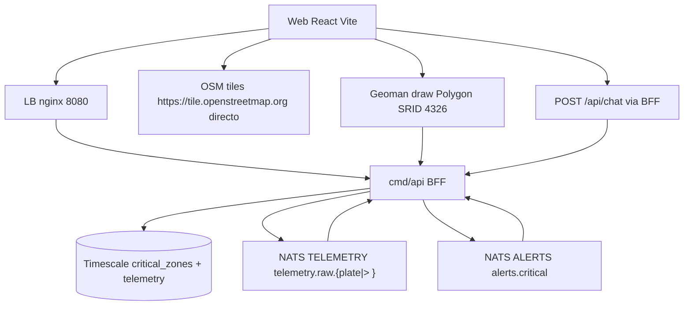

# Plan — SPEC-004: SPA Portal refine (Monitoring + Critical zones con dibujo real)

## Meta

- **SPEC-ID**: SPEC-004
- **Spec**: `docs/specs/SPEC-004-spa-portal-dashboard/spec.md` (approved)
- **Autor**: architect
- **Fecha**: 2026-08-26
- **Rama**: `feature/spa-portal-dashboard`
- **Estado**: approved

## 1. Summary

Pulir `web/` React Vite para cumplir las 8 maquetas: top tabs `Monitoring|Critical zones`, card vehículo `Plate/Lat/Lon/Speed⚠️/Status green-red/Last update` con regex `^[A-Z]{3}[0-9]{3}$`, `Clear vehicle info` que vuelve a flota completa, bottom tabs fijos `Alerts|Chat AI` `overflow-auto`, dibujo de polígono con coords reales EPSG:4326 en `Critical zones` (`Geoman` draft -> `Create zone` habilitado -> modal `Zone name [Accept][Cancel]` -> `POST /api/zones`), listado alternado y edición por doble click (`PUT` rename / `DELETE`). Reusa BFF `cmd/api`/`ALERTS`/`TELEMETRY` de SPEC-002/003 (cero backend nuevo), fija OSM directo y clustering >500. Riesgo: estado `activeTop`/`activeBottom` inconsistente, draft huérfano y modales sin scroll fijo.

## 2. Specification Traceability

| Spec ID | Requirement / Use Case | Technical Change | Tests |
|---------|------------------------|------------------|-------|
| FR-001 (UC-001) | Search plate regex front + GET ?plate + stream?plate filtrado | `web/src/features/monitoring/VehicleSearch.tsx` + `useFleetStream.ts` | TEST-001 AC-001/ AC-003 |
| FR-002 (UC-001) | Card Speed/Status/Last update, ⚠️ >80, not-found mantiene flota | `VehicleCard.tsx` + `VehicleStatusBadge.tsx` | TEST-001 AC-001/ AC-002 |
| FR-003 (UC-001) | Clear vehicle info reconecta sin plate | `VehicleSearch` + `fleetStore.ts` zustand `selectedPlate` | TEST-001 AC-001/ AC-010 |
| FR-004 (UC-002/003) | Monitoring bottom tabs fijos altura proporcional `h-[280px] lg:h-[340px]` | `App.tsx` + `portalStore activeBottom` | TEST-003/004 AC-004/ AC-005 |
| FR-005 (UC-002) | Alerts lista SSE 4 tipos `alert:critical` | `AlertsPanel.tsx` + `useAlertsSSE.ts` | TEST-003 AC-004 |
| FR-006 (UC-003) | Chat AI embed `POST /api/chat` | `ChatTab.tsx` + `chat/ChatWidget.tsx` reuse | TEST-004 AC-005 |
| FR-007 (UC-005) | Top Monitoring\|Critical zones tabs sin reload | `App.tsx` + `portalStore.ts` `activeTop` | TEST-010 AC-011 |
| FR-008 (UC-004) | Critical zones layout Zones list + Map GeoJSON 0.2 | `features/zones/ZonesList.tsx` + `ZonesMap.tsx` | TEST-005 AC-006 |
| FR-009 (UC-004) | Dibujo polígono Geoman draft -> Create zone enabled | `ZoneDrawControl.tsx` | TEST-006 AC-007 |
| FR-010 (UC-004) | Modal crear Zone name -> POST /api/zones | `CreateZoneModal.tsx` | TEST-006/007 AC-007/ AC-008 |
| FR-011 (UC-004) | Zones list dblclick -> modal Rename/Delete -> PUT/DELETE | `EditZoneModal.tsx` | TEST-008 AC-009 |
| FR-012 (UC-001/004) | Leaflet OSM directo + cluster >500 | `map/Map.tsx` reuse | TEST-009 AC-010 / TEST-011 AC-012 |
| BR-001..015 | reglas status, regex, fixed height, habilitado draft etc. (sequencial) | domain-less React guards | AC trace |

## 3. Technical Context

- Web actual (SPEC-002/003): `web/src/map/Map.tsx` con `MapContainer TileLayer OSM + MarkerClusterGroup + GeoJSON`, `hooks/useSSE.ts`, `store/fleetStore.ts` zustand `selectedPlate`, `chat/ChatWidget.tsx` con `useChatApi`, `lib/api.ts` `VITE_API_BASE_URL`, `package.json` deps `react 18, react-leaflet 4, leaflet 1.9, leaflet.markercluster, zustand, react-markdown`. Tests Vitest jsdom msw 94.9% cover.
- Backend intacto: `cmd/api` BFF, `cmd/consumer` detector 4 tipos, streams `TELEMETRY telemetry.raw.{plate|>}`, `ALERTS alerts.critical`, `critical_zones` PostGIS, lb nginx `/api -> api:8080` `proxy_buffering off`, `GET /healthz|/metrics`.
- Nueva dependencia UI: `@geoman-io/leaflet-geoman-free ^2.14` (MIT) para dibujo; fallback `leaflet-draw 1.0.4` si licencia bloquea CI. No backend deps nuevas.
- Estado: `web/src/store/portalStore.ts` + `fleetStore.ts` ampliar `activeTop:'monitoring'|'zones'`, `activeBottom:'alerts'|'chat'`, `selectedPlate:string|null`, `draftPolygon: GeoJSON.Polygon|null`, `zones: FeatureCollection`.
- Infra: `web` Vite SPA, `lb` único entry `8080`, `VITE_API_BASE_URL` env, `depguard` prohíbe `pgx/nats/genkit` en web.

## 4. Architecture Changes

Nuevos: `web/src/features/monitoring/{VehicleSearch.tsx, VehicleCard.tsx, VehicleStatusBadge.tsx}`, `features/zones/{ZonesList.tsx, ZonesMap.tsx, ZoneDrawControl.tsx, CreateZoneModal.tsx, EditZoneModal.tsx}`, `store/portalStore.ts`, `hooks/{useFleetStream.ts, useAlertsSSE.ts}`, `lib/plate.ts` regex.

Modificados: `web/src/App.tsx` (top+bottom tabs, grid proporcional), `map/Map.tsx` (props `filteredVehicles`, `zones`, `onDrawCreate`), `store/fleetStore.ts` (add `selectedPlate`+`setSelectedPlate` reuse), `chat/ChatWidget.tsx` (embebido en tab fijo), `web/package.json`, `web/src/lib/api.test.ts` add plate regex, `infra/postman` no change (reusa).

Eliminados: nada.



Particionado futuro >10k markers MapLibre vector reservado ADR-0007 cond.6; no aplica aquí.

## 5. Detailed Technical Design

- **Componente `VehicleSearch + Card` (`web/src/features/monitoring`)**:
  - `lib/plate.ts: export const PLATE_RE = /^[A-Z]{3}[0-9]{3}$/; export function isValidPlate(s:string):boolean` usado en input `onChange` para `setError` y `disabled` Search. Backend re-valida.
  - `VehicleSearch.tsx`: `<input aria-label="Plate" value={plate} onChange> <button disabled={!isValidPlate(plate)} onClick={() => setSelectedPlate(plate.toUpperCase())}>Search</button> <span hint>3 letras + 3 dígitos</span>`.
  - `VehicleCard.tsx`: props `vehicle: {plate,lat,lon,speed,received_at,status}|null` + `notFound:boolean`. Render `Plate/Lat/Lon` (`lat==null?"—":lat.toFixed(6)`), `Speed: {speed} {speed>80?"⚠️":null}`, `Status: <span style={{color: status==='moving'?'#16a34a':'#dc2626'}}>{status}</span>`, `Last update: {new Date(received_at).toLocaleTimeString()}`. Si `notFound` muestra `placa no encontrada` en contenedor `min-h-[120px]` y mantiene `fleetStore.vehicles` todos.
  - `useFleetStream.ts`: `useEffect` si `selectedPlate` -> `EventSource /api/fleet/positions/stream?plate=${selectedPlate}` else `/stream`, `onmessage fleet:position -> setVehicle + setVehicles(map) + map.setView`. Backoff `0.5*2 cap30` en `onerror`.
  - `Clear vehicle info` verde menta `bg-emerald-300`: `onClick={() => { setPlate(""); setSelectedPlate(null); setNotFound(false); }}` y cierra SSE filtrado en hook.

- **Componente `Bottom Tabs` (`portalStore.ts`)**:
  - `create<PortalState>((set)=>({activeTop:'monitoring', activeBottom:'alerts', draftPolygon:null, setActiveTop, setActiveBottom, setDraftPolygon}))`.
  - `App.tsx`: header `FLEET MONITORING PLATFORM` + `<TopTabs value={activeTop}>` negro activo `#1f2937`. Contenido `activeTop==='monitoring'` -> `grid lg:grid-cols-2 gap-4` izq `VehicleSearch+Card+Clear` der `Map filtered`, abajo ` <BottomTabs>` `Alerts`/`Chat AI` `className="h-[280px] lg:h-[340px] overflow-y-auto border rounded"` proporcional maquetas. `activeTop==='zones'` -> `grid lg:grid-cols-[35%_65%]`.

- **Componente `Zones` (`features/zones`)**:
  - `ZonesList.tsx`: `GET /api/zones` via `useQuery` o `useEffect fetch ${base}/api/zones`, `zones.features.map((f,i)=> <div onDoubleClick(()=>openEdit(f)) className={i%2===0?'bg-emerald-100':'bg-cyan-100'}>{f.properties.name}</div>)` container `h-[360px] lg:h-[480px] overflow-y-auto`. Doble click abre `EditZoneModal`.
  - `ZonesMap.tsx`: envuelve `Map.tsx` con `GeoJSON data={zones} style={{color:'red', fillOpacity:0.2}}` + `ZoneDrawControl`. Si `activeTop==='zones'` montar Geoman.
  - `ZoneDrawControl.tsx`: `useMap()` -> `map.pm.addControls({drawPolygon:true, editMode:false, cutPolygon:false, removalMode:true})`, `map.on('pm:create', e=>{ if(e.shape==='Polygon'){ const gj=e.layer.toGeoJSON(); const coords=gj.geometry.coordinates; const draft=gj.geometry; setDraftPolygon(draft as any); map.removeLayer(e.layer); addDraftLayer(draft); }})`, `pm:remove` limpia `draftPolygon` y deshabilita botón. Validación cliente `coords[0].length>=4 && coords[0].length<=101 && first==last` else hint.
  - `CreateZoneModal.tsx`: `props open, draft, onClose, onCreated`. `if(!open) return null` Portal `role=dialog aria-modal`. Input `value name`, `error` state. `Accept disabled={!name.trim() || !draft}` -> `POST /api/zones {name: name.trim(), geojson:{type:"Polygon", coordinates: draft.coordinates}}` con `getApiBase()`, handle `201` -> `onCreated -> GET /api/zones refresh` + `setDraftPolygon(null)` + `removeDraftLayer`, `409` -> `setError("zone name already exists")` bajo input, `400` -> `setError(details)`. `Cancel` -> `onClose` sin POST pero **no** limpia draft salvo que se quiera; spec dice descarta draft -> `removeDraftLayer` + `setDraftPolygon(null)`.
  - `EditZoneModal.tsx`: `props zone, open, onClose`. Input `prefill zone.properties.name`, botones `Rename` -> `PUT /api/zones/${zone.id} {name}` (conserva `geojson` original fetched), `Delete` -> `DELETE /api/zones/${id}`, `Cancel`. Mismos errores `409/400/404`.

- **Componente `AlertsPanel` + `ChatTab`**:
  - `useAlertsSSE.ts` reuse `useSSE('/api/alerts')` -> `alerts: Alert[]` con `event: alert:critical` parse `JSON`, unshift al array.
  - `AlertsPanel.tsx`: `div className="space-y-2"` cada alert `plate + alert_type traducido`: `zone_enter->entra en zona ${zone_name}`, `speeding_on->superando 80Km/h` etc. + `created_at` HH:mm.
  - `ChatTab.tsx`: ` <ChatWidget />` existente envuelto en `div h-[280px] lg:h-[340px] overflow-y-auto` con `className` fijo.

- **Dependencias**: `@geoman-io/leaflet-geoman-free` (elegida por bundle 30KB, touch, activa) vs `leaflet-draw` descartada por mantenimiento. `jsdom` ya para tests, `msw` para mocks `/api/zones`.

- **Archivos concretos**: `web/src/store/portalStore.ts`, `features/monitoring/VehicleSearch.tsx`, `features/monitoring/VehicleCard.tsx`, `features/zones/*`, `hooks/useFleetStream.ts`, `App.tsx` refactor, `web/src/lib/plate.ts`.

## 6. API Changes

| Endpoint | Método | Cambio | Compat | Validaciones |
|----------|--------|--------|--------|--------------|
| `GET /api/fleet/positions?plate` | GET | reuso, card `limit=1` | compat | `plate` regex, `lat/lon` 6 dec |
| `GET /api/fleet/positions/stream?plate` | GET SSE | reuso filtrado vs todos | compat | `plate` regex, `Accept` |
| `GET /api/zones` | GET | reuso canónico | - | FeatureCollection |
| `POST /api/zones` | POST | reuso | - | Polygon 4..101 SRID4326, 409 lower(name) |
| `PUT /api/zones/{id}` | PUT | reuso rename | - | 409/400 |
| `DELETE /api/zones/{id}` | DELETE | reuso delete | - | 404 |
| `GET /api/alerts` | GET SSE | reuso | - | 4 tipos |
| `POST /api/chat` | POST | reuso | - | 10/min |

No OpenAPI nuevo; linteado `redocly lint` existente debe seguir verde.

## 7. Data Changes

Ninguna migración nueva. Reusa `critical_zones` SPEC-002. Confirma `GIST(geom)` y `CHECK ST_NPoints 4..101` ya existen. Si falta índice, `db-auditor` lo señala pero no bloquea este spec web.

## 8. Event / Messaging Changes

Reusa `ALERTS` `alerts.critical` y `TELEMETRY telemetry.raw.{plate|>}`. Para `stream?plate` filtrado backend ya hace `subscribe telemetry.raw.TTF678` vs `telemetry.raw.>`.

## 9. Observability

- Front: `useFleetStream` log `console.warn [fleet] reconnect backoff`, `useAlertsSSE` `slog` ya en backend.
- Metrics backend siguen `api_sse_clients` para ambos SSE.
- No nuevo dashboard Grafana; opcional `web vitals` `web-vitals` enh.

## 10. Security

- Regex front `PLATE_RE` no sustituye backend 400.
- `POST/PUT/DELETE /zones` rate `10/min IP` + `lower(name)` `409` previene enum.
- BFF ADR-0003 cond.9: `web` sigue sin `pgx/nats/genkit`, `depguard` en `web` bloquea import backend.
- Modales no exponen `client_event_id`, `lon/lat` 6 dec.
- `VITE_API_BASE_URL` público solo, sin secrets.

## 11. Test Strategy

| Test ID | TS | Nivel | Componente | Setup | Input | Expected | Mocks | Ubicación |
|---------|----|-------|------------|-------|-------|----------|-------|-----------|
| TEST-001 | TS-001 | component | VehicleSearch+Card+Clear | msw GET ?plate=TTF678 200 speed90 + stream mock | Search TTF678 + Clear + XXX999 | card verde ⚠️ + Last update, not-found mantiene flota, Clear reconecta sin plate | msw | `features/monitoring/VehicleCard.test.tsx` |
| TEST-002 | TS-002 | unit | plate regex | - | type TTF67 vs TTF678 | disable/enable Search | - | `lib/plate.test.ts` |
| TEST-003 | TS-003 | component | AlertsPanel | SSE mock 2 speeding | tab Alerts | 2 msgs fixed height overflow | EventSource mock | `features/monitoring/AlertsPanel.test.tsx` |
| TEST-004 | TS-004 | component | ChatTab | msw POST /api/chat 200 | tab Chat AI + send | panel fijo, markdown, 429 | msw | `features/monitoring/ChatTab.test.tsx` |
| TEST-005 | TS-005 | component | ZonesList+ZonesMap | GET /zones 0 vs 4 | top Critical zones | vacío sin polygon, 4 filas alternando + 4 polygons 0.2 | msw | `features/zones/ZonesList.test.tsx` |
| TEST-006 | TS-006 | component | ZoneDrawControl+CreateModal | draw polygon 5 coords | Create -> Accept Zona Norte | button enable, POST 201, refresh | msw | `features/zones/CreateZoneModal.test.tsx` |
| TEST-007 | TS-007 | component | CreateModal invalid | draft 3 pts / duplicate | Accept | 400/409 inline, no cierra | msw | same |
| TEST-008 | TS-008 | component | EditZoneModal | zone abc-123 | dblclick -> Rename/Delete/Cancel | PUT 200, DELETE 204, cancel sin API | msw | `features/zones/EditZoneModal.test.tsx` |
| TEST-009 | TS-009 | component | App filtered map | Monitoring | load vs Search vs Clear | todos vs solo TTF678 centrado vs todos | msw+leaflet | `App.test.tsx` |
| TEST-010 | TS-010 | component | TopTabs | SPA loaded | click Monitoring<->Critical zones | activeTop switch sin reload, panels fijos | - | `App.test.tsx` |
| TEST-011 | TS-011 | CI | depguard | build | grep pgx/nats/genkit | 0 matches | - | `web/src/lib/depguard.test.ts` |

Trazabilidad `TS->TEST` 1:1, Vitest jsdom `h-[280px]` class assert `overflow-y-auto`.

## 11.1 TDD — Red-Green-Refactor por Step

| Step | TDD Test File (RED primero) | Casos AAA | AC trace | Gate |
|------|------------------------------|-----------|----------|------|
| 1 | `lib/plate.test.ts`, `features/monitoring/VehicleCard.test.tsx` | plate TTF67 disable, TTF678 enable, card Moving green vs Idle red, speed 80/81 ⚠️, Last update HH:mm, not-found mantiene flota | AC-001, AC-002, AC-003 | unit `vitest --run` RED->GREEN |
| 2 | `hooks/useFleetStream.test.tsx`, `App.test.tsx` filtered | stream sin plate todos, ?plate=TTF678 solo ese, Clear reconecta sin plate, map setView centrado | AC-001, AC-010 | component msw RED->GREEN |
| 3 | `features/monitoring/AlertsPanel.test.tsx`, `ChatTab.test.tsx` | Alerts 2 msgs <2s fixed height, Chat AI embed POST 200 + 429 | AC-004, AC-005 | component RED->GREEN |
| 4 | `features/zones/ZonesList.test.tsx`, `ZonesMap.test.tsx` | zones 0 vacío disabled, 4 zonas alternando + 4 polygons rojo 0.2 | AC-006 | component RED->GREEN |
| 5 | `features/zones/CreateZoneModal.test.tsx`, `ZoneDrawControl.test.tsx` | draft 5 coords enable, Accept 201 refresh, Cancel descarta, invalid 400/409 inline | AC-007, AC-008 | component RED->GREEN |
| 6 | `features/zones/EditZoneModal.test.tsx` | dblclick prefill, Rename 200, Delete 204, Cancel sin API | AC-009 | component RED->GREEN |
| 7 | `App.test.tsx` top/bottom + `lib/depguard.test.ts` | activeTop monitoring->zones switch sin reload, bottom Alerts<->Chat AI, panels fixed proporcional, a11y role=dialog, depguard 0 pgx/nats | AC-011, AC-012 | component RED->GREEN |

## 12. Implementation Steps

### Step 1 — Plate regex + Vehicle card (Moving green/Idle red + Last update)
**Goal**: Validación front + card con SPEC-004 BR-001/002/006/007/009/010
**Changes**: `lib/plate.ts`, `features/monitoring/VehicleSearch.tsx`, `VehicleCard.tsx`, `VehicleStatusBadge.tsx`
**Tests TDD**: `plate.test.ts` TTF67 vs TTF678 + `VehicleCard.test.tsx` moving green #16a34a vs idle red #dc2626, ⚠️ 81, Last update, not-found
**Validation**: `npm test -- --run lib/plate` RED->GREEN, `npm run lint`
**Audit gates (obligatorio)**: `frontend-auditor` (a11y label+aria, contraste Moving/Idle AA, hint regex, not-found UX, Last update) + `reviewer` (depguard BFF cond.9)

### Step 2 — Fleet stream filtrado + Clear
**Goal**: Search subscribe ?plate vs flota, Clear reconecta
**Changes**: `hooks/useFleetStream.ts`, `store/fleetStore.ts` + `portalStore.ts` `selectedPlate`, `App.tsx` wiring `Map filteredVehicles`
**Tests TDD**: `useFleetStream.test.tsx` sin plate todos / ?plate solo TTF678 / Clear vuelve a todos
**Validation**: `curl /api/fleet/positions?plate=TTF678`, `curl -N /api/fleet/positions/stream?plate=TTF678`
**Audit gates (obligatorio)**: `frontend-auditor` (SSE cleanup en unmount, no re-render full fleet, Clear resetea UX, keyboard Enter) + `quality-auditor` (O(n) map update)

### Step 3 — Bottom tabs fijos Alerts + Chat
**Goal**: Altura fija `h-[280px] lg:h-[340px] overflow-y-auto`
**Changes**: `features/monitoring/AlertsPanel.tsx`, `ChatTab.tsx`, `store/portalStore activeBottom`, `App.tsx` bottom tabs
**Tests TDD**: `AlertsPanel.test.tsx` 2 speeding msgs fixed height, `ChatTab.test.tsx` embed + 429
**Validation**: `npm test -- --run AlertsPanel`
**Audit gates (obligatorio)**: `frontend-auditor` (panel fijo no crece `overflow-y-auto` 280/340, `aria-live` Alerts, Chat input+botón azul focus, scroll aislado) + `reviewer` (SSE no filtra PII)

### Step 4 — Top tabs Monitoring|Critical zones + layout proporcional
**Goal**: `activeTop` Zustand sin reload
**Changes**: `store/portalStore.ts`, `App.tsx` `grid lg:cols-2` vs `grid [35%_65%]`, header
**Tests TDD**: `App.test.tsx` click Monitoring<->Critical zones sin reload
**Validation**: `npm run build` + open `http://localhost:5173` toggle
**Audit gates (obligatorio)**: `frontend-auditor` (fidelidad Figma 50/50 vs 35/65, top negro activo vs blanco, responsive sin overflow, no reload) + `reviewer` (state no prop drilling)

### Step 5 — Zones list + map + draw Geoman
**Goal**: List + GeoJSON 0.2 + draft habilita Create zone
**Changes**: `features/zones/ZonesList.tsx`, `ZonesMap.tsx`, `ZoneDrawControl.tsx`, `portalStore draftPolygon`, deps `@geoman-io/leaflet-geoman-free`
**Tests TDD**: `ZonesList.test.tsx` 0 vs 4 alternando, `ZoneDrawControl.test.tsx` draft enable
**Validation**: `GET /api/zones` manual + draw en mapa
**Audit gates (obligatorio)**: `frontend-auditor` (draw draft capa aislada, `Create zone disabled` sin draft con tooltip, lista alterna verde/celeste `key={id}`, GeoJSON rojo 0.2) + `quality-auditor` si CC>10

### Step 6 — Modales Create/Edit/Delete zones
**Goal**: POST/PUT/DELETE con 400/409 inline, Cancel descarta draft
**Changes**: `CreateZoneModal.tsx`, `EditZoneModal.tsx`, `portalStore` modal state
**Tests TDD**: `CreateZoneModal.test.tsx` 201 vs 400/409, `EditZoneModal.test.tsx` Rename 200 Delete 204 Cancel
**Validation**: `curl -X POST /api/zones` via UI modal
**Audit gates (obligatorio)**: `frontend-auditor` (modal `role=dialog aria-modal` centrado overlay `bg-black/50`, focus trap, `Esc` cierra, error inline `409` bajo input, `Rename/Delete/Cancel` keyboard, Cancel descarta draft sin leak) + `security` (rate 10/min)

### Step 7 — Polish a11y, depguard, coverage
**Goal**: Cierre DoD Agentes
**Changes**: `role=dialog`, `aria-label`, `focus trap`, `depguard.test.ts`
**Tests TDD**: `depguard.test.ts` 0 pgx/nats/genkit, a11y axe
**Validation**: `npm test -- --coverage --run` >60%, `docker compose config -q`, `npm run build`, `golangci-lint` still green, reviewer sin hallazgos altos
**Audit gates (obligatorio)**: `frontend-auditor` **final** (checklist completo §11 skill: React, performance cluster, WCAG AA, design system tokens, UX Nielsen, fidelidad 8 maquetas) + `reviewer` + `security` — bloquea cierre si severidad alta

## 12.1 Gates condicionales por mundo — orquestación `architect` (exoesqueleto)

> Regla vinculante para este feature: el `architect` decide **qué auditor disparar** según `git diff --name-only` del Step. No hay auditor único.

| Mundo tocado (`git diff`) | Auditor(es) obligatorio(s) | Qué valida | Cuándo se dispara en SPEC-004 |
|---|---|---|---|
| `web/src/**` **`web/**` solo frontend | `frontend-auditor` **obligatorio por Step** + `reviewer` (solo `depguard` BFF cond.9) | React hooks/cleanup, `h-[280px] lg:h-[340px] overflow-y-auto`, WCAG AA (`aria-label Plate`, `role=dialog` + focus trap), Figma `50/50` vs `35/65`, contraste `Moving #16a34a / Idle #dc2626`, `⚠️ >80`, cluster >500 | **SPEC-004 Steps 1..7** (feature 100% SPA, reusa BFF) — ver `§12 Audit gates` de cada Step |
| `backend/internal/**` `migrations/**` `infra/**` `cmd/**` solo backend/infra | `reviewer` + `quality-auditor` + `security` + `scalability` (+ `db-auditor` si toca `*.sql`/`pgx`) | Clean arch `domain->application->adapters->infra`, `fmt.Errorf:%w`, `gobreaker` + timeout, `GIST/ST_IsValid/ST_Area>0`, `EXPLAIN` sin SeqScan, dedup `Nats-Msg-Id` | No aplica a SPEC-004 salvo que un Step requiera fix BFF (ej. `PUT /zones` validación) |
| **Fullstack** `web/**` **y** `backend/**` | **Ambos mundos en paralelo** — `frontend-auditor` **y** `reviewer/quality/db` — cada uno bloquea `done` si severidad alta | Frontend + backend como arriba, sin duplicar alcance | `Step 5..6 Create/Edit Zone` si se toca `POST/PUT/DELETE /api/zones` handler + `CreateZoneModal` (modal 409 inline + `CHECK ST_NPoints 4..101`) |

**Cómo se invoca:**

```ts
// Solo front (este feature)
task({ subagent_type: "frontend-auditor", prompt: "Audita web/src/features/monitoring + zones AC-001..012, maquetas 8, skill frontend-ux-audit" })
task({ subagent_type: "reviewer", prompt: "Valida depguard web !-> pgx/nats/genkit y tiles OSM directo" })

// Solo back (si surge fix BFF)
task({ subagent_type: "reviewer", prompt: "Audita backend/internal/fleet/adapters/http/zone.go clean arch + error wrap" })
task({ subagent_type: "db-auditor", prompt: "Audita CHECK ST_IsValid ST_Area>0 ST_NPoints 4..101 GIST" })

// Fullstack
task({ subagent_type: "frontend-auditor", prompt: "Modal Zone name 409 inline, focus trap, draft descarta" })
task({ subagent_type: "reviewer", prompt: "Handler zone 400 vs 409 vs 429" })
```

> Si un Step no toca un mundo, **no se dispara** su auditor. En SPEC-004 todos los Steps tocan `web`, por eso `frontend-auditor` es **obligatorio en cada Step**. `reviewer` entra solo para `depguard` final y si aparece backend. El `architect` nunca marca `done` con hallazgo alto abierto de ningún auditor disparado.

## 13. Rollout Strategy

No feature flag, reusa BFF; orden: `web build` -> `docker compose up --build web lb` -> `open 5173` manual toggle. Rollback: revert imagen `web` (SPA estática), no migra DB. Monitor `api_sse_clients` y `p95_api` si UI spamea `GET ?plate`.

## 14. Risks and Mitigations

| Riesgo | Prob | Impacto | Mitigación |
|--------|------|---------|------------|
| `plate` lower vs upper case no match | media | medio | `toUpperCase()` antes de fetch, regex `/^[A-Z]{3}[0-9]{3}$/` |
| Draft huérfano si Cancel no limpia capa | media | medio | `removeDraftLayer()` + `setDraftPolygon(null)` en Cancel |
| Modales bajo scroll fijo pierden focus | media | medio | `role=dialog` Portal a `document.body` + `focus trap` |
| Geoman no carga en jsdom | media | medio | mock `L.PM` en tests, `dynamic(() => import)` en Map |
| `h-[280px]` rompe proporción maqueta | baja | bajo | `lg:h-[340px]` responsive + `overflow-y-auto` |
| `409` duplicate sin feedback | baja | medio | error inline bajo input, no cerrar modal |

## 15. Technical Decisions and Trade-offs

- **Geoman vs leaflet-draw**: Geoman activo, touch, 30KB, misma API GeoJSON. Tradeoff licencia MIT ok vs draw 1.0.4 legacy.
- **Zustand vs TanStack Query** para zones: Zustand para `activeTop/activeBottom/draft` ligero, Query solo si cache GET /zones necesario; elegido Zustand primero, Query enh si `GET /zones` 304 frecuente.
- **Altura fija Tailwind `h-[280px] lg:h-[340px]`**: fija proporcional maquetas, evita layout shift vs `flex-1` que crece con texto. Tradeoff no viewport-based `vh`, pero estable.
- **Top tabs state vs router**: estado local Zustand sin `react-router` para MVP sin URL share; tradeoff no deep link `?tab=zones` pero reversible a route `/zones`.
- **Card `Last update` local**: `toLocaleTimeString()` simple vs `date-fns`; tradeoff i18n mínimo pero cumple SPEC.

## 16. Definition of Done (AGENTS.md §31.4)

- [ ] FR-001..012 implementados con FR/BR->AC trazable
- [ ] TDD cada Step RED primero `// AC-XXX` AAA luego GREEN
- [ ] AC-001..012 cubiertos tests verdes `npm test -- --run` + `go test ./... -race` green
- [ ] `go vet` / `tsc --noEmit` / `docker compose config -q` + `npm run build` green por step
- [ ] Gates: `reviewer` sin hallazgos altos + `security` depguard + `quality-auditor` hot path si CC>10 + `frontend-auditor` **obligatorio si toca `web/**` (en SPEC-004 = en cada Step, ver §12.1 matriz)** — ninguno con hallazgo alto puede quedar abierto
- [ ] `healthz/metrics` intactos, `api_sse_clients` sigue
- [ ] Modales a11y `role=dialog` + altura fija `overflow-y-auto` verificada con 100 alerts
- [ ] `docs/IAUDIT.md` con >=1 hallazgo forzado si IA propone `leaflet-draw` legacy sin cierre
- [ ] Commit `feat(spa): portal dashboard refine [SPEC-004]` Conventional Commits

---

## SPEC GAPs

No bloqueante. Enh: edición geométrica drag vértices (`map.pm.enableGlobalEditMode`) + deep link `?tab=zones&zoneId=`.

## Consistency Checks

- [x] Cada UC tiene implementación definida (UC-001->Step1-2, UC-002/003->Step3, UC-004->Step5-6, UC-005->Step4)
- [x] Cada FR tiene cambio técnico trazable
- [x] Cada BR ligada a FR/AC
- [x] AC->TS->TEST 1:1
- [x] React fijado, no Svelte/Vue
- [x] Reusa contratos OpenAPI/AsyncAPI sin duplicar spec
