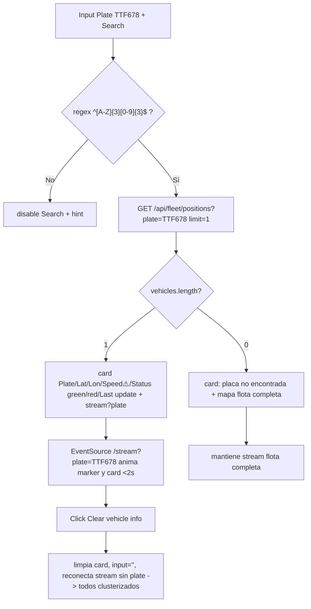
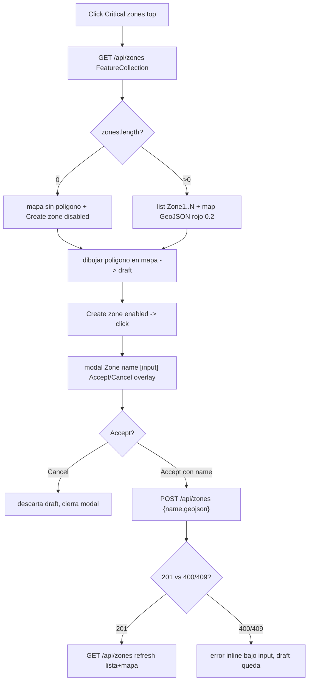
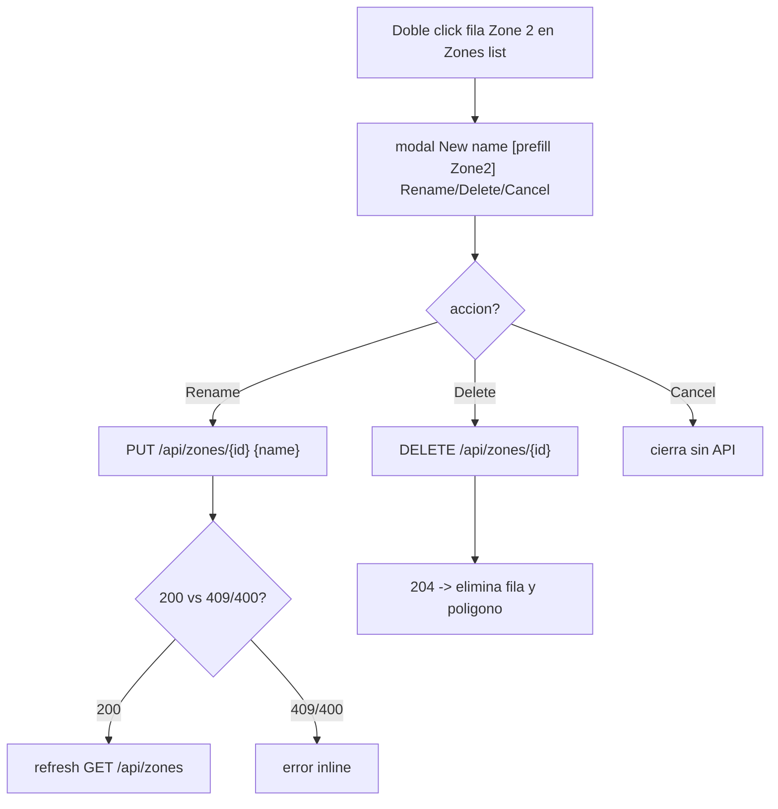
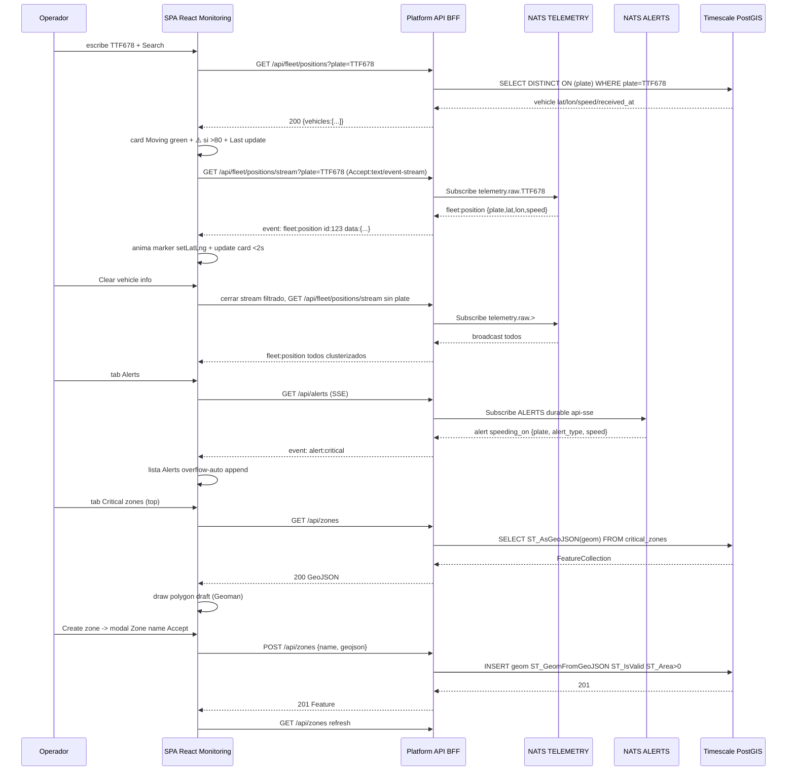
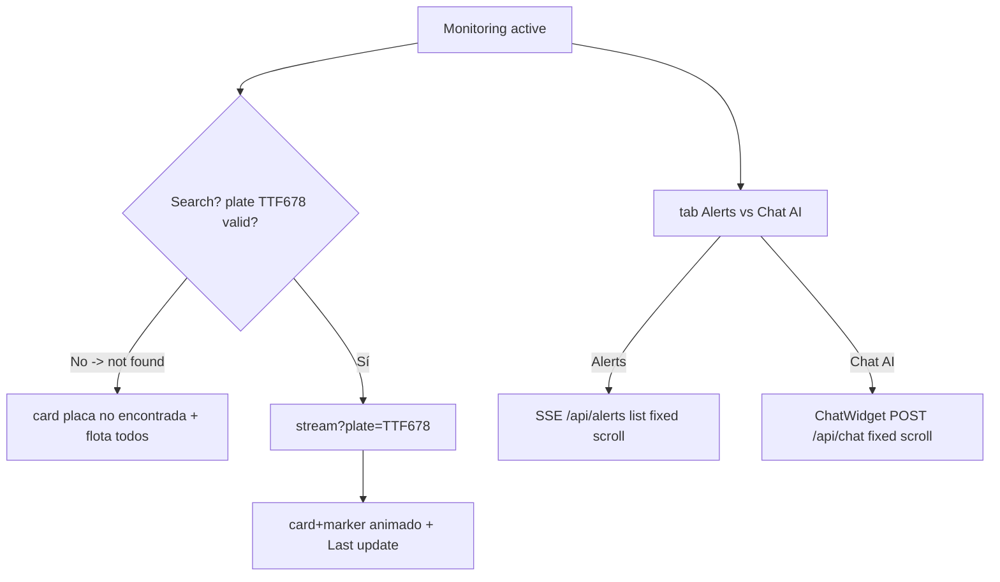
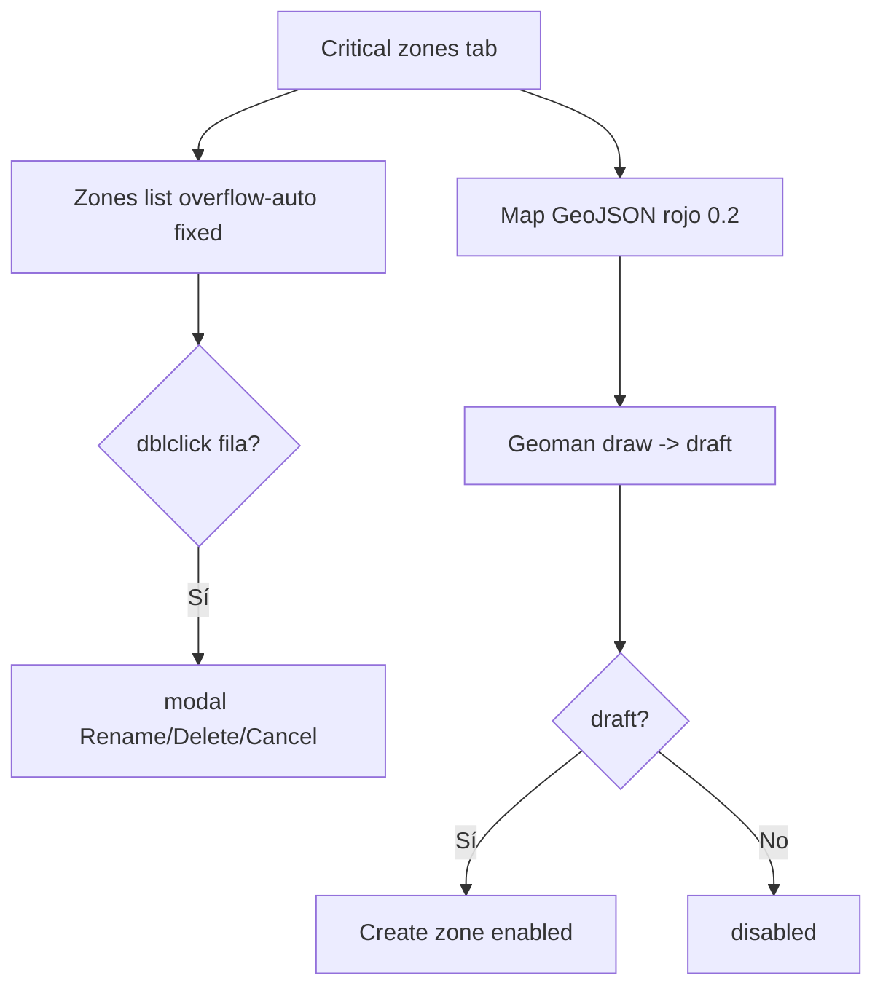

# SPEC-004: Portal SPA refine — detalle placa + alertas + chat + mapa + polígonos de zonas críticas

## Meta

- **SPEC-ID**: SPEC-004
- **Título**: SPA Portal refine: monitoring de placa en tiempo real, alertas y chat fijos, mapa con zonas críticas dibujables
- **Estado**: approved
- **Backlog**: Portal Corporativo sec 4.C (Dashboard Reactivo: mapa, alertas SSE y chat IA) + sec 4.B zonas críticas — refine de SPEC-002/003
- **Autor**: architect
- **Fecha**: 2026-08-26
- **Rama**: `feature/spa-portal-dashboard`

## 1. Overview

SPEC-002 entregó el read path (`GET /api/fleet/positions?plate`, `stream?plate` SSE `fleet:position`, `GET /api/zones` GeoJSON, `GET /api/alerts` SSE `alert:critical` 4 tipos, mapa Leaflet/OSM) y SPEC-003 el chat (`POST /api/chat` Genkit 5 tools). El portal quedó funcional pero sin UX afinada: sin card de vehículo con status coloreado y alerta `>80`, sin tabs fijos con scroll, sin modal de creación/edición de zonas dibujadas con coords reales, y sin toggle top `Monitoring / Critical zones`.

Este spec pule el SPA React (Vite) para que —según las 8 maquetas entregadas— el operador pueda: buscar `TTF678` validada `^[A-Z]{3}[0-9]{3}$`, ver en card `Plate/Lat/Lon/Speed/Status(received_at)` en tiempo real con `Moving` verde / `Idle` rojo y triángulo `>80`; limpiar con `Clear vehicle info` y volver a flota completa animada; alternar abajo `Alerts | Chat AI` y arriba `Monitoring | Critical zones` en paneles de altura fija con `overflow-y:auto`; dibujar un polígono en `Critical zones` y crearlo vía modal `Zone name [Accept][Cancel]` (botón habilitado solo con draft), y renombrar/eliminar con doble click en `Zones list` (`[Rename][Delete][Cancel]`). Las coordenadas reales `EPSG:4326` se validan cierre `first==last`, `4..101 coords`, `ST_Area>0` y `ST_IsValid`. Sin esto la telemetría y las zonas no son operables desde UI.

## 2. Scope

### In Scope

- SPA `web/` React Vite refine: top tabs `Monitoring` (default) / `Critical zones` (estado local, sin route reload), bottom tabs `Alerts` vs `Chat AI` dentro de `Monitoring`, paneles de altura fija proporcional con scroll.
- Card vehículo: `Plate TTF678 | Latitude 45.6 | Longitude 34.5 | Speed 90 ⚠️ | Status Moving(green)/Idle(red) | Last update HH:mm:ss` — regex `^[A-Z]{3}[0-9]{3}$` en front + backend, `GET /api/fleet/positions?plate` snapshot + `GET /api/fleet/positions/stream?plate` SSE filtrado, centrado y animación `marker.setLatLng`, fallback `placa no encontrada` manteniendo flota completa.
- Botón `Clear vehicle info`: limpia card, resetea input, reconecta stream sin `plate` (`telemetry.raw.>`) para ver todos en tiempo real.
- Lista/overlay de zonas en `Critical zones`: `Zones list` (izq) + `Map` (der) con `GET /api/zones FeatureCollection`, `GeoJSON` rojo `fillOpacity 0.2`, cada zona con su polígono.
- Creación de zona: dibujar polígono en mapa (Geoman/leaflet-draw), draft visual, botón `Create zone` deshabilitado hasta draft, click -> modal `Zone name [input] [Accept][Cancel]` -> `POST /api/zones {name, geojson: Polygon}` 201/400/409.
- Edición/eliminación zona: doble click en fila de `Zones list` -> modal `New name [input prefill] [Rename][Delete][Cancel]` -> `PUT /api/zones/{id}` / `DELETE /api/zones/{id}` con refresh `GET /api/zones`.
- Alertas en `Alerts` tab y chat en `Chat AI` tab reutilizando `ChatWidget` existente (`POST /api/chat`), ambos en panel fijo inferior.
- Mapa Leaflet OSM directo `https://{s}.tile.openstreetmap.org/{z}/{x}/{y}.png`, clustering `leaflet.markercluster` si >500, tiles nunca por `/api/tiles`.

### Out of Scope

- Nuevos endpoints BFF/DB/NATS (reusa `SPEC-002` `contracts/http.openapi.yaml` y `events.asyncapi.yaml`): no se crean `POST /chat` nuevo ni streams nuevos.
- Auth JWT completa / scopes por flota (solo `bearerAuth` reservado, `401` en OpenAPI; healthz/metrics sin auth local).
- Placas activas/inactivas lógicas (toda placa con telemetría es activa).
- Edición geométrica del polígono existente (solo rename/delete; reshape queda como enh futuro).
- Mobile Expo/WatermelonDB y sync batch (SPEC-004 es web).
- Terraform prod, k6 nuevo (reusa observability profile existente).

## 3. Actors and Systems

| Actor/Sistema | Tipo | Descripción | Dependencia |
|---------------|------|-------------|-------------|
| Operador de Flota | usuario | Busca placa, lee card, alterna tabs, dibuja zonas | SPA Web |
| Web SPA | sistema | React Vite + Leaflet + Geoman + Zustand + EventSource SSE | Platform API |
| Platform API (`cmd/api`) | servicio | BFF HTTP/SSE — única superficie pública (ADR-0003 cond.9) | TimescaleDB, NATS |
| NATS JetStream | sistema | Streams `TELEMETRY` + `ALERTS` existentes | - |
| TimescaleDB + PostGIS | sistema | Hypertable `telemetry` + `critical_zones geometry(Polygon,4326)` | - |
| OSM Tile Provider | externo | Raster directo `web -> OSM` (ADR-0007) | - |
| AI Agent (`cmd/agent`) | sistema | Responde `POST /api/chat` via BFF (SPEC-003) | Platform API |

## 4. Use Cases

### UC-001 — Ver detalle de un vehículo en tiempo real y limpiar filtro

- **Actor**: Operador
- **Objetivo**: Buscar `TTF678` y ver su última telemetría animada; poder volver a flota completa.
- **Preconditions**: `plate ~ ^[A-Z]{3}[0-9]{3}$`, `telemetry` con al menos 1 row para `TTF678` si existe; `GET /api/fleet/positions?plate` y `stream?plate` disponibles.
- **Trigger**: Input `Plate [TTF678] [Search]` y botón `[Clear vehicle info]`.
- **Main Flow** (placa existente):
  1. Operador escribe `TTF678` (valida regex en front, borde en rojo si inválida, botón Search deshabilitado si no match) y pulsa `Search`.
  2. SPA hace `GET /api/fleet/positions?plate=TTF678&limit=1` -> `200 {vehicles:[{plate,lat,lon,speed,received_at}]}` y pinta card: `Plate: TTF678 / Latitude:45.6 / Longitude:34.5 / Speed:90 ⚠️ si >80 / Status: Moving verde (speed>0) o Idle rojo (speed==0) / Last update: 14:32:10`.
  3. SPA abre `EventSource /api/fleet/positions/stream?plate=TTF678` -> `event: fleet:position` -> card y marker se actualizan en <2s, mapa centra `map.setView([lat,lon], 14)` y `marker.setLatLng`.
  4. Operador pulsa `Clear vehicle info` -> SPA limpia card, resetea input `""`, cierra SSE filtrado, abre `EventSource /api/fleet/positions/stream` sin `plate` -> pinta todos los vehículos clusterizados en tiempo real.
- **Alternative Flows**:
  - 1a. Placa no encontrada (`vehicles:[]` o `404` lógico) -> card muestra `placa no encontrada` en el espacio de info, mapa sigue mostrando flota completa (no queda vacío) y SSE sigue en flota completa o reintenta filtrado sin datos.
  - 1b. Input vacío/inválido `TTF67` -> front bloquea `Search`, muestra hint `3 letras + 3 dígitos`.
  - 1c. Telemetría sin `lat/lon` null -> card muestra `—` y marker no se crea pero card sigue con `speed/status`.
- **Error Flows**:
  - 2a. `GET /api/fleet/positions?plate=TTF678` `503` breaker -> card muestra `reconectando…` + banner stale.
  - 3a. SSE desconecta -> `EventSource.onerror` backoff `0.5s*2 cap 30s`, `:ping 15s` mantiene LB.
- **Postconditions**: Card refleja última telemetría o mensaje not-found; mapa en modo filtrado o flota.
- **Business Rules**: BR-001, BR-002, BR-006, BR-008, BR-009, BR-010

### UC-002 — Consultar alertas en panel fijo con scroll

- **Actor**: Operador
- **Objetivo**: Ver `alerts.critical 4 tipos` en tiempo real sin que el panel crezca.
- **Preconditions**: `ALERTS` stream 7d 1GB, `GET /api/alerts` SSE.
- **Trigger**: Tab `Alerts` (default abajo en Monitoring).
- **Main Flow**:
  1. Operador entra en `Monitoring` -> abajo tab `Alerts` activo (celeste) muestra lista vacía o con `event: alert:critical` pasados.
  2. SPA abre `EventSource /api/alerts` -> cada `alert_type zone_enter|zone_exit|speeding_on|speeding_off` se anexa arriba: `"TTF678 superando 80Km/h – 14:32"` / `"vuelve a <80"` / `"entra en zona Norte"`.
  3. Panel tiene altura fija proporcional (ej. `h-[280px] lg:h-[340px]`) `overflow-y:auto`; si excede, scroll. `:ping 15s` y `Last-Event-ID` replay.
- **Alternative Flows**: 2a. `Last-Event-ID: 100` reconexión -> replay 101.. dentro retention 7d.
- **Error Flows**: `Accept` sin `text/event-stream` -> `400`; NATS down -> `503 retry:5000`.
- **Postconditions**: Lista crece hacia arriba, no empuja layout.
- **BR**: BR-004, BR-005, BR-007

### UC-003 — Chatear con IA en tab fijo

- **Actor**: Operador
- **Objetivo**: Consultar flota en lenguaje natural sin salir de `Monitoring`.
- **Preconditions**: `POST /api/chat` disponible (SPEC-003) vía BFF.
- **Trigger**: Click tab `Chat AI` abajo (desactiva `Alerts`).
- **Main Flow**:
  1. Operador cambia a `Chat AI` (celeste) -> panel fijo misma altura que Alerts muestra historial + input + botón azul `↩` abajo derecha (imagen 8).
  2. Escribe `"¿qué vehículos >20m en zonas críticas?"` -> `POST /api/chat {message}` -> `200 {reply markdown, citations, usage, request_id}` -> render markdown con `GTP980` highlight y `citations`.
  3. Historial swa scroll interno; panel no crece.
- **Error Flows**: `""` -> `400`, `429` 10/min burst 20 -> `Retry-After:6`, `503` sin key -> banner `agente temporalmente no disponible`.
- **BR**: BR-011

### UC-004 — Gestionar zonas críticas dibujando polígono con coords reales

- **Actor**: Operador
- **Objetivo**: Crear/ver/renombrar/eliminar zonas que alimentan mapa y agente (misma fuente `GET /api/zones`).
- **Preconditions**: `critical_zones` tabla, `GET /api/zones -> FeatureCollection`.
- **Trigger**: Top tab `Critical zones`.
- **Main Flow** (crear):
  1. Operador click `Critical zones` (top negro) -> izq `Zones list` (verde claro) + botón `Create zone` (azul, deshabilitado) + der `Map`.
  2. Si `zones==0` mapa sin polígono; si `n>0` lista muestra `Zone 1, Zone 2...` alternando verde/celeste y mapa pinta cada `Feature` rojo `fillOpacity 0.2`.
  3. Operador dibuja polígono en mapa con Geoman (clicks -> cierre) -> draft rojo queda en capa `draftZone`; botón `Create zone` se habilita (BR-012).
  4. Click `Create zone` -> modal centrado overlay oscuro `Zone name [input] [Accept][Cancel]` (imagen 4). Escribe `Zona Norte`.
  5. `Accept` -> `POST /api/zones {name:"Zona Norte", geojson:{type:"Polygon", coordinates:[[[lon,lat]...]]}}` SRID 4326 -> `201 Feature` (validación cierre `first==last`, `4..101 coords`, `ST_Area>0`, `ST_IsValid`) -> `GET /api/zones` refresh -> lista añade `Zona Norte` + mapa añade polígono. `Cancel` descarta draft y cierra modal sin API.
- **Main Flow** (editar/eliminar):
  6. Doble click en fila `Zone 2` de `Zones list` -> modal `New name [input prefill Zone 2] [Rename][Delete][Cancel]` (imagen 6).
  7. Edita a `Zona 2 v2` + `Rename` -> `PUT /api/zones/{id} {name, geojson existente}` -> `200` -> refresh. `Delete` -> `DELETE /api/zones/{id}` -> `204` -> elimina fila y polígono. `Cancel` cierra sin cambios.
- **Alternative Flows**: 5a. `POST` nombre duplicado case-insensitive -> `409 {error:"zone name already exists"}` muestra error bajo input.
- **Error Flows**: Polígono no cerrado / <4 pts / área 0 / >101 -> `400 validation` inline, no persiste, draft mantiene para corregir.
- **Postconditions**: `GET /api/zones` es fuente única para mapa futuro y tool `findVehiclesStoppedInCriticalZones`.
- **BR**: BR-004, BR-012, BR-013

### UC-005 — Navegar entre Monitoring y Critical zones sin perder contexto

- **Actor**: Operador
- **Objetivo**: Cambiar vista top sin reload ni perder SSE base.
- **Preconditions**: SPA cargada.
- **Trigger**: Click `Monitoring` vs `Critical zones` (top).
- **Main Flow**:
  1. Estado `activeTop: 'monitoring'|'zones'` en Zustand/store. Default `monitoring`.
  2. `monitoring` muestra: izq búsqueda+card+Clear, der map+fleet, abajo Alerts/Chat tab.
  3. `zones` muestra: izq Zones list+Create, der Map+draft/polígonos, overlay modales. Al volver a `monitoring`, lista fleet y SSE alerts/chat se re-suscriben sin full reload.
- **Postconditions**: Tabs top mantienen color activo negro, inactivo blanco; contenido cambia por `activeTop`.
- **BR**: BR-014

## 5. Functional Requirements

| ID | Descripción | UC | Prioridad |
|----|-------------|----|-----------|
| FR-001 | `Monitoring` card: input `Plate` con regex `^[A-Z]{3}[0-9]{3}$` front (disable Search si no match, hint) + `Search` -> `GET /api/fleet/positions?plate` + `stream?plate` SSE animación en tiempo real | UC-001 | must |
| FR-002 | Card render: `Plate/Latitude/Longitude/Speed/Status/Last update` con `Status Moving green #16a34a / Idle red #dc2626`, `Speed>80 => ⚠️` en misma línea, `Last update` HH:mm:ss de `received_at`; si `vehicles:[]` mostrar `placa no encontrada` y mantener flota completa en mapa | UC-001 | must |
| FR-003 | Botón `Clear vehicle info` verde menta: limpia card, resetea input `""`, cierra SSE filtrado y reconecta `stream` sin `plate` para flota completa clusterizada | UC-001 | must |
| FR-004 | `Monitoring` bottom tabs fijos: `Alerts` vs `Chat AI` — altura fija proporcional `h-[280px] lg:h-[340px]` `overflow-y:auto`, no empuja layout; `Alerts` activo por defecto, `Chat AI` muestra `ChatWidget` + input + botón azul envío | UC-002/003 | must |
| FR-005 | `Alerts` lista consume `GET /api/alerts` SSE `alert:critical` 4 tipos con `Last-Event-ID` replay 7d, `:ping 15s`, traduce a texto humano | UC-002 | must |
| FR-006 | `Chat AI` embebe `POST /api/chat` SPEC-003 (reply markdown + citations) en panel fijo, rate `10/min` UI feedback `429` | UC-003 | must |
| FR-007 | Top tabs `Monitoring | Critical zones` — store `activeTop`, toggle sin reload, styles activo negro `#1f2937` inactivo blanco borde negro | UC-005 | must |
| FR-008 | `Critical zones` layout: izq `Zones list` (`overflow-y:auto` fijo) + `[Create zone]` azul; der `Map` con `GET /api/zones FeatureCollection` `GeoJSON fillOpacity 0.2` rojo | UC-004 | must |
| FR-009 | Dibujo polígono en `Critical zones` map con `@geoman-io/leaflet-geoman-free` (o `leaflet-draw` fallback): clicks forman `Polygon closed`, draft en capa separada, `Create zone` habilitado solo con draft válido | UC-004 | must |
| FR-010 | Modal crear: `Zone name [input] [Accept][Cancel]` centrado overlay oscuro; `Accept` -> `POST /api/zones {name[1..100], geojson Polygon 4..101 coords}`; `Cancel` descarta draft | UC-004 | must |
| FR-011 | `Zones list` filas `Zone N` alternando verde/celeste; doble click fila -> modal `New name [prefill] [Rename][Delete][Cancel]` -> `PUT /api/zones/{id}` / `DELETE /api/zones/{id}` con refresh y error `409`/`400` inline | UC-004 | must |
| FR-012 | Mapa Leaflet OSM directo `https://{s}.tile.openstreetmap.org/{z}/{x}/{y}.png` + `MarkerClusterGroup` si >500, SSE `fleet:position` todos o filtrado por plate, tiles nunca por `/api/tiles` | UC-001/004 | must |

## 6. Business Rules

| ID | Descripción | UC/FR |
|----|-------------|-------|
| BR-001 | `status` derivado: `speed>0 -> Moving` verde `#16a34a`, `speed==0 -> Idle` rojo `#dc2626`; sin datos recientes se mantiene último `status` | UC-001 FR-002 |
| BR-002 | `Plate` regex `^[A-Z]{3}[0-9]{3}$` valida en front (UX) y backend (400); input no match deshabilita Search | UC-001 FR-001 |
| BR-003 | Paginación keyset existente se reusa para fleet, pero para card se pide `limit=1` | UC-001 FR-001 |
| BR-004 | GeoJSON canónico: `GET /api/zones` es única fuente para `<GeoJSON />` y tool agente; prohibido duplicar zona en frontend | UC-004 FR-008 |
| BR-005 | SSE `Last-Event-ID` replay dentro de `ALERTS.max_age 7d`, `:ping 15s` evita LB timeout 60s, `retry:5000` | UC-002 FR-005 |
| BR-006 | `lat/lon` pueden ser null, precisión máx 6 dec en API pública | UC-001 FR-002 |
| BR-007 | Umbral velocidad: `speeding_on` cuando `speed>80` tras `<=80`, `speeding_off` cuando `speed<=80` tras `>80` | UC-001/002 FR-002/005 |
| BR-008 | Filtro flota: sin `plate` en `/fleet/positions(.stream)` = todos; con `?plate=GTP678` = solo ese; `Clear` reconecta sin filtro | UC-001 FR-003 |
| BR-009 | `placa no encontrada`: si `GET /api/fleet/positions?plate` devuelve `vehicles:[]` -> mostrar mensaje en card y **no vaciar mapa** (sigue flota completa) | UC-001 FR-002 |
| BR-010 | `Last update` en card es `received_at` del último `fleet:position` formateado `HH:mm:ss` local | UC-001 FR-002 |
| BR-011 | Chat rate limit `10 req/min` burst 20; payload sin PII, sin `client_event_id` | UC-003 FR-006 |
| BR-012 | `Create zone` habilitado solo si existe `draftPolygon` con `>=4 coords`, cerrado `first==last` validado cliente; deshabilitado en otro caso | UC-004 FR-009/010 |
| BR-013 | `critical_zones.geom` Polygon cerrado `4..101 coords`, `ST_IsValid`, `ST_Area>0`, SRID 4326, nombre único `409` | UC-004 FR-010/011 |
| BR-014 | Top tabs estado `activeTop` Zustand; cambio no hace full reload ni pierde `VITE_API_BASE_URL` | UC-005 FR-007 |
| BR-015 | Paneles fijos proporcionales: `Monitoring` izq/der `~50/50`, abajo `h-[280px] lg:h-[340px]` `overflow-y:auto`; `Critical zones` izq `~35%` lista, der `~65%` mapa | UC-002/003/004 FR-004/008 |

## 7. Main Flows

### Flow A — Monitoring buscar y limpiar (placa existente y no encontrada)



### Flow B — Critical zones crear (draft -> modal -> POST)



### Flow C — Editar/eliminar con doble click



## 8. Alternative and Error Flows

- `Search` con `TTF67` (5 chars) -> front deshabilita, no llama API; si fuerza via curl -> `400 validation`.
- `GET /fleet/positions?plate=TTF678` `503` breaker -> card `reconectando…` + `retry:5000`.
- `POST /zones` sin draft -> botón deshabilitado previene llamada; si draft abierto con 3 pts -> modal `Accept` devuelve `400 details ["first==last", "ST_Area>0", "ST_NPoints<=101"]` y no cierra modal.
- `PUT` rename a nombre duplicado -> `409` inline `"zone name already exists"`; `DELETE` id inexistente -> `404`.
- SSE sin `Accept: text/event-stream` -> `400`; `Last-Event-ID` fuera retention 7d -> replay desde disponible.
- OSM 429 -> mapa placeholder, lista y alertas siguen.
- `lat/lon` null -> card `—` pero `speed/status` siguen.

## 9. State and Transitions

| Estado | Evento | Siguiente | Condición |
|--------|--------|-----------|-----------|
| `MONITORING` | `Search TTF678` | `MONITORING_FILTERED` | `plate valid`, SSE filtrado conectado |
| `MONITORING_FILTERED` | `Clear vehicle info` | `MONITORING` | cierra SSE filtrado, reconecta fleet todos |
| `MONITORING` | `GET empty vehicles` | `MONITORING_NOT_FOUND` | `placa no encontrada` + flota |
| `MONITORING_NOT_FOUND` | `Clear` | `MONITORING` | limpia mensaje |
| `MONITORING` | `tab Alerts` | `MONITORING_ALERTS` | `alerts SSE` activo |
| `MONITORING` | `tab Chat AI` | `MONITORING_CHAT` | `ChatWidget` activo |
| `ZONES_EMPTY` | `draw polygon` | `ZONES_DRAFT` | `draftPolygon != null` |
| `ZONES_DRAFT` | `Create zone -> Accept 201` | `ZONES_LIST` | `POST ok` + `GET refresh` |
| `ZONES_DRAFT` | `Cancel` | `ZONES_EMPTY/ZONES_LIST` | descarta draft |
| `ZONES_LIST` | `dblclick Rename 200` | `ZONES_LIST` | `PUT ok` refresh |
| `ZONES_LIST` | `dblclick Delete 204` | `ZONES_EMPTY/ZONES_LIST` | elimina |
| `MONITORING` | `click Critical zones` | `ZONES_EMPTY|ZONES_LIST` | `activeTop='zones'` |
| `ZONES_*` | `click Monitoring` | `MONITORING` | `activeTop='monitoring'` reconecta fleets |

## 10. API / Interface Contracts

Reusa `SPEC-002/003` sin nuevos endpoints; `web` solo consume BFF:

- `GET /api/fleet/positions?plate&limit=1&cursor` -> `200 {vehicles:[{plate,lat nullable,lon nullable,speed,received_at, status}], next_cursor}`; `400` plate/cursor inválido; `503` breaker. Validación `plate regex` front y back.
- `GET /api/fleet/positions/stream?plate` SSE `event: fleet:position` `data:{plate,lat,lon,speed,received_at}` `id:nats-seq` `retry:5000` `:ping 15s` `Last-Event-ID` replay.
- `GET /api/zones` -> `200 FeatureCollection` Polygon SRID 4326.
- `POST /api/zones {name[1..100], geojson Polygon}` -> `201 Feature` / `400 validation` / `409 duplicate lower(name)` / `429 10/min IP` / `503`.
- `PUT /api/zones/{id} {name}` -> `200`/`400`/`404`/`409`.
- `DELETE /api/zones/{id}` -> `204`/`404`.
- `GET /api/alerts` SSE `event: alert:critical` `data:{plate,alert_type: zone_enter|zone_exit|speeding_on|speeding_off, zone_id?,zone_name?,lat,lon,speed,created_at}`.
- `POST /api/chat {message[1..4000]}` -> `200 {reply,citations,usage,request_id}` / `400` / `429` / `503`.

Referencia: `docs/specs/SPEC-002-fleet-read-zones/contracts/http.openapi.yaml`, `docs/specs/SPEC-003-assistant-chat/contracts/http.openapi.yaml`, `events.asyncapi.yaml` (subjects `telemetry.raw.{plate}` fan-out, `alerts.critical`).

## 11. Sequence Diagrams



## 12. Flow Diagrams

#### Flow SSE monitoreo top/bottom



#### Flow Zones UI fijo



## 13. Non-Functional Requirements

| ID | Categoría | Descripción |
|----|-----------|-------------|
| NFR-001 | performance | `GET /fleet/positions?plate` p95 <150ms `limit=1`; SSE `fleet:position` card update <2s; `GET /api/zones` p95 <200ms; chat p95 <2s sin contar LLM |
| NFR-002 | scalability | 5k markers cluster obligatorio DOM <500; `Alerts` panel fijo evita layout thrash; draft polygon capa aislada |
| NFR-003 | availability | SPA stateless, SSE reconexión backoff `0.5s*2 cap30s`, `:ping 15s` evita LB/ALB 60s timeout |
| NFR-004 | reliability | `plate not found` no vacía mapa; `Create zone Cancel` no deja draft huérfano |
| NFR-005 | observability | `slog` `plate, zone_id, event_id`, `metrics api_sse_clients` sigue; front `console.warn` reconexión |
| NFR-006 | security | Regex front + back, `PUT/POST/DELETE /zones` rate `10/min IP`, no PII `client_event_id`, BFF ADR-0003 cond.9 |
| NFR-007 | a11y | Input plate `aria-label`, modal `role=dialog aria-modal`, botones `Clear` y `Create zone` focus ring |
| NFR-008 | UX | Layout proporcional: `Monitoring` `grid lg:cols-2` izq `~45%` der `~55%` abajo `h-[280px] lg:h-[340px]`; `Critical zones` izq `~35%` der `~65%` (match maquetas); modales centrados overlay `bg-black/50` |

## 14. Acceptance Criteria

```gherkin
AC-001 (UC-001, FR-001/003, BR-002/008/009):
  Given SPA en Monitoring con input vacío y flota con 3 placas, mock GET /api/fleet/positions?plate=TTF678 -> 200 {vehicles:[{plate:"TTF678", lat:45.6, lon:34.5, speed:90, received_at:"2026-08-26T14:32:10Z"}]}
  When escribo "TTF678" (match regex) y click Search
  Then fetch GET ?plate=TTF678 limit 1, card muestra Plate:TTF678 Lat:45.6 Lon:34.5 Speed:90 ⚠️ Status:Moving verde #16a34a Last update 14:32:10 y SSE /stream?plate=TTF678 conectado animando marker; When click Clear vehicle info Then card limpia, input "" y SSE reconecta sin plate mostrando todos clusterizados

AC-002 (UC-001, FR-002, BR-001/007/009 borde not-found):
  Given mock GET ?plate=XXX999 -> 200 {vehicles:[]}
  When Search XXX999
  Then card muestra "placa no encontrada" donde iba info y mapa sigue con flota completa (no vacío) y no cierra SSE flota; When speed=0 Then Status:Idle rojo #dc2626 sin ⚠️; When speed=80 Then sin ⚠️; When speed=81 Then con ⚠️

AC-003 (UC-001, FR-001, BR-002 regex):
  Given input "TTF67" (5 chars)
  When tipeo
  Then Search disabled y hint "3 letras + 3 dígitos" y no hace fetch; When "TTF678" Then enabled

AC-004 (UC-002, FR-004/005, BR-005/007):
  Given SSE GET /api/alerts emite 2 alerts speeding_on/off para TTF678
  When tab Alerts activo
  Then lista muestra en <2s "TTF678 superando 80Km/h" y "TTF678 vuelve a <80Km/h" y panel tiene height fijo 280px lg:340px overflow-y:auto (no crece con texto) y :ping 15s; When tab invisible Then SSE sigue pero no empuja layout

AC-005 (UC-003, FR-004/006, BR-011):
  Given tab Chat AI inactivo y mock POST /api/chat -> 200 {reply:"TTF678 en Zona Norte", citations:[]}
  When click Chat AI tab
  Then panel fijo misma altura que Alerts muestra ChatWidget con historial, input y botón azul envío ↩ abajo derecha; When envío "hola" Then POST /api/chat y render markdown; When 11 req/min Then 429 Retry-After:6 inline

AC-006 (UC-004, FR-008, BR-004/015 state vacío):
  Given GET /api/zones -> 200 {features:[]} y click top Critical zones
  When render
  Then Zones list vacía (green 100% height overflow-auto) + Create zone disabled + Map sin polígono y sin error; When GET con 4 zonas Then lista muestra Zone 1..4 alternando verde/celeste y map pinta 4 GeoJSON rojo fillOpacity 0.2

AC-007 (UC-004, FR-009/010, BR-012/013 crear):
  Given en Critical zones dibujo polygon 5 coords cerrado [[-74.07,4.71],[-74.05,4.71],[-74.05,4.73],[-74.07,4.73],[-74.07,4.71]]
  When draft existe
  Then Create zone enabled; When click Create zone Then modal centrado overlay bg-black/50 Zone name [input] [Accept][Cancel]; When Accept con "Zona Norte" Then POST /api/zones 201 y GET /api/zones refresh añade fila+polígono; When Cancel Then modal cierra y descarta draft sin POST

AC-008 (UC-004, FR-009/010, BR-013 bordes invalid):
  Given draft 3 coords o no cerrado first!=last o área 0
  When Accept
  Then POST -> 400 {error:validation} inline bajo input y no cierra modal; When name duplicado "Zona Norte" existente Then 409 inline y draft permanece

AC-009 (UC-004, FR-011, BR-013 rename/delete):
  Given Zones list con id abc-123 "Zone 2"
  When doble click fila Zone 2
  Then modal New name [prefill "Zone 2"] [Rename][Delete][Cancel]; When edito "Zone 2 v2" + Rename Then PUT /api/zones/abc-123 200 y refresh; When Delete Then DELETE 204 y fila+polígono desaparecen; When Cancel Then cierra sin API

AC-010 (UC-001, FR-012, BR-008 map filtered vs all):
  Given Monitoring sin búsqueda
  When carga
  Then GET /api/fleet/positions sin plate + stream sin plate -> todos markers clusterizados; When Search TTF678 Then stream ?plate=TTF678 solo ese y map centra animando; When Clear Then vuelve a todos

AC-011 (UC-005, FR-007, BR-014 fixed layout):
  Given SPA loaded Monitoring activo negro vs Critical zones blanco
  When click Critical zones top
  Then activeTop='zones' sin reload y contenido cambia a Zones list+Map+Create; When click Monitoring Then vuelve a Search+Card+Map+Alerts/Chat; panels mantienen altura fija proporcional no crecen con texto y usan scroll

AC-012 (UC-002/003/004, FR-004/008/012, NFR-006/008 a11y/BFF):
  Given build web
  When grep pgx/nats/genkit en web/src
  Then 0 matches depguard; tiles fetch directo https://{s}.tile.openstreetmap.org sin /api/tiles; modales tienen role=dialog y focus trap
```

## 15. Functional Test Scenarios

| ID | UC/FR/AC | Preconditions | Input | Action | Expected Result |
|----|----------|---------------|-------|--------|-----------------|
| TS-001 | UC-001 FR-001/002/003 AC-001/002 | 3 placas, 1 con TTF678 speed 90 | Search TTF678 + Clear + Search XXX999 | GET + SSE + click | card Moving verde ⚠️ + Last update, not-found mantiene flota, Clear reconecta sin plate |
| TS-002 | UC-001 FR-001 AC-003 | input vacío | type TTF67 vs TTF678 | input | disable/enable Search |
| TS-003 | UC-002 FR-004/005 AC-004 | NATS ALERTS 2 speeding | tab Alerts | SSE | 2 msgs <2s fixed height overflow |
| TS-004 | UC-003 FR-004/006 AC-005 | chat mock 200 | tab Chat AI + send | click/post | panel fijo, markdown, 429 handling |
| TS-005 | UC-004 FR-008 AC-006 | zones 0 y 4 | top Critical zones | GET /zones | vacío sin polígono, 4 filas alternando + 4 polygons rojo 0.2 |
| TS-006 | UC-004 FR-009/010 AC-007 | draft polygon 5 coords | Create zone -> Accept Zona Norte | draw+modal+POST | 201 + refresh |
| TS-007 | UC-004 FR-010 AC-008 | draft invalid/duplicate | Accept invalid | POST | 400/409 inline, no cierra |
| TS-008 | UC-004 FR-011 AC-009 | zone abc-123 | dblclick -> Rename/Delete/Cancel | modal+PUT/DELETE | 200 rename, 204 delete, cancel sin API |
| TS-009 | UC-001 FR-012 AC-010 | Monitoring load | default vs Search TTF678 vs Clear | GET/stream | todos vs solo ese centrado vs todos again |
| TS-010 | UC-005 FR-007 AC-011 | SPA loaded | click Monitoring<->Critical zones | toggle | activeTop switch sin reload, panels fijos |
| TS-011 | UC-002/004 FR-004/008/012 AC-012 | build | grep + network inspect | CI | depguard 0 pgx/nats, tiles OSM direct, dialog a11y |

## 16. Open Questions

- [x] ¿Regex front? — Sí, `^[A-Z]{3}[0-9]{3}$` deshabilita Search.
- [x] ¿Placa no encontrada vacía mapa? — No, muestra mensaje y mantiene flota.
- [x] ¿Altura fija proporcional? — Sí, `h-[280px] lg:h-[340px]` overflow-auto 3 paneles.
- [x] ¿Create zone habilitado cuándo? — Solo con draft válido.
- [x] ¿Modal Rename/Delete? — Sí, doble click.
- [ ] ¿Edición geométrica del polígono (drag vértices) en versión futura? — No bloquea MVP; anotado como enh.

## 17. Assumptions

- `GET /api/fleet/positions?plate` y `stream?plate` ya existen (SPEC-002); este spec solo consume y hace `limit=1` para card.
- `speed` int km/h, umbral 80 fijo MVP (BR-011).
- `received_at` server time, `Last update` formateado local HH:mm:ss.
- Geoman es capa de dibujo; si no se instala, fallback `leaflet-draw` mantiene mismo contrato GeoJSON.
- Top tabs Zustand store; no router adicional.
- `ChatWidget` reutiliza SPEC-003 sin cambios de API.
- Modales con overlay `bg-black/50`, `role=dialog`, focus trap, `Esc` cierra.

---

## Trazabilidad

```
UC-001 -> FR-001, FR-002, FR-003, BR-001/002/008/009/010 -> AC-001, AC-002, AC-003, AC-010 -> TS-001, TS-002, TS-009
UC-002 -> FR-004, FR-005, BR-005/007 -> AC-004 -> TS-003
UC-003 -> FR-004, FR-006, BR-011 -> AC-005 -> TS-004
UC-004 -> FR-008, FR-009, FR-010, FR-011, BR-004/012/013 -> AC-006, AC-007, AC-008, AC-009 -> TS-005, TS-006, TS-007, TS-008
UC-005 -> FR-007, BR-014/015 -> AC-011 -> TS-010
Transversal -> FR-012, NFR-006 -> AC-012 -> TS-011
```

## Contratos

- HTTP/SSE: `docs/specs/SPEC-002-fleet-read-zones/contracts/http.openapi.yaml` + `SPEC-003-assistant-chat/contracts/http.openapi.yaml` (reusados, sin cambios)
- Eventos NATS: `docs/specs/SPEC-002-fleet-read-zones/contracts/events.asyncapi.yaml` (`telemetry.raw.{plate}` fan-out `fleet:position`, `alerts.critical` 4 tipos)
- Si se añade `zone editor` no cambia contrato: mismo `POST /api/zones` Polygon.

## Validación (pre-entrega)

- [ ] Cada UC tiene flujo principal y alternos/errores
- [ ] Cada FR ligado a UC
- [ ] Cada BR implementable
- [ ] Cada AC Gherkin medible con `Given/When/Then` y trazable a UC/FR/BR
- [ ] Cada AC tiene al menos un TS
- [ ] No TS introduce requisitos nuevos
- [ ] Diagramas mermaid representan comportamiento no implementación
- [ ] Tecnología fijada React Vite + Leaflet + Geoman (sec 4.C)
- [ ] Open Questions no bloqueantes resueltas
