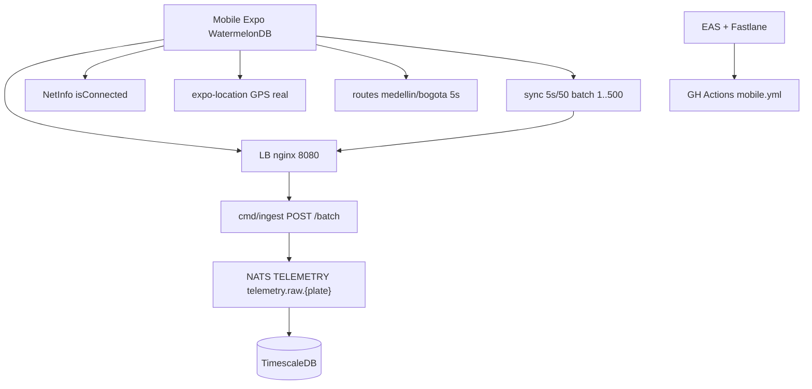

# Plan — SPEC-005: App móvil offline-first (Expo + WatermelonDB)

## Meta

- **SPEC-ID**: SPEC-005
- **Spec**: `docs/specs/SPEC-005-mobile-offline-first/spec.md` (approved)
- **Autor**: architect
- **Fecha**: 2026-08-26
- **Rama**: `feature/mobile-offline-first`
- **Estado**: approved

## 1. Summary

Construir `mobile/` Expo SDK 52 + WatermelonDB offline-first que persiste `pending_telemetry` con `client_event_id` sagrado y sincroniza en bloque vía `POST /v1/telemetry` (1) y `POST /batch` (1-500) con máquina de estados `idle->connecting->connected->error`, dos conceptos desacoplados `Network connectivity` (NetInfo) vs `Syncing data ...` (202), `Disconnect` purga, toggle `Activar ruta simulada` y dos rutas predeterminadas Medellín/Bogotá con `speed` variado. Reusa `SPEC-001` sin backend nuevo. Riesgos: WatermelonDB JSI en Expo, `EXPO_PUBLIC_API_URL` LAN IP, backoff correcto 429/503, limpieza de buffer al cambiar ruta.

## 2. Specification Traceability

| Spec ID | Requirement / Use Case | Technical Change | Tests |
|---------|------------------------|------------------|-------|
| FR-001 (UC-001) | Plate regex `^[A-Z]{3}[0-9]{3}$` toUpper, Connect disabled | `mobile/src/components/PlateInput.tsx` + `lib/plate.ts` | TEST-001 AC-001 |
| FR-002 (UC-001) | idle->connecting->connected->error con 202 | `mobile/src/hooks/useConnection.ts` + `store/appStore.ts` | TEST-002 AC-002 |
| FR-003 (UC-001/005) | Network vs Syncing desacoplados + WatermelonDB status | `hooks/useNetInfo.ts` + `hooks/useSyncStatus.ts` + `StatusPanel.tsx` | TEST-003 AC-003 |
| FR-004 (UC-003) | Disconnect purga BD + reset | `store/appStore.ts` `disconnect()` + `db/telemetry.ts` `clearPending()` | TEST-004 AC-004 |
| FR-005 (UC-004) | Toggle OFF gris disabled hasta connected; ON habilita rutas azules | `components/RouteToggle.tsx` | TEST-005 AC-005 |
| FR-006 (UC-004) | ON->OFF purga+GPS real; select ruta purga+reinicia | `hooks/useSimulatedRoute.ts` + `store/appStore.ts` | TEST-006/007 AC-006/007 |
| FR-007 (UC-004) | Rutas Medellín/Bogotá ~20 pts 5s batch 5s/50 | `routes/medellin.ts` + `bogota.ts` + `hooks/useTelemetryGenerator.ts` | TEST-006 AC-006 |
| FR-008 (UC-002) | WatermelonDB pending_telemetry | `db/schema.ts` + `db/telemetry.ts` | TEST-008/009 AC-008/009 |
| FR-009 (UC-002) | Sync batch 202/429/503 backoff | `lib/sync.ts` + `hooks/useSync.ts` | TEST-008/010 AC-008/010 |
| FR-010 (UC-001) | EXPO_PUBLIC_API_URL LAN IP | `lib/api.ts` + `.env.example` | TEST-011 AC-011 |
| FR-011 (UC-001) | EAS + Fastlane + GH Actions | `eas.json` + `fastlane/` + `.github/workflows/mobile.yml` | TEST-011 AC-011 |
| FR-012 (UC-001/004) | 6 wireframes fidelidad colores | `App.tsx` + `components/*` styles | TEST-012 AC-012 |
| BR-001..011 | reglas placa, idle vacío, desacoplados, purga | guards en store + db | AC trace |

## 3. Technical Context

- Backend intacto: `cmd/ingest` `POST /v1/telemetry|/batch` `202/400/429/503` `Retry-After:5`, LB `http://host:8080` único entry, NATS `telemetry.raw.{plate}` `Duplicates 2m`, Timescale `PK(client_event_id,received_at)` `ON CONFLICT DO NOTHING` — móvil no toca backend.
- Web intacta: `web/` no afectado; móvil no comparte store.
- Stack móvil fijado (ADR-0002): `mobile/` Expo + `fastlane/` + `EAS`, `monorepo` con `backend/` separado, `mobile` split primero si cadencia diverge.
- Deps nuevas: `expo@~52, watervelondb@^0.28, @nozbe/watermelondb, expo-sqlite (adapter), @react-native-community/netinfo, expo-location, expo-constants, uuid (react-native-get-random-values), zustand`.
- Estado actual: `mobile/` no existe (`ls` vacío), `docs/specs/SPEC-005` recién approved, `EXPO_PUBLIC_API_URL` aún no en `.env.example`.
- Restricciones: `16GB RAM` — no levantar emulador + 4 bins + k6 simultáneo; `WatermelonDB` requiere JSI/native, fallback `expo-sqlite` si bloquea `expo go`.

## 4. Architecture Changes

Nuevos: `mobile/` app (Expo) con `App.tsx`, `src/db/{schema.ts, telemetry.ts, index.ts}`, `src/store/appStore.ts`, `src/hooks/{useConnection.ts, useNetInfo.ts, useSync.ts, useTelemetryGenerator.ts, useSimulatedRoute.ts}`, `src/lib/{plate.ts, api.ts, sync.ts}`, `src/routes/{medellin.ts, bogota.ts}`, `src/components/{PlateInput.tsx, StatusPanel.tsx, RouteToggle.tsx, RouteButtons.tsx}`, `eas.json`, `fastlane/Fastfile`, `.github/workflows/mobile.yml`, `mobile/package.json`, `mobile/app.json`.

Modificados: `.env.example` (añade `EXPO_PUBLIC_API_URL`), `README.md` (sección mobile), `docker-compose.yml` no toca (solo LB).

Eliminados: nada.

## 5. Detailed Technical Design

- **Componente `Plate + Connection` (`mobile/src`)**:
  - `lib/plate.ts`: `export const PLATE_RE = /^[A-Z]{3}[0-9]{3}$/; export const normalizePlate = (s:string)=>s.trim().toUpperCase(); export const isValidPlate=(s)=>PLATE_RE.test(normalizePlate(s));` SSOT, reusa regex web pero sin import cruzado (copia por monorepo split futuro).
  - `components/PlateInput.tsx`: `<TextInput value={plate} onChangeText={t=>setPlate(normalizePlate(t))} placeholder="ACF356" maxLength={6} autoCapitalize="characters" testID="plate-input" />` + hint `"3 letras + 3 números"` si `plate.length>0 && !isValidPlate(plate)`. `Connect` `<Pressable disabled={!isValidPlate(plate)} style={!valid && {opacity:0.5}} testID="connect-btn">`.
  - `store/appStore.ts` (zustand): `type ConnState='idle'|'connecting'|'connected'|'error'; type State={plate:string, conn:ConnState, net:'OK'|'ERROR', db:'OK'|'ERROR', sync:'CONNECTING'|'CONNECTED'|'ERROR', simEnabled:boolean, simOn:boolean, selectedRoute:'medellin'|'bogota'|null, setPlate, connect, disconnect, setConn, setNet, setDb, setSync}`. `connect` valida `isValidPlate`, `db OK`, `net OK`, luego `setConn('connecting'); setSync('CONNECTING'); await sync.postSingle(firstPoint); if 202 -> connected+CONNECTED else -> error`. `disconnect` -> `await db.clearPending(); abortController.abort(); clearInterval; setPlate(''); setConn('idle'); setSync('CONNECTING'); setSimOn(false); setSelected(null);`
  - `hooks/useNetInfo.ts`: `NetInfo.addEventListener(s=> setNet(s.isConnected&&s.isInternetReachable? 'OK':'ERROR'))` + initial `fetch()`. No hace `fetch` si `ERROR`.
  - `hooks/useConnection.ts`: orquesta `connecting` timeout 5s: `Promise.race([postSingle, sleep(5000).then(()=>throw timeout)])` -> catch => `error`. Respeta `429/503` como `error` según FR-002 (distinto de `connected`).

- **Componente `WatermelonDB + Sync` (`mobile/src/db`, `lib/sync`)**:
  - `db/schema.ts`: `appSchema({version:1, tables:[tableSchema({name:'pending_telemetry', columns:[{name:'client_event_id', type:'string', isIndexed:true}, {name:'plate', type:'string', isIndexed:true}, {name:'lat', type:'number', isOptional:true}, {name:'lon', type:'number', isOptional:true}, {name:'speed', type:'number'}, {name:'occurred_at', type:'number'}, {name:'sync_status', type:'string'}, {name:'attempts', type:'number'}, {name:'last_error', type:'string', isOptional:true}]})]})` + `migrations`.
  - `db/telemetry.ts`: `class PendingTelemetry extends Model { static table='pending_telemetry'; @field('client_event_id') clientEventId; @field('plate') plate; @field('sync_status') syncStatus; }` + helpers `enqueue(point)`, `getPending(limit)`, `markSynced(ids)`, `clearPending()`, `countPending()`. `client_event_id = uuid.v4()` con `react-native-get-random-values`.
  - `lib/api.ts`: `const base = Constants.expoConfig?.extra?.apiUrl ?? process.env.EXPO_PUBLIC_API_URL ?? 'http://localhost:8080'; export const postTelemetry=(e)=>fetch(base+'/v1/telemetry',{method:'POST', headers:{'Content-Type':'application/json'}, body:JSON.stringify(e)}); export const postBatch=(evs)=>fetch(base+'/v1/telemetry/batch',{method:'POST', body:JSON.stringify({events:evs})});` Timeout 5s via `AbortController`.
  - `lib/sync.ts`: `export async function flushPending(db, plate){ const pending=await db.getPending(500); if(!pending.length) return; const payload=pending.map(toApiEvent); const res=await postBatch(payload); if(res.status===202){ await db.markSynced(pending.map(p=>p.id)); setSync('CONNECTED'); } else if(res.status===429||res.status===503){ const ra=res.headers.get('Retry-After')??'5'; throw Object.assign(new Error('retry'),{retryAfter:parseInt(ra)}); } else throw new Error('error'); }` Backoff en `useSync.ts`: `let delay=5000*Math.pow(2,attempts); delay=Math.min(delay,60000); delay+=Math.random()*1000;`.
  - `hooks/useSync.ts`: intervalo `5s` si `connected` y `net OK`; también trigger al volver `net OK` y al encolar. Si `pending>=50` flush inmediato. Maneja `attempts++` y `failed` tras 5.
  - `hooks/useTelemetryGenerator.ts`: `setInterval(5000, ()=>{ const pt = simOn ? nextSimPoint(selectedRoute) : nextGpsPoint(); db.enqueue({plate, ...pt, client_event_id:uuid(), sync_status:'pending'}) })` solo si `connected`. `nextGpsPoint` usa `Location.getCurrentPositionAsync` si `simOn===false` y permiso granted, sino no encola.

- **Componente `Ruta simulada` (`mobile/src/routes`, `hooks/useSimulatedRoute`)**:
  - `routes/medellin.ts`: `export const MEDELLIN_ROUTE: Array<{lat:number, lon:number, speed:number}> = [{lat:6.2442, lon:-75.5812, speed:45}, {lat:6.2445, lon:-75.5805, speed:85}, {lat:6.2448, lon:-75.5798, speed:0}, ... 20 pts]` con speed variado para `speeding_on/off`. Similar `bogota.ts` centro `4.7110,-74.0721`. Placeholder inicial, reemplazable sin migrar DB.
  - `hooks/useSimulatedRoute.ts`: `let idx=0; function nextSimPoint(route){ const p=route[idx%route.length]; idx++; return {...p, occurred_at:Date.now()}; }` + `selectRoute(r){ await db.clearPending(); idx=0; setSelected(r); }` + `toggleSim(on){ if(!connected) return; if(on){ setSimOn(true); } else { await db.clearPending(); setSimOn(false); setSelected(null); } }` — OFF limpia y pasa a GPS real.
  - `components/RouteToggle.tsx`: `<Switch value={simOn} onValueChange={toggleSim} disabled={conn!=='connected'} testID="sim-toggle" />` + label `Activar ruta simulada OFF/ON` color `#16a34a` ON vs gris. `components/RouteButtons.tsx`: dos `<Pressable disabled={!simOn} style={selected==='medellin'? green:#86efac : blue:#93c5fd}>` con `onPress={()=>selectRoute('medellin')}`.

- **Componente `StatusPanel` (`mobile/src/components/StatusPanel.tsx`)**:
  - Render fiel a wireframes: `Syncing data ... {sync}` rojo `#dc2626`, `WatermelonDB status ○ OK/ERROR` verde `#16a34a`/rojo, `Network connectivity ○ OK/ERROR`. Props desde `appStore`.

- **Dependencias y fallbacks**: `watermelondb` elegida por observabilidad y perf (vs `expo-sqlite` directo). Si JSI falla en `expo go`, fallback a `expo-sqlite` con mismo `pending_telemetry` tabla y API `db.clearPending` idéntica (adapter switch). `react-native-get-random-values` necesario para `uuid` en RN.

- **Archivos concretos**: `mobile/app.json` (`expo.name: fleet-mobile`, `extra.apiUrl`), `mobile/package.json`, `mobile/src/App.tsx` (composition), `mobile/src/db/*`, `mobile/src/store/*`, `mobile/src/hooks/*`, `mobile/src/lib/*`, `mobile/src/routes/*`, `mobile/src/components/*`.

## 6. API Changes

| Endpoint | Método | Cambio | Compat | Validaciones |
|----------|--------|--------|--------|--------------|
| `POST /v1/telemetry` | POST | reuso móvil 1 online | compat | plate regex, speed int, lat/lon nullable |
| `POST /v1/telemetry/batch` | POST | reuso móvil offline 1..500 | compat | 400 all-or-nothing, 429/503 Retry-After |
| `GET /healthz` | GET | debug opcional | - | - |

No OpenAPI nuevo; `redocly lint` existente debe verde.

## 7. Data Changes

SQLite/WatermelonDB local: nueva DB `pending_telemetry` versión 1 (no Timescale). Sin migración backend. Si cambia schema móvil, WatermelonDB `migrations` locales.

## 8. Event / Messaging Changes

Reusa `telemetry.raw.{plate}` `Nats-Msg-Id=client_event_id` dedup 2m, `telemetry.dlq` — móvil no publica NATS directo, solo HTTP LB.

## 9. Observability

- Móvil: `console.log [sync] plate=ACF356 pending=50 202` + `Sentry` opcional enh, `NetInfo` events log.
- Backend: `api_sse_clients` no afectado; `ingest` `slog` ya loguea `plate, client_event_id`.
- No nuevo dashboard; `mobile` `adb logcat` / `expo log`.

## 10. Security

- Sin `GEMINI_API_KEY` en móvil, solo `EXPO_PUBLIC_API_URL` público.
- `plate` no PII; `client_event_id` no expone conductor.
- `WatermelonDB` file en `documentDirectory` sandbox iOS/Android, no backup cloud si `expo-secure-store` no usado (deuda prod: `SQLCipher`).
- Rate limit backend ya 12/min burst20 protege móvil spameando.

## 11. Test Strategy

| Test ID | TS | Nivel | Componente | Setup | Input | Expected | Mocks | Ubicación |
|---------|----|-------|------------|-------|-------|----------|-------|-----------|
| TEST-001 | TS-001 | unit | lib/plate | - | acf356 vs ACF35 | normalize + isValid | - | `mobile/src/lib/plate.test.ts` |
| TEST-002 | TS-002 | component | PlateInput+useConnection | render App idle | type acf356 + Connect | enabled verde vs disabled hint, connecting->connected 202 o error timeout | msw fetch 202 | `mobile/src/components/PlateInput.test.tsx` |
| TEST-003 | TS-003 | component | StatusPanel+useNetInfo | NetInfo mock OK->ERROR | avion toggle | Network ERROR + Syncing ERROR -> reconecta CONNECTED | NetInfo mock + msw | `mobile/src/components/StatusPanel.test.tsx` |
| TEST-004 | TS-004 | component | appStore+db | connected 20 pending | Disconnect | 0 pending, input "", idle, toggle OFF gris | WatermelonDB mock | `mobile/src/store/appStore.test.tsx` |
| TEST-005 | TS-005 | component | RouteToggle | idle vs connected | observe | OFF gris disabled vs OFF habilitado vs ON azul | - | `mobile/src/components/RouteToggle.test.tsx` |
| TEST-006 | TS-006 | component | RouteButtons+useSimulatedRoute | connected ON | click Medellin->Bogota | purga + verde vs azul + encolado 5s | WatermelonDB + routes | `mobile/src/components/RouteButtons.test.tsx` |
| TEST-007 | TS-007 | component | RouteToggle | simulado Medellin verde | ON->OFF | purga + gris + GPS real | Location mock | same |
| TEST-008 | TS-008 | integration | lib/sync | 60 offline Medellín | recover Net OK | POST /batch 50 202 50 purged; 429 keeps 60 backoff | msw + db | `mobile/src/lib/sync.test.ts` |
| TEST-009 | TS-009 | integration | db/telemetry | 245 pending | kill & relaunch | 245 restores | WatermelonDB | `mobile/src/db/telemetry.test.ts` |
| TEST-010 | TS-010 | integration | sync 503 | Net OK | batch 20 -> 503 | Network OK + Syncing ERROR backoff 60s | msw | `mobile/src/lib/sync.test.ts` |
| TEST-011 | TS-011 | e2e | expo LAN | EXPO_PUBLIC_API_URL LAN IP + eas | expo start + eas build | Expo Go 202 via LB + workflow path-filter | - | `mobile/e2e` |
| TEST-012 | TS-012 | visual | App 6 wireframes | render | snapshot | colores #86efac #f9a8d4 #dc2626 #93c5fd | - | `mobile/src/App.test.tsx` |

Trazabilidad `TS->TEST` 1:1, Jest/RNTL + `msw` + `watermelondb` mock.

## 11.1 TDD — Red-Green-Refactor por Step

| Step | TDD Test File (RED primero) | Casos AAA | AC trace | Gate |
|------|------------------------------|-----------|----------|------|
| 1 | `lib/plate.test.ts`, `components/PlateInput.test.tsx` | plate acf356 toUpper, TGY589 enabled, ACF35 disabled hint | AC-001 | unit `npm test` RED->GREEN |
| 2 | `hooks/useConnection.test.tsx`, `store/appStore.test.tsx` | idle->connecting->connected 202, timeout 5s -> error | AC-002 | component msw RED->GREEN |
| 3 | `components/StatusPanel.test.tsx`, `hooks/useNetInfo.test.tsx` | Net OK->ERROR + Syncing CONNECTED->ERROR desacoplados | AC-003, AC-010 | component RED->GREEN |
| 4 | `store/appStore.test.tsx` disconnect | 20 pending -> 0 + idle + OFF gris | AC-004 | component RED->GREEN |
| 5 | `components/RouteToggle.test.tsx` | OFF gris disabled idle vs habilitado connected vs ON azul | AC-005 | component RED->GREEN |
| 6 | `components/RouteButtons.test.tsx`, `hooks/useSimulatedRoute.test.tsx` | Medellin verde purga, Bogota verde, 5s encolado | AC-006 | component RED->GREEN |
| 7 | `components/RouteToggle.test.tsx` ON->OFF | purga + GPS real | AC-007 | component RED->GREEN |
| 8 | `lib/sync.test.tsx`, `db/telemetry.test.ts` | 60 offline batch 50 202, 429 backoff, 245 survive kill, 503 desacoplado | AC-008, AC-009, AC-010 | integration RED->GREEN |
| 9 | `App.test.tsx` visual + `eas.json` | 6 wireframes colores + LAN IP + workflow | AC-011, AC-012 | e2e RED->GREEN |

## 12. Implementation Steps

### Step 1 — Plate regex + input (BR-001/002)
**Goal**: Validación front + Connect disabled
**Changes**: `mobile/src/lib/plate.ts`, `components/PlateInput.tsx`, `App.tsx` idle
**Tests TDD**: `plate.test.ts` acf356 vs ACF35 + `PlateInput.test.tsx` enabled/hint
**Validation**: `npm test -- plate` RED->GREEN, `npx expo start --tunnel`
**Audit gates**: `reviewer` (no secret, `EXPO_PUBLIC` env) + `quality-auditor` (plate SSOT)

### Step 2 — Conexión idle->connecting->connected/error
**Goal**: Máquina estados + 202
**Changes**: `store/appStore.ts`, `hooks/useConnection.ts`, `hooks/useNetInfo.ts`, `lib/api.ts`, `StatusPanel.tsx` Syncing/Net/DB
**Tests TDD**: `useConnection.test.tsx` 202 vs timeout 5s -> error
**Validation**: `curl /v1/telemetry` manual, Expo Go LAN IP
**Audit gates**: `reviewer` (error wrap, AbortController) + `security` (no NATS key)

### Step 3 — Status desacoplados + WatermelonDB OK
**Goal**: Tres dots independientes
**Changes**: `db/schema.ts`, `db/index.ts`, `hooks/useNetInfo`, `StatusPanel`
**Tests TDD**: `StatusPanel.test.tsx` avion vs 503 desacoplado
**Validation**: modo avión en simulador
**Audit gates**: `quality-auditor` (NetInfo listener leak)

### Step 4 — Disconnect purga
**Goal**: BD 0 + idle
**Changes**: `db/telemetry.ts clearPending()`, `store disconnect()`
**Tests TDD**: `appStore.test.tsx` 20->0
**Validation**: `npx expo start`, Disconnect y check DB count
**Audit gates**: `reviewer` (abort + clear atomico)

### Step 5 — Toggle Activar ruta simulada
**Goal**: OFF gris -> ON azul
**Changes**: `components/RouteToggle.tsx`, `store simOn`
**Tests TDD**: `RouteToggle.test.tsx` disabled idle vs habilitado connected
**Validation**: Expo Go visual 6 wireframes
**Audit gates**: `frontend-auditor` mobile (o `quality`) — toggle a11y

### Step 6 — Rutas Medellín/Bogotá
**Goal**: Selección verde + purga + 5s
**Changes**: `routes/medellin.ts`, `bogota.ts`, `hooks/useSimulatedRoute.ts`, `hooks/useTelemetryGenerator.ts`, `components/RouteButtons.tsx`
**Tests TDD**: `RouteButtons.test.tsx` purga + verde selec
**Validation**: seleccionar Medellin y ver `pending` 20 en 100s
**Audit gates**: `reviewer` (client_event_id uuid) + `scalability` (batch 500/30s quota)

### Step 7 — Sync batch + offline 245
**Goal**: Batch 202/429/503 backoff + persistencia kill
**Changes**: `lib/sync.ts`, `hooks/useSync.ts`, `db/telemetry.ts` attempts
**Tests TDD**: `sync.test.ts` 60 pending batch 50, 429 keeps, 245 survive, 503 desacoplado
**Validation**: cortar red, generar 60, reconectar batch 202
**Audit gates**: `reviewer` + `scalability` + `quality-auditor` (backoff no leak)

### Step 8 — ON->OFF GPS real
**Goal**: Purga + Location
**Changes**: `hooks/useSimulatedRoute` ON->OFF + `expo-location`
**Tests TDD**: `RouteToggle ON->OFF` purga + GPS mock
**Validation**: `expo-location` permiso + `getCurrentPositionAsync`
**Audit gates**: `security` (permiso location) + `reviewer`

### Step 9 — EAS/Fastlane + GH Actions + polish 6 wireframes
**Goal**: CI/CD móvil + fidelidad
**Changes**: `eas.json`, `fastlane/Fastfile`, `.github/workflows/mobile.yml`, `App.tsx` styles #86efac #f9a8d4 #dc2626 #93c5fd #16a34a
**Tests TDD**: `App.test.tsx` 6 snapshots colores
**Validation**: `eas build --platform android --profile preview` (dry-run), `docker compose config -q`, `npm test -- --coverage`
**Audit gates**: `reviewer` final + `security` (no secret en eas.json) + `scalability` — bloquea cierre si severidad alta

## 12.1 Gates condicionales — orquestación `architect`

| Mundo tocado | Auditor | Qué valida | En SPEC-005 |
|---|---|---|---|
| `mobile/**` solo RN | `reviewer` + `quality-auditor` + `security` | RN WatermelonDB schema, uuid sagrado, backoff, NetInfo leak, EXPO_PUBLIC env, deps sin CVE | Steps 1..7 |
| `backend/**` + `mobile/**` | `+ scalability` + `db-auditor` | Batch 500/30s quota 12/min, dedup Nats-Msg-Id 2m, no seq scan | Step 6..7 si toca ingest |
| Full `infra/**` (EAS) | `security` + `reviewer` | eas.json sin secreto, Fastlane no hardcode | Step 9 |

> `architect` decide qué auditor disparar según `git diff`. `quality-auditor` obligatorio en sync hot path; `scalability` si batch/throughput; `security` si location/secrets.

## 13. Rollout Strategy

No feature flag; `mobile` no afecta backend LB. Orden: `npx expo start --tunnel` -> Expo Go LAN IP `192.168.x.x:8080` -> `Connect` -> `Medellín` -> verificar SPA `GET /fleet/positions?plate=ACF356` aparece. Rollback: `git revert` mobile, backend intacto. Monitor `POST /batch 202` en `ingest` logs.

## 14. Risks and Mitigations

| Riesgo | Prob | Impacto | Mitigación |
|--------|------|---------|------------|
| WatermelonDB JSI falla en Expo Go | media | alto | fallback `expo-sqlite` adapter, mismo schema |
| LAN IP vs localhost Expo Go | alta | medio | `EXPO_PUBLIC_API_URL` + `Constants.expoConfig.extra.apiUrl` + README IP |
| Backoff infinito 429 | media | medio | cap 60s + jitter + attempts 5 -> failed |
| Kill app pierde pending | baja | alto | WatermelonDB persist, test TS-009 |
| Toggle ON sin connected genera | baja | medio | disabled hasta connected |
| EAS build sin creds | baja | bajo | `eas.json` preview sin submit, dry-run |

## 15. Technical Decisions and Trade-offs

- **WatermelonDB vs expo-sqlite directo**: Watermelon observable + perf O(1) por query, trade RAM ~5MB vs sqlite raw 1MB; fallback si JSI bloquea.
- **Zustand vs Redux**: Zustand ligero para `appStore` 5 campos vs Redux boilerplate; tradeoff no time-travel pero suficiente.
- **Batch 5s/50 vs 30s/500**: 5s/50 más reactivo demo (245 en 25s) vs 30s/500 prod; tradeoff más requests pero dentro quota 12/min (batch cuenta 1 req).
- **Expo SDK 52 vs bare RN**: Expo Go permite probar en cel sin build, tradeoff no native modules custom pero WatermelonDB soportado via `expo-sqlite`.
- **LAN IP vs tunnel**: LAN IP rápido p95 50ms vs tunnel 500ms; doc ambos en README.

## 16. Definition of Done (AGENTS.md)

- [ ] FR-001..012 implementados FR/BR->AC trazable
- [ ] TDD cada Step RED primero `// AC-XXX` AAA luego GREEN
- [ ] AC-001..012 tests verdes `npm test -- --run` en `mobile/` + `go test ./... -race` backend intacto
- [ ] `npx tsc --noEmit` `npx expo lint` `docker compose config -q` green por step
- [ ] Gates: `reviewer` sin altos + `quality-auditor` backoff + `security` location/secrets + `scalability` batch — ninguno alto abierto
- [ ] `docs/IAUDIT.md` con >=1 hallazgo forzado si IA propone `AsyncStorage` sin dedup
- [ ] Commit `feat(mobile): offline-first WatermelonDB + sync batch [SPEC-005]` Conventional Commits

---

## SPEC GAPs

No bloqueante. Enh: `SQLCipher` at-rest, `expo-task-manager` background sync si SO lo permite.

## Consistency Checks

- [x] Cada UC tiene implementación (UC-001->Step1-2, UC-002->Step7, UC-003->Step4, UC-004->Step5-6, UC-005->Step3)
- [x] Cada FR trazable
- [x] Cada BR ligada
- [x] AC->TS->TEST 1:1
- [x] Expo+WatermelonDB fijado sec 4.D, no contradice ADR-0002
- [x] Reusa contratos sin duplicar spec
