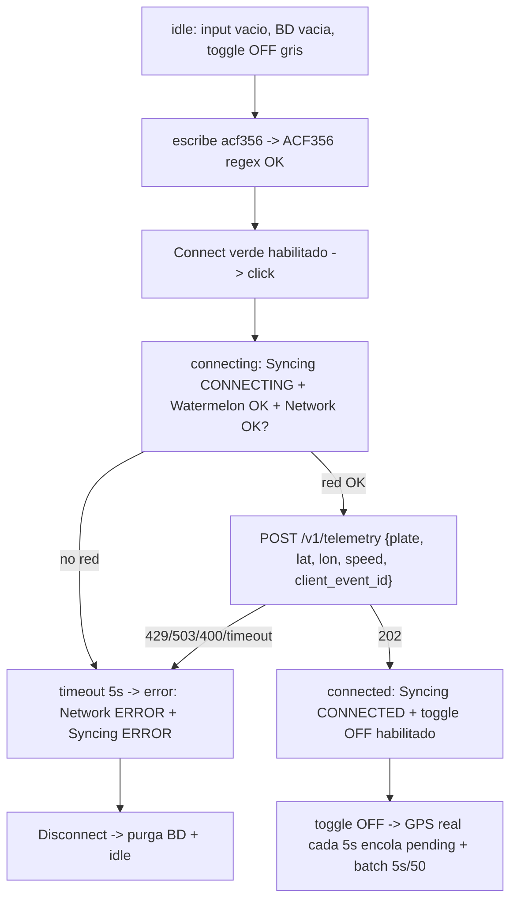
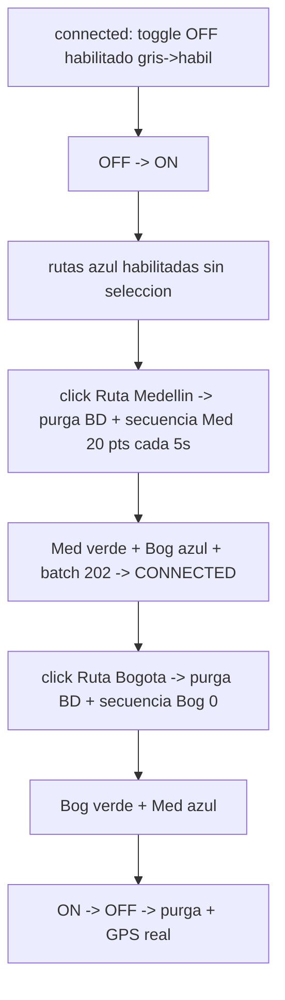
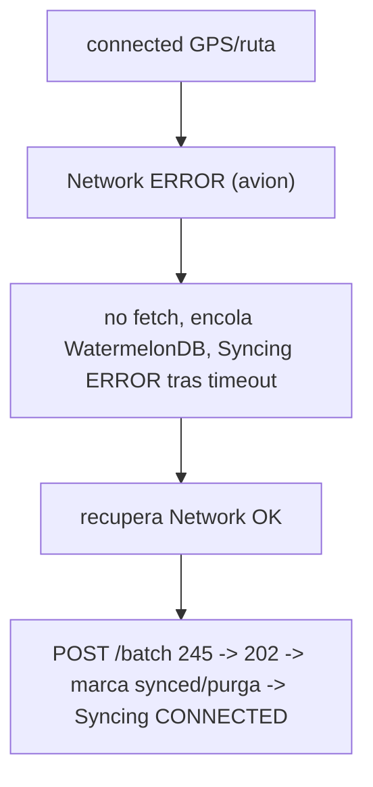
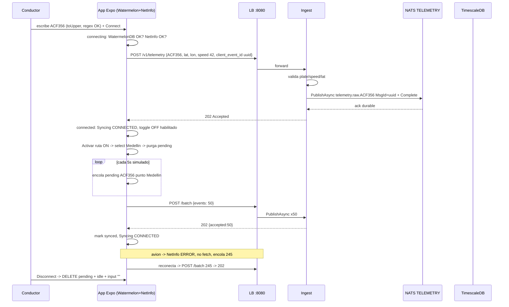
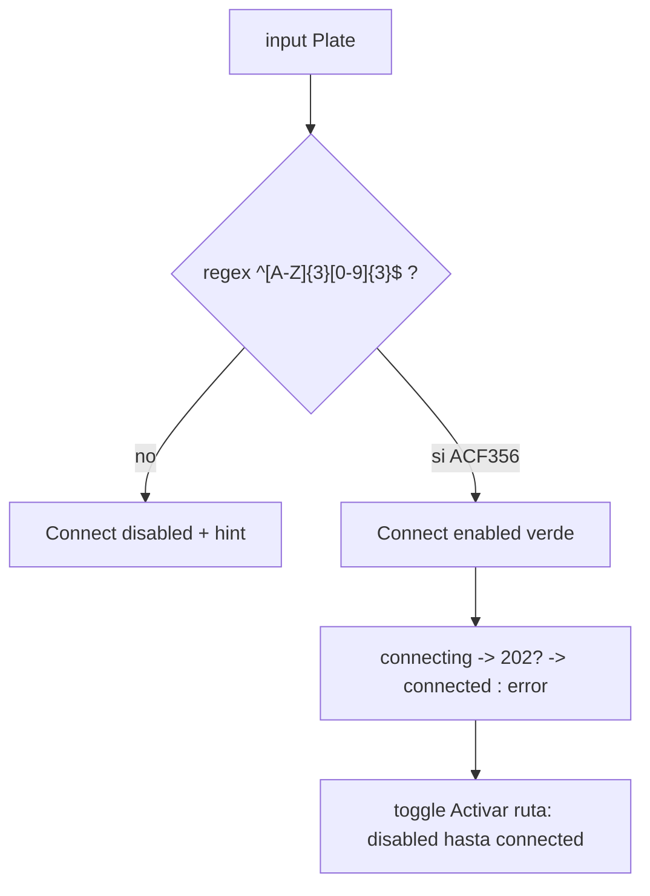

# SPEC-005: App móvil offline-first (Expo + WatermelonDB) — captura telemetría y sync en bloque

## Meta

- **SPEC-ID**: SPEC-005
- **Título**: App del Conductor offline-first — React Native Expo + WatermelonDB + sync batch idempotente con estados `idle->connecting->connected->error` y rutas simuladas Medellín/Bogotá
- **Estado**: approved
- **Backlog**: Portal Corporativo sec 4.D (Ecosistema Móvil Offline-First) + sec 4.A (ingesta batch) + sec 4.E (EAS/Fastlane)
- **Autor**: architect
- **Fecha**: 2026-08-26
- **Rama**: `feature/mobile-offline-first`

## 1. Overview

El conductor debe poder operar sin red (modo avión, túnel, zona rural) sin perder telemetría. La app es la **fuente de verdad mientras no hay red**; el backend es la fuente una vez sincronizado. Este spec cierra el cuadrante móvil de la PRUEBA-TECNICA: implementa la App Expo offline-first que persiste localmente en WatermelonDB (SQLite) y sincroniza en bloque vía `POST /v1/telemetry` (1 online) y `POST /v1/telemetry/batch` (1-500, ej. 245 al reconectar) con dedup `client_event_id -> Nats-Msg-Id` (SPEC-001 BR-004).

Separación de conceptos exigida por el solicitante:
- **Conectividad** = estado de red del equipo (`expo-netinfo` `isConnected/isInternetReachable`). `OFF` no intenta `fetch`.
- **Sincronización** = respuesta del servidor (`202 Accepted` retenido durable en NATS). Sin `202` no hay `connected`.

Máquina de estados: `idle` (sin placa) -> `connecting` (valida red+DB+primer 202) -> `connected` (recibe `202` periódico) -> `error` (sin respuesta o error del servidor desde `connecting`). `Disconnect` limpia buffer `pending_telemetry` y libera input para nueva placa. Sin placa no hay envío y la BD está vacía.

La placa es el ID estable `^[A-Z]{3}[0-9]{3}$` (ej `ACF356`, `TGY589`), normalizada a mayúsculas como en web. Tras `connected`, el toggle `Activar ruta simulada` habilita la selección de dos rutas predeterminadas (Medellín / Bogotá) con variaciones de posición y velocidad para demostrar alertas (`speeding_on/off`, `zone_enter/exit` en web). Cambiar de ruta limpia el buffer previo. Pasar `ON -> OFF` limpia buffer y vuelve a transmitir posición/velocidad de los instrumentos del equipo (GPS real).

Imágenes de referencia (6 wireframes adjuntos) definen la fidelidad UX: `Plate` input, `Connect` verde / `Disconnect` rosa, estados `CONNECTING/CONNECTED/ERROR` en rojo, `WatermelonDB status OK/ERROR` y `Network connectivity OK/ERROR` con dot verde/rojo, `Activar ruta simulada OFF/ON` y botones `Ruta urbana Medellín/Bogotá` (gris deshabilitado -> azul habilitado -> verde seleccionado).

## 2. Scope

### In Scope

- App `mobile/` Expo SDK 52 + React Native, WatermelonDB (fallback `expo-sqlite` si JSI bloquea), modelo `pending_telemetry` con `client_event_id` sagrado (uuid v4) para dedup `Nats-Msg-Id`.
- Flujo placa: input `^[A-Z]{3}[0-9]{3}$`, normaliza `toUpperCase+trim`, `Connect` deshabilitado hasta match, validación front + backend `400`.
- Máquina de estados `idle -> connecting -> connected -> error` con `Disconnect` que limpia `pending_telemetry` y resetea input/estado.
- Dos conceptos desacoplados: `Network connectivity` (NetInfo) vs `Syncing data ...` (respuesta `202`).
- Encolado telemetría: sin conexión acumula `pending`; con conexión hace `flush` en bloque `POST /batch` (1-500) y online de a 1 vía `POST /v1/telemetry`. Manejo `429 Retry-After:5` y `503 Retry-After` con backoff exponencial + jitter, sin brute-force.
- Modo `Activar ruta simulada`: `OFF` deshabilitado hasta `connected`; `ON` habilita rutas; seleccionar Medellín/Bogotá limpia buffer y genera secuencia predefinida con `speed` variado (incluye `0` y `>80`); `ON->OFF` limpia y vuelve a GPS real.
- Config `EXPO_PUBLIC_API_URL` para `localhost` vs `LAN IP` (Expo Go en cel), `expo-netinfo`, `expo-location` (solo para modo real, no necesario para demo simulada).
- CI/CD móvil: `EAS` (`eas.json`) + `Fastlane` (`fastlane/`) + `GitHub Actions` (`.github/workflows/mobile.yml`) como exige PRUEBA sec 4.D.
- Observabilidad móvil: `slog` local `plate, client_event_id, attempts, sync_status`.

### Out of Scope

- Nuevos endpoints backend (reusa `SPEC-001` `POST /v1/telemetry` y `/batch` `202/400/429/503`, `GET /healthz`).
- Auth JWT / `X-Device-Token` HMAC en MVP (reservado, `security: []` como SPEC-001; deuda prod documentada).
- Edición geométrica de zonas, mapa en el móvil, chat IA en el móvil.
- Background fetch agresivo iOS/Android (se acumula y flushea en foreground; no loop en bg).
- Vector DB / RAG, push notifications.
- Terraform prod y k6 caos (SPEC-005 no los crea, solo consume `202` para estado).

## 3. Actors and Systems

| Actor/Sistema | Tipo | Descripción | Dependencia |
|---------------|------|-------------|-------------|
| Conductor | usuario | Ingresa placa, conecta, activa ruta simulada, alterna Medellín/Bogotá, desconecta | App Expo |
| App Expo (mobile/) | sistema | React Native Expo + WatermelonDB + NetInfo + Location | Platform API (LB) |
| Platform API (`cmd/ingest` via LB `nginx:8080`) | servicio | `POST /v1/telemetry` y `/batch` -> NATS `telemetry.raw.{plate}` | NATS JetStream |
| NATS JetStream | sistema | Stream `TELEMETRY` `max_bytes 5GB` `Duplicates 2m` | - |
| TimescaleDB | sistema | Hypertable `telemetry` `PK(client_event_id, received_at)` | - |
| EAS / Fastlane / GitHub Actions | sistema | Build/deploy móvil | - |
| Operador web | usuario | Verifica en SPA que la telemetría del móvil aparece en mapa/alertas | - |

## 4. Use Cases

### UC-001 — Ingresar placa y conectar (máquina de estados)

- **Actor**: Conductor
- **Objetivo**: Registrar vehículo y pasar a transmisión.
- **Preconditions**: App en `idle`, `pending_telemetry` vacía, sin placa ingresada no hay envío.
- **Trigger**: Input `Plate` + botón `Connect`.
- **Main Flow**:
  1. Conductor escribe `acf356` -> app normaliza `ACF356`, valida regex `^[A-Z]{3}[0-9]{3}$`; `Connect` permanece deshabilitado hasta match, hint `"3 letras + 3 números"` si inválido.
  2. Pulsa `Connect` -> estado `connecting`, UI muestra `Syncing data ... CONNECTING` rojo, `WatermelonDB status OK` (DB inicializada), `Network connectivity OK|ERROR` según NetInfo.
  3. App valida `WatermelonDB` OK + `Network` OK, genera primer punto telemetry `{plate, lat, lon, speed, client_event_id uuid, occurred_at}` y hace `POST /v1/telemetry` (o `POST /batch` si hay backlog).
  4. Servidor responde `202 {accepted:true}` -> estado `connected`, UI `Syncing data ... CONNECTED` rojo, mantiene `OK` ambos dots; `Activar ruta simulada` pasa de deshabilitado a `OFF` habilitado.
- **Alternative Flows**:
  - 1a. Input `ACF35` (5 chars) -> `Connect` disabled, no `fetch`.
- **Error Flows**:
  - 3a. `Network ERROR` (modo avión) -> sin `fetch`, permanece `connecting` hasta timeout `5s` -> `error` (dot rojo `Network ERROR`, `Syncing ERROR`).
  - 3b. `202` no llega o llega `400/429/503` -> `connecting -> error`, UI `Syncing data ... ERROR` + `WatermelonDB/Network` según corresponda; `429/503` respeta `Retry-After` y backoff, no quema batería.
  - 3c. `WatermelonDB ERROR` (init falla) -> `error` directo, no intenta red.
- **Postconditions**: `connected` implica `toggle` habilitado; `error` requiere `Disconnect` o reintento manual.
- **Business Rules**: BR-001, BR-002, BR-003, BR-004

### UC-002 — Offline-first: acumular y sincronizar en bloque

- **Actor**: Conductor / Sistema
- **Objetivo**: No perder telemetría sin red y drenar al reconectar.
- **Preconditions**: `connected` con ruta activa o GPS real generando puntos cada `5s`.
- **Trigger**: Pérdida/recuperación de red (NetInfo) o intervalo flush.
- **Main Flow**:
  1. Cada `5s` se encola `pending_telemetry` con `client_event_id` uuid, `sync_status=pending`.
  2. Si `Network OK` -> cada `5s` o `batch >=50` hace `POST /batch {events: 1..500}` (ej. 245) -> `202 {accepted:N}` -> marca `synced` / purga (ver BR-006).
  3. Si `Network ERROR` -> no hace `fetch`, cola crece en WatermelonDB, sobrevive a kill de app.
- **Alternative Flows**:
  - 2a. `429 Retry-After:5` -> mantiene `pending`, backoff `5s + jitter 0-1s`, no vacía.
  - 2b. `503` -> mismo, pero muestra `Syncing ERROR` y `Network OK` (conceptos separados).
- **Error Flows**: `attempts >=5` -> marca `failed` y notifica, no reintenta infinito.
- **Postconditions**: Al reconectar, `batch` resincroniza sin duplicar (`ON CONFLICT DO NOTHING` + dedup `Nats-Msg-Id` 2m).
- **Business Rules**: BR-004, BR-005, BR-006, BR-007, BR-010

### UC-003 — Desconectar y limpiar

- **Actor**: Conductor
- **Objetivo**: Cambiar de vehículo/terminar turno sin fuga de datos.
- **Preconditions**: `connected` o `error`.
- **Trigger**: Botón `Disconnect` (rosa).
- **Main Flow**:
  1. Pulsa `Disconnect` -> detiene intervalo generación, aborta `fetch` en vuelo, `DELETE FROM pending_telemetry`, limpia input `""`, resetea a `idle`, `Connect` vuelve verde deshabilitado, `Activar ruta simulada` vuelve `OFF` gris deshabilitado, rutas grises.
- **Postconditions**: BD vacía, listo para nueva placa.
- **Business Rules**: BR-008

### UC-004 — Activar ruta simulada y elegir Medellín/Bogotá

- **Actor**: Conductor
- **Objetivo**: Demostrar telemetría con variaciones sin GPS real.
- **Preconditions**: `connected`, toggle `Activar ruta simulada` habilitado `OFF`.
- **Trigger**: Toggle `OFF -> ON` y botón `Ruta urbana Medellín/Bogotá`.
- **Main Flow** (toggle ON):
  1. Conductor pasa `OFF -> ON` -> rutas pasan de gris a azul habilitadas, sin selección, intervalo real GPS pausado, aún no genera simulada.
  2. Pulsa `Ruta urbana Medellín` -> limpia buffer `pending_telemetry`, inicia secuencia Medellín (puntos predefinidos ~20, `speed` variado `0/45/85`), encola cada `5s`, flushea en batch. Botón Medellín pasa a verde seleccionado, Bogotá queda azul.
  3. Pulsa `Ruta urbana Bogotá` -> limpia buffer previo, reinicia secuencia Bogotá desde punto 0, Bogotá verde, Medellín azul.
- **Alternative Flows**:
  - 2a. Pasar `ON -> OFF` -> limpia buffer simulado y empieza a transmitir posición/velocidad según instrumentos del equipo (GPS real `expo-location`).
- **Error Flows**: Si no hay `connected`, toggle permanece gris deshabilitado, no genera.
- **Postconditions**: Placa se mantiene al cambiar de ruta; solo buffer se reinicia.
- **Business Rules**: BR-009, BR-010, BR-011

### UC-005 — Observar estado de conectividad vs sincronización

- **Actor**: Conductor
- **Objetivo**: Distinguir falla de red vs falla de servidor.
- **Preconditions**: `connected` con generación activa.
- **Trigger**: Modo avión o backend `503`.
- **Main Flow**:
  1. Modo avión -> `Network connectivity ERROR` rojo, `Syncing data ...` pasa a `ERROR` tras timeout sin `202`, `WatermelonDB OK`. Cola crece.
  2. Recupera red -> `Network OK`, reintenta batch -> `Syncing CONNECTED` tras `202`.
  3. Backend `503` con red OK -> `Network OK` verde, `Syncing ERROR` rojo desacoplado.
- **Business Rules**: BR-004, BR-005

## 5. Functional Requirements

| ID | Descripción | UC | Prioridad |
|----|-------------|----|-----------|
| FR-001 | Input `Plate` valida `^[A-Z]{3}[0-9]{3}$` en front, normaliza `toUpperCase+trim`, `Connect` deshabilitado hasta match, hint `"3 letras + 3 números"`, backend valida igual `400`; sin placa no hay envío y `pending_telemetry` vacía | UC-001 | must |
| FR-002 | Máquina de estados `idle -> connecting -> connected -> error`; `connecting` valida `WatermelonDB OK` + `Network OK` + primer `POST` con `202`; sin `202` o error servidor `400/429/503/timeout 5s` -> `error`; `Disconnect` resetea a `idle` | UC-001, UC-003 | must |
| FR-003 | Dos indicadores desacoplados: `Network connectivity OK/ERROR` desde `expo-netinfo` y `Syncing data ... CONNECTING/CONNECTED/ERROR` desde respuesta `202` (conceptos distintos) + `WatermelonDB status OK/ERROR` | UC-001, UC-005 | must |
| FR-004 | `Disconnect` limpia `pending_telemetry`, aborta `fetch`, detiene intervalo, limpia input `""`, deshabilita `Activar ruta simulada` y rutas (grises) | UC-003 | must |
| FR-005 | `Activar ruta simulada` toggle `OFF` gris deshabilitado si no `connected`; en `connected` habilitado `OFF`; `ON` habilita rutas azules | UC-004 | must |
| FR-006 | Toggle `ON -> OFF` limpia buffer y cambia a GPS real (`expo-location`); `OFF -> ON` habilita rutas; seleccionar ruta limpia buffer previo y reinicia secuencia desde 0 | UC-004 | must |
| FR-007 | Rutas predeterminadas: `Medellín` y `Bogotá` ~20 puntos cada una, `lat/lon` reales, `speed` variado `0/45/85` para `speeding_on/off` y `zone_enter/exit`; generación cada `5s`, flush batch cada `5s` o `>=50` pendientes, `POST /batch 1..500` con `client_event_id` uuid; placa se mantiene al cambiar ruta | UC-004 | must |
| FR-008 | Persistencia WatermelonDB `pending_telemetry {id, client_event_id uuid, plate, lat nullable, lon nullable, speed int>=0, occurred_at, sync_status pending|syncing|synced|failed, attempts, last_error}`; `client_event_id` sagrado para dedup `Nats-Msg-Id`; sobrevive a kill | UC-002 | must |
| FR-009 | Sync batch idempotente: `POST /batch` con `events[1..500]` `1MB`, `202 {accepted:N}` -> marca `synced`/`delete`; `429/503` respeta `Retry-After` + backoff exponencial `5s*2^attempts` cap `60s` + jitter `0-1s`, no vacía; `attempts>=5` -> `failed` | UC-002 | must |
| FR-010 | Config `EXPO_PUBLIC_API_URL` para LB `http://host:8080` (LAN IP en Expo Go) y `Network` via `NetInfo`, `Location` solo modo real | UC-001, UC-002 | must |
| FR-011 | CI/CD móvil: `eas.json` (dev/preview/prod), `fastlane/` y `.github/workflows/mobile.yml` con `path-filter` + `EAS Build` | UC-001 | must |
| FR-012 | UI fiel a 6 wireframes: `Plate` input, `Connect` verde `#86efac` / `Disconnect` rosa `#f9a8d4`, estados rojo `#dc2626`, dots `OK` verde `#16a34a` / `ERROR` rojo, rutas gris `#e5e7eb` -> azul `#93c5fd` -> verde `#86efac` seleccionado, toggle `OFF` gris / `ON` verde | UC-001, UC-004 | must |

## 6. Business Rules

| ID | Descripción | UC/FR |
|----|-------------|-------|
| BR-001 | Placa ID canónico `^[A-Z]{3}[0-9]{3}$` `GTP890` estable, normalizada mayúsculas. `Connect` disabled si no match | UC-001 FR-001 |
| BR-002 | Sin placa no hay telemetría ni BD con datos; `pending_telemetry` vacía en `idle` | UC-001 FR-001 |
| BR-003 | `connecting -> connected` solo con `202`; sin `202` o error servidor -> `error`; `connecting` valida `WatermelonDB OK` + `Network OK` primero | UC-001 FR-002 |
| BR-004 | `Conectividad` (NetInfo) vs `Sincronización` (202) desacoplados; ambos `ERROR` si no hay red y no hay `202`; con red OK y `503` -> `Network OK` + `Syncing ERROR` | UC-001/005 FR-003 |
| BR-005 | `Disconnect` purga `pending_telemetry` y resetea input/estado a `idle`, aborta `fetch` y detiene intervalo | UC-003 FR-004 |
| BR-006 | Toggle `Activar ruta simulada` deshabilitado hasta `connected`; `OFF` gris, `ON` verde habilita rutas | UC-004 FR-005 |
| BR-007 | Seleccionar ruta limpia buffer previo y reinicia secuencia; `ON->OFF` limpia y pasa a GPS real | UC-004 FR-006 |
| BR-008 | Rutas ~20 puntos, `speed int>=0`, `lat[-90,90] lon[-180,180] nullable`, generación `5s`, batch `1..500` con `client_event_id` uuid para dedup `Nats-Msg-Id` + `ON CONFLICT DO NOTHING` | UC-004 FR-007/008 |
| BR-009 | Backoff `429/503` con `Retry-After` + exp `5s*2^n` cap 60s + jitter, `attempts>=5` -> `failed` | UC-002 FR-009 |
| BR-010 | `EXPO_PUBLIC_API_URL` para LAN IP, `WatermelonDB` persiste tras kill, `sync_status` trazable | UC-002 FR-008/010 |
| BR-011 | Fidelidad visual 6 wireframes: colores y habilitación exactos | UC-001/004 FR-012 |

## 7. Main Flows

### Flow A — Conectar y transmitir real



### Flow B — Ruta simulada Medellín/Bogotá



### Flow C — Offline y reconexión



## 8. Alternative and Error Flows

- `Plate` `ACF35` 5 chars -> `Connect` disabled, hint, no API.
- `POST /batch` con 1 inválido (`speed -1`) -> `400` all-or-nothing (SPEC-001), mantiene `pending`, no purga.
- `429` quota `12/min burst 20` por placa -> `Retry-After:5`, backoff, sigue `connected` lógico pero `Syncing` puede mostrar `ERROR` transitorio si no hay `202`.
- `503` infra (`MaxPending 512` o `jetstream >=80%` o breaker) -> mismo backoff, `Network OK` + `Syncing ERROR`.
- `WatermelonDB init fail` -> `WatermelonDB ERROR` rojo, no intenta red, `error`.
- App kill en `pending 100` -> al relanzar, WatermelonDB restaura 100, `idle` pero con datos si ya había placa -> requiere `Connect` para drenar.
- `OFF->ON` sin `connected` -> toggle gris, no hace nada.
- `Disconnect` en `error` -> purga y `idle` aunque había `failed`.

## 9. State and Transitions

| Estado | Evento | Siguiente | Condición |
|--------|--------|-----------|-----------|
| `idle` | input `ACF356` valid | `idle` (Connect habilitado) | regex OK |
| `idle` | `Connect` click | `connecting` | valid + DB/Net check |
| `connecting` | `202` primer POST | `connected` | `Network OK` + `WatermelonDB OK` + `202` |
| `connecting` | timeout 5s / `4xx`/`5xx` / Net ERROR / DB ERROR | `error` | sin `202` |
| `connected` | `Disconnect` | `idle` | purga BD + reset input |
| `connected` | `Network ERROR` persistente | `error` | sin `202` tras timeout |
| `error` | `Disconnect` | `idle` | purga |
| `error` | `Connect` reintento | `connecting` | nueva placa o misma |
| `connected` | `OFF->ON` | `connected` (modo simulado) | rutas azules |
| `connected` modo simulado | `select Medellin/Bogota` | `connected` | purga + secuencia |
| `connected` simulado | `ON->OFF` | `connected` (GPS real) | purga + GPS |

Estados finales: `idle` / `connected` / `error` (requiere `Disconnect`).

## 10. API / Interface Contracts

Reusa `SPEC-001` sin nuevos endpoints:

- `POST /v1/telemetry` `{plate ^[A-Z]{3}[0-9]{3}$, speed int>=0, lat nullable, lon nullable, occurred_at optional, client_event_id uuid}` -> `202 {accepted:true}` / `400` / `429 Retry-After:5` / `503 Retry-After`
- `POST /v1/telemetry/batch` `{events: [1..500]}` -> `202 {accepted:N}` / mismos errores, all-or-nothing
- `GET /healthz` y `GET /metrics` (no usados por móvil, solo debug)
- Headers: `Content-Type: application/json`, `Nats-Msg-Id: client_event_id` interno (no expuesto al móvil, lo setea `ingest`)
- `EXPO_PUBLIC_API_URL` env: `http://localhost:8080` (simulador) o `http://192.168.x.x:8080` (Expo Go LAN)
- Referencia: `docs/specs/SPEC-001-telemetry-ingest/contracts/http.openapi.yaml` y `events.asyncapi.yaml` (`telemetry.raw.{plate}`, `Nats-Msg-Id`)

## 11. Sequence Diagrams



## 12. Flow Diagrams

#### `Plate` y estados



## 13. Non-Functional Requirements

| ID | Categoría | Descripción |
|----|-----------|-------------|
| NFR-001 | performance | Encolado `5s`, flush `5s/50`, `POST /batch` p95 <500ms LAN, no bloquea UI, backoff no quema batería |
| NFR-002 | reliability | Offline-first: kill app con 100 pending -> restaura 100, dedup `client_event_id` evita duplicar tras 2m `Duplicates` |
| NFR-003 | scalability | 1 placa `1 evt/5s` = 12/min < quota `12/min burst20`; batch `500/30s` respeta `SPEC-001` BR-005 |
| NFR-004 | availability | `idle` sin placa = BD vacía; `Disconnect` purga determinista; `WatermelonDB` init <1s |
| NFR-005 | observability | Log local `plate, client_event_id, sync_status, attempts, last_error`, NetInfo listener, no PII conductor |
| NFR-006 | security | Sin secreto en git, `EXPO_PUBLIC_API_URL` env, `plate` no es PII, `client_event_id` no expone conductor |
| NFR-007 | UX/a11y | 6 wireframes fieles, `aria-label Plate`, `Connect`/`Disconnect` focus, toggle accesible |
| NFR-008 | DX | `npx expo start --tunnel`, `EXPO_PUBLIC_API_URL` LAN IP, `WatermelonDB` reconstruye sin migrate manual |

## 14. Acceptance Criteria

```gherkin
AC-001 (UC-001, FR-001/002/003, BR-001/002/003):
  Given app en idle con input vacio y pending_telemetry 0
  When escribo "acf356" (lower) y observo
  Then input muestra "ACF356" mayusculas, Connect pasa de disabled a enabled verde, hint no visible; When escribo "ACF35" Then Connect disabled y hint "3 letras + 3 números"; When sin placa y con toggle Then no hay fetch ni BD con datos

AC-002 (UC-001, FR-002/003, BR-003/004):
  Given input "TGY589" valido y WatermelonDB OK + Network OK
  When click Connect
  Then estado connecting muestra "Syncing data ... CONNECTING" rojo + "WatermelonDB status OK" verde + "Network connectivity OK" verde y hace POST /v1/telemetry; When responde 202 Then pasa a "Syncing data ... CONNECTED" rojo y habilita "Activar ruta simulada" OFF; When no hay 202 en 5s o responde 400/429/503 Then pasa a error con dot rojo y Syncing ERROR

AC-003 (UC-001/005, FR-003, BR-004):
  Given connected con "WatermelonDB OK" y "Network OK" y "Syncing CONNECTED"
  When activo modo avion
  Then "Network connectivity ERROR" rojo y tras timeout "Syncing data ... ERROR" rojo pero "WatermelonDB OK" se mantiene verde; When reconecto avion Then "Network OK" y batch pendiente hace POST /batch y vuelve a "Syncing CONNECTED" con 202

AC-004 (UC-003, FR-004, BR-005):
  Given connected con 20 pending y input "TGY589" y toggle ON
  When click Disconnect
  Then pending_telemetry 0, input "" , estado idle, Connect verde disabled, "Activar ruta simulada" OFF gris deshabilitado y rutas grises, intervalo detenido y fetch abortado

AC-005 (UC-004, FR-005/006, BR-006/007):
  Given idle sin conectar
  When observo "Activar ruta simulada"
  Then toggle OFF gris deshabilitado y rutas "Medellin/Bogota" grises deshabilitadas; When conectado y toggle OFF Then habilitado y rutas grises pero habilitables; When paso OFF->ON Then rutas pasan a azul habilitadas sin seleccion

AC-006 (UC-004, FR-006/007, BR-007/008):
  Given connected con toggle ON y rutas azules
  When click "Ruta urbana Medellín"
  Then purga pending previo, boton Medellin pasa a verde seleccionado #86efac y Bogota queda azul #93c5fd, empieza a encolar Medellin cada 5s con lat/lon reales y speed variado (incluye 0 y 85); When luego click "Ruta urbana Bogotá" Then purga Medellin y Bogota pasa a verde, Medellin a azul, secuencia reinicia 0

AC-007 (UC-004, FR-006, BR-007):
  Given connected en modo simulado Medellin verde
  When paso toggle ON->OFF
  Then purga buffer simulado, rutas vuelven a gris deshabilitadas, y empieza a transmitir GPS real (expo-location) cada 5s con misma placa

AC-008 (UC-002, FR-008/009, BR-008/009):
  Given offline con 60 puntos simulados Medellín (sin red) pendientes
  When recupera Network OK
  Then hace POST /batch con batch 50 (max 500) y luego resto, cada con client_event_id uuid unico y Nats-Msg-Id dedup 2m; When responde 202 {accepted:50} Then 50 marcados synced/purgados y "Syncing CONNECTED"; When responde 429 Retry-After:5 Then mantiene 60 pending y reintenta con backoff 5s*2^n + jitter sin vaciar

AC-009 (UC-002, FR-008, BR-010):
  Given conectado con 245 offline (ej PRUEBA)
  When kill app y relanzo
  Then WatermelonDB restaura 245 pending (si habia placa previa, requiere Connect para drenar) y sobrevive; When consulto DB Entonces SELECT count(*)=245 y client_event_id uniques

AC-010 (UC-002, FR-009, BR-009 borede):
  Given conectado con Network OK pero backend responde 503
  When batch 20
  Then mantiene Network OK verde pero Syncing ERROR rojo desacoplado y hace backoff hasta 60s, attempts++ y last_error="503 backpressure", no purga; When luego 202 Then vuelve a CONNECTED

AC-011 (FR-010/011, NFR-008):
  Given mobile/ con EXPO_PUBLIC_API_URL=http://192.168.1.10:8080 y eas.json + fastlane/ + .github/workflows/mobile.yml
  When "npx expo start" y "eas build --platform android --profile preview"
  Then Expo Go en cel conecta via LAN IP y hace POST 202 via LB, y workflow corre path-filter mobile/

AC-012 (FR-012, NFR-007):
  Given build mobile
  When render 6 wireframes
  Then colores exactos: Connect verde #86efac, Disconnect rosa #f9a8d4, Syncing rojo #dc2626, OK verde #16a34a, ERROR rojo #dc2626, ruta gris #e5e7eb azul #93c5fd verde #86efac, fonts sketch y touch targets >=44pt
```

## 15. Functional Test Scenarios

| ID | UC/FR/AC | Preconditions | Input | Action | Expected Result |
|----|----------|---------------|-------|--------|-----------------|
| TS-001 | UC-001 FR-001 AC-001 | idle vacio | type "acf356" vs "ACF35" | input | toUpper + Connect enabled vs disabled hint |
| TS-002 | UC-001 FR-002/003 AC-002 | DB OK Net OK | click Connect TGY589 | POST 1 | connecting -> connected 202 o error timeout 5s |
| TS-003 | UC-001/005 FR-003 AC-003 | connected | avion ON/OFF | NetInfo toggle | Network ERROR + Syncing ERROR -> reconecta OK + batch 202 |
| TS-004 | UC-003 FR-004 AC-004 | connected 20 pending toggle ON | click Disconnect | press | 0 pending, input "", idle, toggle OFF gris |
| TS-005 | UC-004 FR-005 AC-005 | idle vs connected | observe toggle | state | OFF gris disabled idle vs OFF habilitado connected vs ON azul |
| TS-006 | UC-004 FR-006/007 AC-006 | connected ON | click Medellin -> Bogota | press | purga + verde selec + encolado 5s variado |
| TS-007 | UC-004 FR-006 AC-007 | simulado Medellin verde | toggle ON->OFF | toggle | purga + gris + GPS real |
| TS-008 | UC-002 FR-008/009 AC-008 | 60 offline Medellin | recover Net OK | batch flush | POST /batch 50 -> 202 50 purge; 429 keeps 60 + backoff |
| TS-009 | UC-002 FR-008 AC-009 | 245 offline kill | kill & relaunch | restart | 245 restores |
| TS-010 | UC-002 FR-009 AC-010 | Net OK but 503 | batch 20 | POST | Network OK + Syncing ERROR + backoff 60s |
| TS-011 | FR-010/011 AC-011 | mobile/ env LAN IP + eas | expo start + eas build | CLI | Expo Go LAN 202 + workflow path-filter |
| TS-012 | FR-012 AC-012 | build | render | visual | colores wireframes exactos |

## 16. Open Questions

- [x] ¿Regex placa? — `^[A-Z]{3}[0-9]{3}$` deshabilita Connect, toUpper como web.
- [x] ¿Sin placa sin BD? — Sí, 0 pending en idle.
- [x] ¿Conectividad vs sincronización desacoplados? — Sí, NetInfo vs 202.
- [x] ¿Disconnect purga? — Sí.
- [x] ¿ON->OFF a GPS real? — Sí, limpia y GPS.
- [x] ¿Rutas ~20 pts con speed 0/85? — Sí, placeholder (coordenadas reales Medellin/Bogota se inyectan luego, no bloquea spec).
- [ ] ¿Coordenadas finales Medellin/Bogota? — No bloquea draft->approved; se entregarán como `mobile/src/routes/medellin.ts` y `bogota.ts` en plan (enh no bloqueante).

## 17. Assumptions

- `POST /v1/telemetry` y `/batch` ya existen (SPEC-001) con `202` async NATS `Duplicates 2m` y `ON CONFLICT DO NOTHING`; móvil solo consume `202/429/503`.
- WatermelonDB en Expo con `expo-sqlite` adapter; si JSI bloquea, fallback `expo-sqlite` mantiene mismo modelo.
- Intervalo `5s` alineado con `SPEC-001` `1 evt/5s` y quota `12/min burst20`; batch `5s/50` respeta `500/30s`.
- GPS real vía `expo-location` solo en `ON->OFF`; simulada no requiere permiso location.
- `EXPO_PUBLIC_API_URL` resuelve `localhost` vs `LAN IP` para Expo Go; LB `8080` único entry point.
- CI móvil path-filter: no dispara build full backend si solo cambia `mobile/`.

---

## Trazabilidad

```
UC-001 -> FR-001, FR-002, FR-003, BR-001/002/003 -> AC-001, AC-002, AC-003 -> TS-001, TS-002, TS-003
UC-002 -> FR-008, FR-009, BR-008/009/010 -> AC-008, AC-009, AC-010 -> TS-008, TS-009, TS-010
UC-003 -> FR-004, BR-005 -> AC-004 -> TS-004
UC-004 -> FR-005, FR-006, FR-007, BR-006/007/008 -> AC-005, AC-006, AC-007 -> TS-005, TS-006, TS-007
UC-005 -> FR-003, BR-004 -> AC-003, AC-010 -> TS-003, TS-010
Transversal -> FR-010, FR-011, FR-012 -> AC-011, AC-012 -> TS-011, TS-012
```

## Contratos

- HTTP: `docs/specs/SPEC-001-telemetry-ingest/contracts/http.openapi.yaml` (reusado, sin cambios) — `POST /v1/telemetry` y `/batch` `202/400/429/503`
- Eventos NATS: `docs/specs/SPEC-001-telemetry-ingest/contracts/events.asyncapi.yaml` (`telemetry.raw.{plate}` `Nats-Msg-Id=client_event_id` dedup 2m, `MaxDeliver 3 -> dlq`)
- Env: `EXPO_PUBLIC_API_URL` (string URL) + `EXPO_PUBLIC_API_TIMEOUT` (default 5000)

## Validación (pre-entrega)

- [ ] Cada UC tiene flujo principal y alternos/errores
- [ ] Cada FR ligado a UC
- [ ] Cada BR implementable y sin solución prematura (qué no cómo)
- [ ] Cada AC Gherkin medible con `Given/When/Then` y trazable a UC/FR/BR
- [ ] Cada AC tiene al menos un TS
- [ ] No TS introduce requisitos nuevos
- [ ] Diagramas mermaid representan comportamiento no implementación
- [ ] Tecnología fijada Expo + WatermelonDB (PRUEBA sec 4.D) sin contradecir ADR-0002
- [ ] Open Questions no bloqueantes resueltas o marcadas enh

