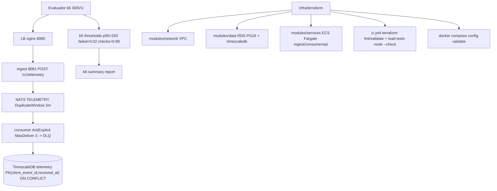

# Plan — SPEC-006: Infraestructura Caos/Carga (k6) + IaC Terraform + Docker Compose

## Meta

- **SPEC-ID**: SPEC-006
- **Spec**: `docs/specs/SPEC-006-infra-chaos-iac/spec.md` (approved)
- **Autor**: architect
- **Fecha**: 2026-08-29
- **Estado**: approved

## 1. Summary

Cerrar el cuadrante `4.E` (lo único pendiente del MVP): `infra/k6/*.js` simulando `300 VU` con `10%` dup (`client_event_id` → `Nats-Msg-Id`) y `5%` payloads inválidos (`400` sin contaminar stream), thresholds `p95<250/failed<0.02/checks>0.99` + verificación dedup, y `infra/terraform/` modular `network/data/services` + `envs/{dev,prod}` con `fmt/validate` verde y sin secretos en git. Todo validado por `ci.yml` (`compose config`, `node --check`, `terraform validate`) y documentado en `README`. Riesgos: `k6` + `compose` en `16GB`, `DuplicateWindow 2m` ya existente, tradeoff `RDS+timescaledb` vs `ECS TimescaleDB`.

## 2. Specification Traceability

| Spec ID | Requirement / Use Case | Technical Change | Tests |
|---------|------------------------|------------------|-------|
| FR-001 (UC-001) | k6 300 VU 5m  POST /v1/telemetry con plate válida | `infra/k6/load.js` (+ `chaos.js` o `scenarios`) `k6/http` + `k6/check` + `__ENV.BASE_URL` | TEST-001 (TS-001) AC-001 |
| BR-001 (UC-001) | 10% dup `client_event_id` reuse → `Nats-Msg-Id` 2m | `infra/k6/load.js` lógica `Math.random()<0.10` + `uuid` pool + `PublishAsync` dedup | TEST-002 (TS-002) AC-002 |
| FR-002 (UC-001) | 10% dup aceptado 202 sin fila duplicada | mismo script `check 202` + doc `GET /api/fleet/positions` spot check | TEST-002 AC-002 |
| BR-002 (UC-001) | 5% err `400` sin publish | `infra/k6/load.js` ramas `GTP98/speed -1/lat 100/{} sin plate` → `check 400` | TEST-003 (TS-003) AC-003 |
| FR-003 (UC-001) | 5% err `400` no contamina stream/consumer | mismo | TEST-003 AC-003 |
| BR-003 (UC-001/003) | thresholds `p95<250/failed<0.02/checks>0.99` | `options.thresholds` + `summary` | TEST-001/004 AC-001/004 |
| FR-004 (UC-001/003) | thresholds emitidos y validados | mismo | TEST-001 AC-001 |
| FR-005 (UC-001/003) | dedup verificable documentado | `infra/k6/README.md` + comentario script `GET /positions` | TEST-009 AC-009 |
| FR-006 (UC-002) | `infra/terraform` modules + envs | `infra/terraform/{main,variables,outputs,versions}.tf` + `modules/{network,data,services}` + `envs/{dev,prod}/main.tf` | TEST-005 (TS-005) AC-005 |
| BR-004 (UC-002) | `terraform fmt` canónico | `versions.tf` `~>1.15/aws ~>5` + `fmt -recursive` | TEST-005 AC-005 |
| BR-005 (UC-002) | sin `*.tfvars` secretos | `.gitignore` + `*.tfvars.example` + `TF_VAR_*` | TEST-005 AC-005 |
| FR-007 (UC-002) | sin secretos en git, gitleaks verde | mismo + `gitleaks.toml` | TEST-005 AC-005 |
| BR-006 (UC-002) | `compose config` gate | `docker-compose.yml` intacto + `ci.yml` `compose` job | TEST-006 (TS-006) AC-006 |
| FR-008 (UC-002) | compose válido tras cambios | mismo | TEST-006 AC-006 |
| FR-009 (UC-002) | ci valida `k6` + `tf` no pasivo | `.github/workflows/ci.yml` `load-tests` `node --check` + `terraform` `fmt/validate` | TEST-007 (TS-007) AC-007 |
| FR-010 (UC-002/003) | README doc `compose up/k6/terraform plan` + 16GB | `README.md` § Testing + `infra/k6/README.md` | TEST-008 (TS-008) AC-008 |
| AC-009/010 | script sin secretos, dedup estable | `infra/k6/*.js` `grep` + `GET /positions` | TEST-009/010 AC-009/010 |

## 3. Technical Context

- Servicios actuales: `nats:2.10 -js file` (`TELEMETRY` `max_bytes 5GB dev`, `ALERTS` `7d`), `timescaledb` `PG15 + PostGIS` (`telemetry` chunk 1 día, `critical_zones`), `ingest:8081` `PublishAsyncMaxPending 1024`, `consumer:8082`, `api:8083` `BFF SSE`, `agent:8084` `Genkit`, `web:5173`, `lb nginx:8080` único entry — `docker-compose.yml` ya validado por `compose` job (ADRs `0001/0002/0005/0006/0007`).
- Stack k6: no existe (`infra/k6/*.js` faltante, `ci.yml` `load-tests` queda `sin scripts k6 todavía — stub pasivo`). `skill chaos-load-testing` fija `300 VU constant-vus 5m`, `thresholds p95<250/failed<0.02/checks>0.99`, `Nats-Msg-Id` dup y `DuplicateWindow 2m` ya en `TELEMETRY` (SPEC-001 `BR-004`).
- Stack Terraform: no existe (`find *.tf` vacío, `infra/terraform` faltante, `ci.yml` `terraform` queda pasivo con `hashFiles('infra/terraform/**/*.tf')`). `skill iac-and-cicd` fija módulos `network/data/services`, `envs/dev+prod`, `terraform fmt/validate`, `ops via GH Secrets`, sin `Terragrunt`.
- CI actual: `.github/workflows/ci.yml` `backend`, `terraform` (`setup-terraform 1.15.8` con guards `hashFiles`), `compose` (`docker compose config --quiet`), `web`, `mobile`, `load-tests` (`node --check` sobre `infra/k6`+`tests/load`), `secrets` `gitleaks`. `.gitignore` ya cubre `.env`; falta `*.tfvars`.
- Restricciones heredadas: ADR-0001 (JetStream `5GB dev / 50-100 prod`, `DuplicateWindow 2m`, `replicas 1 dev`), ADR-0002 (monorepo `<50 vars` `.env.example`, `shared/domain` top), ADR-0004 (`GEMINI_API_KEY` solo env, `gitleaks` gate), ADR-0005 (monolito modular `gobreaker` en `ingest`), `AGENTS.md` máquina `16GB` (core `6-9GB`, `observability +2GB`, `k6 1-2GB 1000VU` → no `observability + k6 + 4 bins -race` simultáneo).

## 4. Architecture Changes

Nuevos: `infra/k6/load.js` + `infra/k6/chaos.js` (o `scenarios` en `load.js`) + `infra/k6/README.md` + `infra/terraform/**` (`main.tf, variables.tf, outputs.tf, versions.tf, modules/network, modules/data, modules/services, envs/dev/main.tf, envs/prod/main.tf`, `terraform.tfvars.example`, `README`). Modificados: `README.md` (§ Testing + § Infra), `.gitignore` (añadir `*.tfvars`), potencialmente `.github/workflows/ci.yml` (ajustar `hashFiles` para no pasivo, aunque ya está). `docker-compose.yml` tocado solo si se añade `profiles` o health extras (no necesario). Eliminados: nada.



Decisión particionado >10k msg/s no MVP (ADR-0001 cond.7) — `k6` 300 VU usa `0.3%` del techo broker `370k msg/s`.

## 5. Detailed Technical Design

- **Componente `k6 scripts` (`infra/k6/`)**:
  - Interfaces: `k6/http`, `k6/check`, `k6/execution`, `uuid` vía `crypto` o paquete `k6-utils`. Env `BASE_URL=__ENV.BASE_URL||'http://localhost:8080'`. Ports consumidos: `POST /v1/telemetry` (`SPEC-001` `OpenAPI`) y opcional `POST /v1/telemetry/batch`.
  - Responsabilidades: generar `plate` válida `GTP${100+Math.floor(Math.random()*900)}` (regex `^[A-Z]{3}[0-9]{3}$`), `speed 0..90 int`, `lat 6.14..6.34 lon -75.68..-75.48` (Medellín) o `4.65..4.77/-74.12..-74.02` (Bogotá), `client_event_id` uuid `v4`, `occurred_at` `new Date().toISOString()`. Pool `lastIds: string[]` de 1000 para dup. Lógica por iteración (ordenado como en spec flow):
    ```js
    const r = Math.random();
    if (r < 0.10 && lastIds.length) { id = lastIds[rand]; payload = dupPayload(id); }
    else if (r < 0.147 && r >=0.10) { payload = invalidPayloadSet[rand]; expect=400; }
    else { id = uuidv4(); lastIds.push(id); payload = validPayload(id); expect=202; }
    ```
    `invalidPayloadSet`: `{plate:'GTP98', speed:-1, lat:100, lon:200, body:'{}', missingPlate:true, missingLon:true, badJson:'{'}`.
  - Flujo: `http.post(BASE_URL+'/v1/telemetry', JSON.stringify(payload), {headers:{'Content-Type':'application/json'}})` → `check(res, { '202 valid': r=>expect===202&&r.status===202, '400 invalid': r=>expect===400&&r.status===400, 'no 500': r=>r.status!==500 })`. Métricas: `options = { scenarios:{ fleet:{ executor:'constant-vus', vus:300, duration:'5m' } }, thresholds:{ http_req_duration:['p(95)<250'], http_req_failed:['rate<0.02'], checks:['rate>0.99'] } }`. Alternativo documentado `ramping-vus` para `ts/load`.
  - Persistencia/eventos: no escribe DB directo; dedup se valida leyendo `GET /api/fleet/positions?limit=500` o contando `pending` pre/post (comentario en script). No hardcodea `DATABASE_URL` ni `GEMINI_API_KEY`.
  - Concurrencia: `300 VU` `~1-2GB` (ADR-0002 cond.7); idempotencia: `Nats-Msg-Id=client_event_id` `2m` ya en `TELEMETRY` (SPEC-001); `CopyFrom` `ON CONFLICT` backend.
  - Dependencias: `k6` binario local (`brew install k6`) o `grafana/k6:latest` docker; `docker compose up --wait` healthy.
  - Archivos: `infra/k6/load.js`, `infra/k6/chaos.js` (variante con `scenarios`/`batch` o `downtime` opcional), `infra/k6/README.md`, `tests/load` stub si existe.

- **Componente `Terraform IaC` (`infra/terraform/`)**:
  - Interfaces: `terraform >=1.15`, `aws provider ~>5`, `random` para passwords, `TF_VAR_*` env.
  - Responsabilidades: declarar VPC (`modules/network`: `aws_vpc`, `2 az subnets`, `igw, nat` mínimos), Data (`modules/data`: elección documentada `RDS Postgres 16 + timescaledb extension` vs `ECS TimescaleDB` — decisión MVP: `RDS db.t3.micro` free-tier con `parameter_group` `rds.extensions` + `aws_db_instance` + `aws_security_group` permitiendo `5432` solo desde `ECS SG`; trade-off: `RDS` reduce RAM local vs `self-host` 2GB más pero costo `~$15/mes`), Services (`modules/services`: `ECS Fargate` `aws_ecs_cluster` + `aws_ecs_task_definition` `ingest/consumer/api` con `image` var, `aws_ecs_service` `desired_count 1`, `aws_lb` `ALB` + `target_groups` `80->8080/8081/8083`, `IAM` `taskRole`).
  - Flujo: `terraform fmt -check -recursive infra/terraform` → `terraform init -backend=false && validate` en `root` y `envs/prod` (ADRs). `outputs.tf` expone `alb_dns`, `rds_endpoint`, `ecs_cluster_name`. `variables.tf` sin defaults sensibles (`variable "db_password" { sensitive = true }`).
  - Persistencia: `tfstate` local en MVP (`init -backend=false`), opcional `S3+DynamoDB` post-MVP (Open Question).
  - Transacciones: `*.tfvars` no versionado, `terraform.tfvars.example` con `project="fleet" region="us-east-1" db_instance_class="db.t3.micro"`.
  - Dependencias: `AWS creds` en `GitHub Secrets` solo para `plan/apply` manual; `validate` local sin creds.
  - Archivos: `infra/terraform/main.tf` (root llama `modules`), `variables.tf`, `outputs.tf`, `versions.tf`, `modules/network/{main,variables,outputs}`, `modules/data/{main,...}`, `modules/services/{main,...}`, `envs/dev/main.tf`, `envs/prod/main.tf`, `terraform.tfvars.example`, `.gitignore` `*.tfvars`, `infra/terraform/README.md`.

- **Componente `CI + Compose + Docs` (`ci.yml`, `docker-compose.yml`, `README.md`, `.gitignore`)**:
  - `ci.yml` ya tiene guards `hashFiles('infra/terraform/**/*.tf')` y `node --check` sobre `infra/k6`; tras crear archivos los jobs dejarán de ser pasivos automáticamente. No requiere cambio, pero se verificará que `terraform_fmt` use `recursive`. `compose` job intacto.
  - `README.md` § `Testing automático` y nueva § `Infra` documentan `k6 run infra/k6/load.js`, `chaos.js`, `terraform init/plan`.
  - `.gitignore` añade `*.tfvars` y `*.tfstate*`.

## 6. API Changes

| Endpoint | Método | Cambio | Compatibilidad | Validaciones |
|----------|--------|--------|----------------|--------------|
| `POST /v1/telemetry` | POST | reuso k6 carga (sin cambio) | backward compatible | plate `^[A-Z]{3}[0-9]{3}$`, `speed int>=0`, `lat/lon` nullable en rango, `400` sin publish |
| `POST /v1/telemetry/batch` | POST | opcional k6 batch variante | compat | `1..500`, `1MB`, `all-or-nothing` `400` |
| `GET /api/fleet/positions` | GET | lectura spot-check dedup (sin cambio) | compat | `limit 1..500`, keyset |
| `GET /healthz` | GET | gate `docker compose` healthy para k6 | - | - |
| `GET /metrics` | GET | `p95, breaker, jetstream_bytes` | - | - |

Sin `OpenAPI` nuevo; `redocly lint` ya verde en `SPEC-001`.

## 7. Data Changes

Sin hypertable nueva. `telemetry` ya con `PK(client_event_id, received_at)`, `index(plate, received_at DESC)`, `GIST(geom)`. Si se elige `RDS` en `infra/terraform/data`, `aws_db_instance` con `engine=postgres 16`, `parameter group` `rds.force_ssl=0` dev, `allocated_storage 20`, `backup_retention 7`. No `CopyFrom` nuevo; `k6` no altera `pg_advisory_lock`. Backward compat: `terraform` no toca `migrations/` (`cmd/ingest` aplica).

```hcl
# ejemplo modules/data/main.tf fragmento
resource "aws_db_instance" "timescale" {
  engine               = "postgres"
  engine_version       = "16.3"
  instance_class       = var.db_instance_class
  allocated_storage    = 20
  db_name              = "fleet"
  username             = var.db_username
  password             = var.db_password
  vpc_security_group_ids = [var.rds_sg_id]
  db_subnet_group_name = var.db_subnet_group
  skip_final_snapshot  = true
}
```

## 8. Event / Messaging Changes

Reusa `TELEMETRY` `storage=file` `max_bytes 5GB dev` `DuplicateWindow 2m` `discard=old` `telemetry.raw.{plate}` `Nats-Msg-Id=client_event_id`. No `ALERTS` nuevo. `k6` produce vía HTTP `ingest` (`PublishAsyncMsgId`) no directo NATS. `Consumer` `CopyFrom 500-1000` `MaxAckPending 10k` at-least-once `ON CONFLICT`. Sin `DLQ` nuevo; `k6` inválidos nunca llegan a `consumer`.

## 9. Observability

- k6: `summary` `http_reqs, http_req_duration p95, checks, http_req_failed` + `k6 --out json` opcional y `prometheus-nats-exporter` `jetstream_bytes >=80%` alerta (ADR-0001 cond.5). `infra/k6/README.md` explica `k6 run --summary-export`.
- Logs `slog` JSON `plate, client_event_id` ya en `ingest`; `k6` no expone `GEMINI_API_KEY`.
- Metrics: `lb:8080/metrics` `p95`, `consumer:8082/metrics` `ack_pending`, `api:8083/metrics` `sse_clients`.
- Dashboards: no nuevo (`profile observability` opcional).
- Correlation: `client_event_id` uuid en payload y `Nats-Msg-Id` trazable.

## 10. Security

- k6 script sin secretos (solo `__ENV.BASE_URL`); `terraform` sin `*.tfvars` reales (`gitleaks` gate ADR-0004), `RDS SG` solo `ECS SG` `5432`, no `0.0.0.0/0`.
- `GEMINI_API_KEY` no en `infra/k6` ni `tf` (condición ADR-0003 cond.9).
- Input validación ya en `ingest` (`plate` regex, `speed` int, `lat/lon` range) cubre `5%` err sin `panic`.
- `ALB` TLS termination documentado post-MVP; HTTP dev ok.

## 11. Test Strategy

| Test ID | TS Relacionado | Nivel | Componente | Setup | Input | Expected | Mocks | Ubicación |
|---------|----------------|-------|------------|-------|-------|----------|-------|-----------|
| TEST-001 | TS-001 | performance (k6) | `infra/k6/load.js` | `docker compose up --wait` | `BASE_URL=8080` 300 VU 10s smoke | `p95<250 failed<0.02 checks>0.99 http_reqs>0` | - | `k6 run` local + `node --check` en `ci.yml load-tests` |
| TEST-002 | TS-002 | integration (k6→NATS→DB) | `infra/k6` dedup | `telemetry` baseline count | `10% dup` pool uuid reuse | `202` cada dup, `count DISTINCT client_event_id` estable, `GET /fleet/positions` no duplica | - | `k6` + `SELECT` o `GET /api/fleet/positions` |
| TEST-003 | TS-003 | integration | `infra/k6` invalid | - | `5%` `GTP98/speed -1/lat 100/{} sin plate` | `400` sin `PublishAsync`, sin fila `telemetry` | - | `k6` checks 400 |
| TEST-004 | TS-004 | performance | `infra/k6` full 5m  | `300VU 5m` (manual/CI opcional) | `10%+5%` combinados | `p95<250` `failed≈0.05` `checks>0.99` `jetstream_bytes<5GB` | - | `k6 run` full |
| TEST-005 | TS-005 | contract (terraform) | `infra/terraform` | `*.tf` existe | `terraform fmt -check -recursive && init -backend=false && validate` root+`envs/prod` | `0` exit `versions ~>1.15/aws ~>5` no `tfvars` secretos | - | `ci.yml` `terraform` job |
| TEST-006 | TS-006 | contract | `docker-compose.yml` | - | `docker compose config -q` | `0` exit `lb/ingest/nats/timescaledb` presentes | - | `ci.yml` `compose` |
| TEST-007 | TS-007 | e2e (CI) | `ci.yml` | push `infra/k6/*.js`+`*.tf` | `git push` | jobs `terraform`+`load-tests` corren `node --check`+`validate`, rojo si inválido | - | `GH Actions` |
| TEST-008 | TS-008 | contract (docs) | `README.md` | - | `grep k6 run infra/k6 && terraform init` | README doc `compose up`, `k6 load/chaos`, `terraform plan`, notas `16GB` | - | `README.md` |
| TEST-009 | TS-009 | unit (js syntax) | `infra/k6/load.js` | - | `node --check + grep client_event_id 0.10 0.05 thresholds __ENV` | `node --check` OK, contiene `10%/5%`, `thresholds`, `__ENV.BASE_URL`, sin secretos | - | `ci.yml load-tests` |
| TEST-010 | TS-010 | integration | `infra/k6` → `fleet positions` | baseline `positions` | ráfaga `10% dup+5% invalid` 10s | únicos estables, inválidos ausentes, `failed≈5%` | - | `k6` + `GET /fleet/positions` |

Trazabilidad `TS->TEST` 1:1.

## 12. Implementation Steps

### Step 1 — k6 scripts base + README (FR-001/002/003/004/005, BR-001/002/003, AC-001/002/003/004/009)
**Goal**: `infra/k6/load.js` (+ `chaos.js` o `scenarios`) executable + doc dedup.
**Spec References**: UC-001, FR-001..005, AC-001..004/009/010, TS-001..004/009/010
**Changes**: `infra/k6/load.js` (300 VU `constant-vus 5m`, `thresholds p95<250/failed<0.02/checks>0.99`, `10% dup reuse uuid`, `5% invalid set`, `checks 202/400`, `__ENV.BASE_URL`), `infra/k6/chaos.js` (variante `batch`/`ramping` o `downtime` doc), `infra/k6/README.md` (cómo verificar dedup `GET /positions`, métricas), `tests/load` stub si existe.
**Implementation**: `uuid` via `crypto.randomUUID()` o `k6-utils`, `Math.random()<0.10` dup, `Math.random()<0.0526` invalid del resto, `validPayload` con `lat/lon` Medellín/Bogotá, `invalidPayloads` array, `http.post(BASE_URL+'/v1/telemetry')`, `options` con `scenarios.fleet`. Sin `GEMINI_API_KEY`.
**Tests**: TEST-001/002/003/004/009/010 (`node --check`, `k6 run --duration 10s` smoke, `grep` checks)
**Dependencies**: `SPEC-001` endpoints; ninguna infra TF.
**Validation**: `node --check infra/k6/load.js && k6 run infra/k6/load.js --duration 10s --vus 10` con `docker compose up --wait`, `curl http://localhost:8080/healthz`.
**Audit gates**: `reviewer` (no secreto, input valida), `quality-auditor` si lógica `Math.random` compleja.

### Step 2 — Terraform skeleton + fmt/validate (FR-006/007, BR-004/005, AC-005)
**Goal**: `infra/terraform/` `fmt` limpio + `validate` OK root.
**Spec References**: UC-002, FR-006/007, AC-005, TS-005
**Changes**: `infra/terraform/versions.tf` (`required_version ~>1.15`, `aws ~>5`, `random`), `variables.tf` (project, region, db_username/password sensitive sin default), `outputs.tf` (`alb_dns, rds_endpoint`), `main.tf` (root llama `modules`), `modules/network/{main,variables,outputs.tf}` (VPC 2 AZ), `modules/data/{main,...}` (RDS PG16 + SG), `modules/services/{main,...}` (ECS Fargate + ALB stub), `terraform.tfvars.example`, `infra/terraform/README.md`.
**Implementation**: `terraform fmt -recursive`, `terraform init -backend=false && validate` loop. `.gitignore` + `*.tfvars`.
**Tests**: TEST-005 (`fmt -check`, `validate` root)
**Dependencies**: Step 1 no bloqueante (paralelo).
**Validation**: `terraform fmt -check -recursive infra/terraform && cd infra/terraform && terraform init -backend=false && terraform validate`.
**Audit gates**: `reviewer` + `security` (SG no `0.0.0.0/0`, no `tfvars` con secretos).

### Step 3 — Terraform envs + compose gate + README (FR-008/010, BR-006, AC-006/008)
**Goal**: `envs/dev+prod`, `compose config` verde, `README` doc.
**Spec References**: UC-002/003, FR-008/010, AC-006/008, TS-006/008
**Changes**: `infra/terraform/envs/dev/main.tf` (`module root source=../..`), `envs/prod/main.tf` (prod `desired_count` 1/2), `README.md` § `Testing automático`/`§ Infra` (compose up, k6 run, terraform plan, notas 16GB), `.gitignore` (`*.tfvars, *.tfstate*`).
**Implementation**: `envs/*` heredan variables, `outputs` de root passthrough. Doc `k6 run infra/k6/load.js` y `chaos.js`, `terraform init && plan` sin creds.
**Tests**: TEST-006 (`docker compose config -q`), TEST-008 (`grep README`)
**Dependencies**: Step 2.
**Validation**: `docker compose config -q && cat README | grep -E "k6 run|terraform plan" && ls infra/terraform/envs/prod/main.tf`.
**Audit gates**: `reviewer` (no secreto en README).

### Step 4 — CI hardening + full verification (FR-009, AC-007)
**Goal**: `ci.yml` no pasivo, `node --check` + `tf validate` corren y bloquean merge.
**Spec References**: UC-002, FR-009, AC-007, TS-007
**Changes**: verificar `.github/workflows/ci.yml` `terraform`/`load-tests` `hashFiles` guards ya adecuados; si falta `recursive`, ajustar. No tocar `compose` job.
**Implementation**: `ci.yml` ya usa `hashFiles('infra/terraform/**/*.tf')` y `find infra/k6 tests/load *.js` → tras Steps 1-2 automáticamente deja stub. Si se quiere job `k6` full opcional, añadir `k6 run` con `docker compose up` en `ci.yml` `load-tests` pero smoke `10s` no `5m` por `16GB`.
**Tests**: TEST-007 (push simula, `node --check` rojo si sintaxis inválida)
**Dependencies**: Steps 1-3.
**Validation**: `git add infra/k6/load.js infra/terraform/main.tf && git commit && gh run watch` o `act` local; `node --check infra/k6/load.js` manual.
**Audit gates**: `reviewer` + `scalability` si se añade `k6` full en CI (RAM).

## 13. Rollout Strategy

No feature flag; nuevos `infra/` no afecta runtime `ingest`. Orden: `Step 1` k6 (sin infra TF) → `Step 2` TF root → `Step 3` `envs`+`README` → `Step 4` CI verde. Deploy cloud manual `terraform plan` sin `apply` sin `AWS` creds; local `docker compose up` intacto. Rollback: `git revert` `infra/` sin tocar `backend`. Monitor `jetstream_bytes` + `p95` en `metrics`.

## 14. Risks and Mitigations

| Riesgo | Probabilidad | Impacto | Mitigación |
|--------|--------------|---------|------------|
| k6 300 VU + compose satura 16GB | media | alto | Smoke `10s`/`10 VU` local, `5m 300VU` solo CI o manual, no `observability` + `-race` simultáneo |
| Dup mal implementado (uuid nuevo) → dedup no probada | media | alto | Pool `lastIds` 1000, test `SELECT DISTINCT` + spot `GET /positions` |
| 5% err responde 202 por bug ingest | baja | alto | `check 400` + `http_req_failed` threshold falla |
| `RDS` costo vs `ECS TimescaleDB` 2GB | baja | medio | Doc tradeoff, MVP `RDS t3.micro` free-tier, plan `services` con `ECS` alternativa |
| `terraform fmt` desalineado bloquea PR | media | bajo | `terraform fmt -recursive` en pre-commit |
| `gitleaks` por `tfvars` | baja | alto | `.gitignore` `*.tfvars`, `tfvars.example` sin secretos |

## 15. Technical Decisions and Trade-offs

- **k6 vs JMeter**: JMeter GUI y distribuido nativo vs k6 JS versionable + `node --check` CI. Decisión: `k6` (binario Go `~1-2GB` 1000 VU, igual filosofía `ADR-0001` NATS liviano). Razón: `BR-001/002` con `Math.random()` trivial en JS vs `Groovy` en JMeter. Trade-off: sin GUI para QA no-dev, reportes via `prometheus-nats-exporter` no HTML nativo.
- **300 VU `constant-vus 5m` vs `ramping-vus`**: `constant` muestra p95 sostenido simple; `ramping` muestra degradación escalonada. Decisión: `constant` primario + doc `ramping` alternativo. Trade-off: `ramping` más output pero thresholds equivalentes.
- **Dedup verif. via `GET /positions` vs `SELECT` DB**: `GET` no requiere cred DB en CI, `SELECT` más preciso. Decisión: doc `GET` spot-check + `SELECT` opcional local. Razón: CI sin `postgres`. Trade-off: `GET` no prueba `ON CONFLICT` directo.
- **RDS PG16 + `timescaledb` vs ECS TimescaleDB**: RDS sin RAM local, gestionado; ECS self-host 2GB + `EBS` extra. Decisión: `RDS` MVP free-tier. Trade-off: costo `~$15` vs `16GB` dev holgado.
- **Tfstate local `init -backend=false` vs `S3+DynamoDB`**: Local valida sin creds AWS; S3 requiere `apply` remoto. Decisión: local MVP + doc `S3` post-MVP. Razón: prueba evalúa `fmt/validate` no `apply` real.

Links: ADR-0001 (5GB `DuplicateWindow`), ADR-0002 (monorepo, `compose config`), ADR-0004 (secretos), ADR-0005 (breaker), `skill chaos-load-testing`, `skill iac-and-cicd`.

## 16. Definition of Done

- [ ] FR-001..010 + BR-001..006 implementados
- [ ] AC-001..010 cubiertos con `node --check`/`k6 smoke`/`terraform validate`/`compose config` verdes que los citan
- [ ] TS-001..010 con TEST-001..010 verdes o justificados `5m full` manual
- [ ] `node --check infra/k6/*.js` + `terraform fmt -check -recursive && validate` + `docker compose config -q` verde cada Step
- [ ] `reviewer` sin hallazgos altos; `security` (`SG` + `no tfvars`) y `scalability` (`16GB` + `300VU`) si aplica
- [ ] `README.md` § `k6` + `terraform` documentado
- [ ] Backward compat: `POST /v1/telemetry` + `-compose` intactos
- [ ] Docs y `contracts/` sin duplicar (reusa `SPEC-001`)
- [ ] Sin SPEC GAP abiertos

---

## SPEC GAPs (si los hay)

Ninguno bloqueante. Enh opcional: `k6` `batch` chaos con `500` eventos y `ALB` TLS acm.

## Consistency Checks (pre-entrega)

- [ ] Cada UC tiene implementación (UC-001→Step1, UC-002→Step2/3, UC-003→Step1/3)
- [ ] Cada FR tiene cambios técnicos (tabla trazabilidad completa)
- [ ] Cada BR tiene implementación
- [ ] Cada AC tiene TEST vía `node --check`/`validate`/`grep`/`k6`
- [ ] Cada TS tiene TEST técnico
- [ ] No hay TEST sin SPEC GAP
- [ ] Steps ordenados `k6 → terraform root → envs/README → CI`
- [ ] Cambios compatibles con `monorepo + compose` + `NATS 5GB`
- [ ] Decisiones justificadas (k6 vs JMeter, RDS, constant-vus)
- [ ] SPEC GAPs identificados
