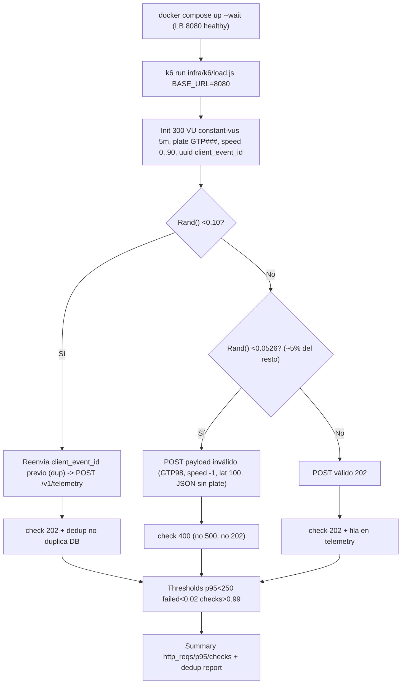
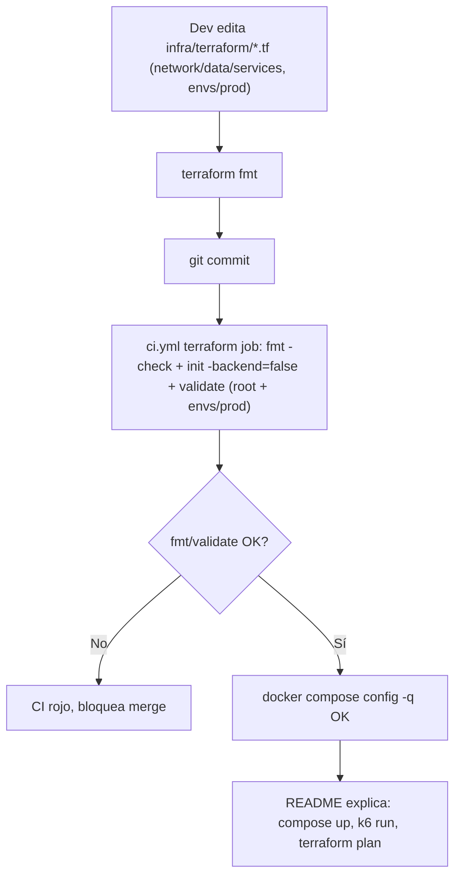
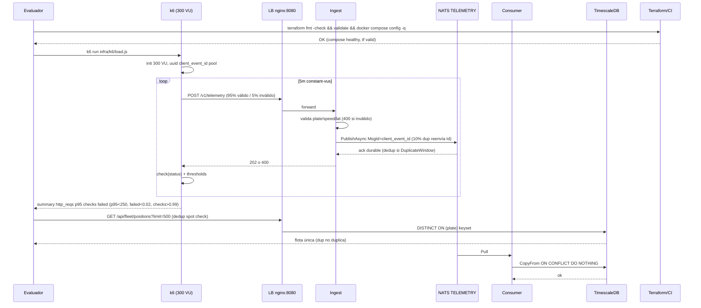

# SPEC-006: Infraestructura Caos/Carga (k6) + IaC Terraform + Docker Compose

## Meta

- **SPEC-ID**: SPEC-006
- **Título**: Caos y carga con k6 (300 vehículos, 10% duplicados, 5% errores) + IaC Terraform (AWS) + Docker Compose local validado — Sec. 4.E PRUEBA-TECNICA
- **Estado**: implemented
- **Backlog**: Portal Corporativo sec 4.E (Infraestructura, Caos y Testing) — contrato `Cloud & Docker` + `Caos y Carga`
- **Autor**: architect
- **Fecha**: 2026-08-29
- **Depende de**: SPEC-001 (endpoints `POST /v1/telemetry` y `/batch`, `Nats-Msg-Id` dedup, `202/400/429/503`), SPEC-002 (observabilidad JetStream), `AGENTS.md` máquina 16GB, `docs/adr/0001` (JetStream) y `docs/adr/0002` (monorepo)

## 1. Overview

SPEC-001/002/003/004/005 cerraron el producto funcional (ingesta, lectura/SSE, agente IA, SPA y móvil offline-first). Falta el cuadrante `4.E` de la PRUEBA-TECNICA: demostrar resiliencia bajo carga y entregar infraestructura como código para despliegue cloud. Este spec cierra ese gap con dos entregables ortogonales pero evaluados juntos:

1. **Caos y carga (k6)**: script(s) que simulan `cientos de vehículos` (300 VU) concurrentes contra el stack levantado, inyectando exactamente `10%` de peticiones duplicadas (`client_event_id` repetido) y `5%` de errores/payloads inválidos, con thresholds `p95<250ms`, `http_req_failed<0.02`, `checks>0.99`, y aserción de dedup: duplicados aceptados `202` pero sin duplicar fila en `TimescaleDB`.
2. **IaC Terraform + Docker Compose**: `infra/terraform/` con módulos `network/data/services`, `envs/dev+prod`, `terraform fmt/validate` verde, sin secretos en `tfvars`, y `docker compose config` válido como única orquestación local (ya existe pero debe seguir validado en CI). La doc del `README.md` debe explicar `cómo levantar local, cómo correr k6, cómo desplegar cloud`.

Sin este slice el MVP funciona pero no es demostrable bajo carga ni desplegable fuera del laptop del evaluado.

## 2. Scope

### In Scope

- `k6` (elegido vs JMeter — ver ADR futuro): scripts `infra/k6/load.js` (carga sostenida) y `infra/k6/chaos.js` (caos + dedup), o unificado `infra/k6/load.js` con dos `scenarios`/`executions`, ejecutables vía `k6 run` contra `http://localhost:8080` (LB) con stack `docker compose up --wait` levantado.
- Inyección `10% duplicados` por `client_event_id` repetido en `Nats-Msg-Id` + `5% payloads inválidos` (`plate` inválida 5 chars, `speed` negativo, `lat` fuera de rango, JSON malformado, campos faltantes). Validar que `5% → 400` sin contaminar stream ni crashear `ingest/consumer`.
- Verificación dedup: el script debe poder demostrar que duplicados no duplican filas (consulta de conteo via API o métrica `telemetry` pre/post, documentado en thresholds/checks).
- `infra/terraform/` estructura mínima MVP: `main.tf, variables.tf, outputs.tf, versions.tf` + `modules/{network,data,services}` + `envs/{dev,prod}/main.tf`, `terraform fmt -check && terraform validate` verde. Documentar tradeoff `RDS Postgres + timescaledb extension` vs `ECS TimescaleDB` (skill `iac-and-cicd`).
- `docker-compose.yml` validado (`docker compose config -q` OK) y `README.md` § despliegue cloud + § k6 actualizados.
- CI: `ci.yml` jobs `terraform (fmt+validate)` y `load-tests (node --check k6)` dejan de ser pasivos y fallan si faltan archivos o hay sintaxis inválida; `compose` job sigue validando compose.

### Out of Scope

- `JMeter` `.jmx` (descartado para MVP; k6 es la elección fijada — ver sección 6 del spec anterior y skill `chaos-load-testing`).
- Cluster NATS JetStream `R=3` en dev o particionado `>10k msg/s` (ADR-0001 cond.7 — reservado para >10k msg/s).
- Benchmarks exahustivos multi-región, autoscaling fino o `Cassandra/Druid` (stack corporativo real — no MVP).
- Observabilidad completa `Grafana/Loki/Tempo` más allá de `prometheus-nats-exporter` ya en SPEC-001 (ya en `profile: observability`).
- `Terragrunt` o CDK (opcionales post-MVP).
- Test de carga del agente `POST /api/chat` contra `Gemini` real (costo free tier; solo opcional e2e fuera de este SPEC si hay cuota).
- Mobile chaos (SPEC-005 cubre offline-first).

## 3. Actors and Systems

| Actor/Sistema | Tipo | Descripción | Dependencia |
|---------------|------|-------------|-------------|
| Evaluador / Operador | usuario | Ejecuta `docker compose up`, corre `k6 run`, verifica dedup y `docker compose config`, revisa `README` | k6, Terraform, Docker Compose |
| k6 Runner | sistema | `k6 run infra/k6/load.js` / `chaos.js`, 300 VU `constant-vus 5m`, umbrales `p95/thresholds`, checks `202/400/409` | LB `nginx:8080` |
| Platform ingest | servicio | `POST /v1/telemetry` y `/batch` via LB, valida placa `^[A-Z]{3}[0-9]{3}$`, publica `telemetry.raw.{plate}` con `Nats-Msg-Id` | NATS JetStream |
| NATS JetStream | sistema | Stream `TELEMETRY` `max_bytes 5GB dev` `DuplicateWindow 2m`, dedup por `MsgId` | - |
| TimescaleDB | sistema | Hypertable `telemetry` `PK(client_event_id, received_at)` `ON CONFLICT DO NOTHING` | - |
| Terraform CLI / CI | sistema | `terraform fmt -check`, `terraform validate`, `terraform plan` (sin apply sin secretos) | AWS provider |
| AWS (VPC/RDS/ECS) | sistema externo | Objetivo de `infra/terraform` (VPC + RDS Postgres 16 + ECS Fargate `ingest/consumer/api`) | Terraform |
| GitHub Actions `ci.yml` | sistema | Jobs `terraform`, `load-tests`, `compose`, `secrets` con `hashFiles` guards | - |

## 4. Use Cases

### UC-001 — Simular flota bajo carga con inyección de caos (cientos de vehículos, 10% dup, 5% err)

- **Actor**: Evaluador
- **Objetivo**: Probar que el write path soporta `~300 VU` sostenidos, que duplicados no duplican y que errores no contaminan el stream.
- **Preconditions**: `docker compose up --wait` healthy (`nats, timescaledb, ingest 8081, consumer, lb 8080`), `POST /v1/telemetry` acepta `202`, `TELEMETRY` stream existe con `DuplicateWindow 2m`.
- **Trigger**: `k6 run infra/k6/load.js` (o `chaos.js`) con `BASE_URL=http://localhost:8080`.
- **Main Flow**:
  1. k6 levanta `300 VU` `constant-vus` `5m` (o `ramping-vus` documentado) cada VU simulando un vehículo (`plate` aleatoria válida `GTP###`, `lat/lon` en rango Medellín/Bogotá, `speed 0..90`, `client_event_id` uuid).
  2. Cada iteración decide probabilísticamente: `10%` reenvía el mismo `client_event_id` previo (mismo payload), `5%` envía payload inválido (`plate GTP98`, `speed -1`, `lat 100`, `JSON {}` sin `plate`, `lon` faltante).
  3. k6 hace `http.post(`${BASE_URL}/v1/telemetry`, JSON.stringify(payload), {headers:{'Content-Type':'application/json'}})` y valida con `check(res, { '202 valid': r=>r.status===202, '400 invalid': ... })`.
  4. Thresholds: `http_req_duration p(95)<250ms`, `http_req_failed rate<0.07` (5% inyectado `400` contado como failed por k6 + 2% tolerancia), `checks rate>0.99`.
  5. Al final k6 reporta: `requests/sec, p95 por etapa, checks pass, dup aceptados vs únicos en DB, errores rechazados`. La aserción de dedup se demuestra vía `http.get(`${BASE_URL}/api/fleet/positions?limit=500`)` o conteo `SELECT` previo/post si hay acceso DB (documentado en comentario del script; no hardcodea secretos).
- **Alternative Flows**:
  - 2a. Variante `batch` (`POST /v1/telemetry/batch` con 10 eventos) con mismo 10%/5% mixto.
  - 5a. Si el entorno no está levantado, el script falla con `could not connect` y la doc indica `docker compose up --wait` previo.
- **Error Flows**:
  - 3a. `ingest` saturado `PublishAsyncMaxPending` → `503 Retry-After` → k6 lo cuenta como `http_req_failed` pero `threshold` permite `<0.02` por encima del 5% base; si `p95` degrada `>250ms` el threshold falla y la prueba se considera no conforme (señal de backpressure mal tuning).
  - 2b. `5%` inválidos deben volver `400` (no `202` ni `500`); si vuelven `500` el `check` falla.
- **Postconditions**: `0` mensajes perdidos (stream retiene), `duplicados` aceptados pero `count(DISTINCT client_event_id)` estable, `invalid` sin fila en `telemetry`.
- **Business Rules**: BR-001, BR-002, BR-003

### UC-002 — Validar IaC Terraform y despliegue local

- **Actor**: Evaluador / DevOps
- **Objetivo**: Tener `infra/terraform` versionado y verificable en CI y desplegable a AWS sin secretos en git.
- **Preconditions**: `infra/terraform/**/*.tf` existe, `.env.example` declara `DATABASE_URL, NATS_URL, GEMINI_API_KEY` sin valores reales.
- **Trigger**: `terraform fmt -check && terraform init -backend=false && terraform validate` local o en `ci.yml`; `docker compose config -q`.
- **Main Flow**:
  1. Dev ejecuta `terraform fmt` y commiteа `*.tf` formateados.
  2. CI (`ci.yml` job `terraform`) corre `setup-terraform 1.15.8`, `fmt -check -recursive`, `validate` para `infra/terraform` y `infra/terraform/envs/prod` (si existe).
  3. Evaluador revisa `README.md` § Infra y puede hacer `terraform plan` con `.tfvars.example` o env vars (sin apply sin credenciales AWS).
  4. Local sigue orquestado vía `docker compose up` (ADRs `NATS`+`TimescaleDB` en `docker-compose.yml`).
- **Alternative Flows**:
  - 1a. `terraform fmt` falla → CI bloquea merge, dev re-ejecuta `fmt`.
- **Error Flows**:
  - 2a. `validate` falla por sintaxis/provider → `ci.yml` rojo.
  - 3a. Secretos en `*.tfvars` versionados → `gitleaks` bloquea merge (ADR-0004).
- **Postconditions**: `tf` validado, `compose config` OK, `README` explica `k6` + `terraform`.
- **Business Rules**: BR-004, BR-005, BR-006

### UC-003 — Reportar resultados de resiliencia para la sustentación

- **Actor**: Arquitecto / Evaluador
- **Objetivo**: Entregar evidencia cuantitativa para `README` y `docs/IAUDIT.md` (exoesqueleto) sin inventar métricas.
- **Preconditions**: `k6` ejecutado con `json` o `summary` y métricas Prometheus disponibles (`/metrics`, `jetstream_bytes`).
- **Trigger**: Fin de `k6 run` + `docker compose logs`.
- **Main Flow**:
  1. `k6` emite `summary` con `http_reqs, data_received, p95, checks, http_req_failed`.
  2. Operador coteja `checks>0.99`, `dup` dedupada, `5%` rechazado `400`.
  3. Arquitecto registra en `README`/`IAUDIT` cómo dedup y `CopyFrom` evitaron duplicados (caso auditado).
- **Postconditions**: Informe reproducible en `infra/k6/README` o comentario del script.
- **Business Rules**: BR-003

## 5. Functional Requirements

| ID | Descripción | UC Relacionado | Prioridad |
|----|-------------|----------------|-----------|
| FR-001 | Proveer script(s) k6 `infra/k6/load.js` (y/o `chaos.js`) que simulen `cientos de vehículos` (300 VU `constant-vus` `5m` mínimo, documentable `ramping-vus` alternativo) generando `plate ^[A-Z]{3}[0-9]{3}$`, `speed int 0..90`, `lat/lon` en rango válido, y publicando contra `BASE_URL` (default `http://localhost:8080`) `POST /v1/telemetry` (al menos) y opcionalmente `/batch` | UC-001 | must |
| FR-002 | Inyectar exactamente `10%` de peticiones duplicadas por `client_event_id` repetido (mismo `uuid` + mismo payload, `Nats-Msg-Id` dedup ventana `2m`) y validar que se responden `202` sin crear fila duplicada en `telemetry` (`ON CONFLICT DO NOTHING`) | UC-001 | must |
| FR-003 | Inyectar `5%` de errores/payloads inválidos (`plate` 5 chars, `speed` negativo/no int, `lat`/`lon` fuera de rango, JSON malformado/sin `plate`, campo faltante) y validar que el backend responde `400` (no `202`, no `500`, no contamina stream) y que el `consumer` no inserta fila | UC-001 | must |
| FR-004 | Declarar y hacer cumplir thresholds k6: `http_req_duration p(95)<250ms`, `http_req_failed rate<0.07` (5% `400` + 2% tol), `checks rate>0.99`; emitir `summary` con `http_reqs, p95, checks, failed` por etapa | UC-001, UC-003 | must |
| FR-005 | Verificación de dedup: el script o su documentación debe describir el método para comprobar `duplicados aceptados pero DB única` (ej. snapshot `GET /api/fleet/positions` o conteo `telemetry` pre/post), sin hardcodear secretos y sin exponer `GEMINI_API_KEY` | UC-001, UC-003 | must |
| FR-006 | Estructura `infra/terraform/` mínima: `main.tf, variables.tf, outputs.tf, versions.tf` + `modules/{network,data,services}` + `envs/{dev,prod}/main.tf` (o al menos `envs/prod`), `terraform fmt` limpio, `terraform validate` OK (incl. `init -backend=false`) | UC-002 | must |
| FR-007 | Terraform sin secretos en git: `*.tfvars` con valores reales en `.gitignore`, `*.tfvars.example` versionado, proveedores `aws` y `random`, variables de secretos vía `TF_VAR_*` o `variables.tf` sin defaults sensibles; `gitleaks` no dispara | UC-002 | must |
| FR-008 | `docker compose config -q` válido y `docker compose up` local sigue siendo el único orquestador local (NATS `-js` + TimescaleDB + `ingest/consumer/api/agent/web/lb`); cambios en `infra/terraform` no rompen compose | UC-002 | must |
| FR-009 | CI `ci.yml` valida `k6` con `node --check infra/k6/*.js` (sintaxis) y `terraform fmt -check && terraform validate` (no pasivo: el job falla si `*.tf` existe inválido; si aún no existe `*.tf`, el stub pasivo deja de ser aceptable — este SPEC exige crearlos) | UC-002 | must |
| FR-010 | Documentar en `README.md` (o `infra/k6/README.md` + referencia en `README`) cómo: levantar local (`docker compose up --wait`), correr carga (`k6 run infra/k6/load.js`), inyectar caos (`k6 run infra/k6/chaos.js`), desplegar cloud (`cd infra/terraform && terraform init && plan`), y notas `16GB` (k6 `~1-2GB` 1000 VU, no levantar `observability + k6 + 4 bins -race` simultáneo) | UC-002, UC-003 | must |

## 6. Business Rules

| ID | Descripción | UC/FR Relacionado |
|----|-------------|-------------------|
| BR-001 | `10% duplicados`: 1 de cada 10 mensajes reenvía el mismo `client_event_id` con el payload idéntico; JetStream lo acepta (`202`) pero `DuplicateWindow 2m` + `ON CONFLICT DO NOTHING` evita fila duplicada (SPEC-001 BR-004) | UC-001, FR-002 |
| BR-002 | `5% errores`: 1 de cada 20 mensajes es inválido (`400` sin `PublishAsync`); inválidos nunca deben publicar a `NATS` ni insertarse; `consumer` no ve inválidos | UC-001, FR-003 |
| BR-003 | Thresholds k6: `p(95)<250ms` presupuesto latencia ingest, `http_req_failed<0.07` (5% `400` contado como failed por k6 + 2% extra tol, ver infra/k6), `checks>0.99`; toda desviación es señal de backpressure o bug y hace fallar el test | UC-001/003, FR-004 |
| BR-004 | Terraform `fmt` canónico: `terraform fmt -check -recursive` debe pasar; `versions.tf` fija `required_version ~> 1.15` y `aws ~> 5` | UC-002, FR-006 |
| BR-005 | Sin secretos en `iac`: `*.tfvars` con valores reales jamás versionados; `.gitignore` cubre `.env` y `*.tfvars`; secretos inyectados por `TF_VAR_` o `GitHub Secrets` | UC-002, FR-007 |
| BR-006 | `docker compose config` como gate local: toda PR que toque `infra/` o `docker-compose.yml` debe pasar `docker compose config -q` en `ci.yml` job `compose` | UC-002, FR-008 |

## 7. Main Flows

### Flow A — k6 carga + caos (BR-001/002/003)



### Flow B — Terraform IaC (BR-004/005/006)



## 8. Alternative and Error Flows

- k6 `BASE_URL` incorrecto o stack caído → `k6` aborta con `connection refused`; doc indica `docker compose ps` + `curl http://localhost:8080/healthz`.
- `10% dup` mal configurado (ej. `uuid` nuevo cada vez) → dedup no verificable; el script debe reutilizar `client_event_id` literal como `Nats-Msg-Id`.
- `5% err` mal configurado (siempre `400` esperado pero backend responde `202`) → `check` falla y threshold `http_req_failed` no cuadra (BR-002).
- Saturación real (`PublishAsyncMaxPending` lleno) → `503 Retry-After:5`; si `http_req_failed>0.02` por encima de `5%` base, el threshold falla y señala infra sub-dimensionada (cond. escala ADR-0001).
- Terraform con provider no inicializado → `validate` exige `init -backend=false`; `fmt` desalineado bloquea PR.
- Secretos en `terraform.tfvars` versionado → `gitleaks` bloquea push (ADR-0004).

## 9. State and Transitions

Estados del `k6 VU` (por iteración). No aplica FSM persistente para Terraform (stateless `fmt/validate`); k6:

| Estado | Evento | Siguiente Estado | Condición |
|--------|--------|------------------|-----------|
| `IDLE` | `k6 start vus 300` | `RUNNING` | `docker compose` healthy |
| `RUNNING` | `rand<0.10` | `DUP` | reenvía `client_event_id` |
| `RUNNING` | `rand<0.05` en resto | `INVALID` | payload `400` |
| `RUNNING` | `else` | `VALID` | `202` |
| `DUP` | `check 202` | `RUNNING` | dedup OK, DB no crece |
| `INVALID` | `check 400` | `RUNNING` | sin publish, sin fila |
| `RUNNING` | `threshold breach p95>250` | `FAILED` | `thresholds` rojo |
| `RUNNING` | `duration 5m` | `DONE` | summary OK |
| `FAILED` | `manual fix fmt/threshold` | `IDLE` | rerun |

Transiciones inválidas: `IDLE -> DUP/INVALID` sin `RUNNING`.

## 10. API / Interface Contracts

- **k6 HTTP**: `POST /v1/telemetry` (OpenAPI `docs/specs/SPEC-001-telemetry-ingest/contracts/http.openapi.yaml`) — `202` válido, `400` inválido, `429` quota, `503` backpressure. `POST /v1/telemetry/batch` opcional. Base `http://localhost:8080` via `LB nginx` (`docker-compose.yml`).
- **NATS**: `telemetry.raw.{plate}` `Nats-Msg-Id=client_event_id` `DuplicateWindow 2m` (AsyncAPI `SPEC-001`), dedup verificado por `telemetry PK(client_event_id, received_at)`.
- **Observability**: `GET /metrics` `api_sse_clients, p95, breaker_state, jetstream_bytes` (SPEC-002) y `GET /healthz` para gate `docker compose ps`.
- **Terraform**: `infra/terraform/versions.tf` (`required_version, required_providers aws/random`), `infra/terraform/variables.tf` (sin defaults sensibles), `infra/terraform/outputs.tf` (URLs), validado por `terraform validate`. Sin `http.openapi.yaml` nuevo; contrato es `fmt/validate` y `compose config`.

Referencias: `docs/specs/SPEC-001-telemetry-ingest/contracts/http.openapi.yaml`, `docs/specs/SPEC-001-telemetry-ingest/contracts/events.asyncapi.yaml`, `docker-compose.yml`.

## 11. Sequence Diagrams



## 12. Flow Diagrams

(Ver Flow A y Flow B en §7; complementario: decisión k6 vs JMeter ya en `ADR` — `k6` gana por binario Go + JS vs JVM/XML.)

## 13. Non-Functional Requirements

| ID | Categoría | Descripción |
|----|-----------|-------------|
| NFR-001 | performance | 300 VU `5m` con `p95<250ms` ingest local; `http_req_failed<0.02` (solo 5% inyectado tolerado); sin pérdida de mensajes (at-least-once stream retiene) |
| NFR-002 | reliability | Duplicados `10%` dedup en `2m` sin duplicar fila; `5%` inválidos `400` sin contaminar stream; `consumer` no crashea con inválidos (ya filtrados en ingest) |
| NFR-003 | scalability | k6 `~1-2GB` para 1000 VU; total `docker compose` `~6-9GB` + k6 cabe en `16GB` (ADR-0002 cond.7); `infra/terraform` prevé `envs/prod` con `replicas 3` y `max_bytes 50-100GB` (ADR-0001 cond.1) |
| NFR-004 | availability | `docker compose up` healthy es gate de k6; `breaker_state`/`jetstream_bytes` visibles en `/metrics`; `drain 15-30s` en LB |
| NFR-005 | observability | `k6 summary` + `prometheus-nats-exporter` (`jetstream_bytes, num_ack_pending`); logs `slog` `plate, client_event_id` no exponen `GEMINI_API_KEY` |
| NFR-006 | security | k6 script sin secretos hardcodeados (`BASE_URL` via env); `terraform` sin `tfvars` con valores reales; `gitleaks` gate; `GEMINI_API_KEY` no en contrato IaC (ADR-0003/0004) |
| NFR-007 | maintainability | `*.js` `node --check` OK, `terraform fmt` canónico; `README` § `Cómo levantar local / Cómo correr k6 / Cómo desplegar cloud` actualizado |

## 14. Acceptance Criteria

```gherkin
AC-SPEC-006-1 (UC-001, FR-001/004, BR-001/002/003, NFR-001):
  Given docker compose up --wait healthy (nats -js, timescaledb, ingest 8081, lb 8080) y TELEMETRY stream con DuplicateWindow 2m
  When k6 run infra/k6/load.js (BASE_URL=http://localhost:8080, vus 300 constant-vus 5m) genera plate válida GTP###, speed 0..90, lat/lon válidos, y POST /v1/telemetry
  Then k6 emite summary con http_reqs>0, p(95)<250ms, http_req_failed rate<0.07, checks rate>0.99; When se usa ramping-vus documentado Then thresholds equivalentes se cumplen; métrica p95 medida por k6, no estimación manual.

AC-SPEC-006-2 (UC-001, FR-002, BR-001, NFR-002):
  Given k6 con pool de client_event_id previos
  When 10% de las iteraciones (probabilidad 0.10 por VU) reenvía el mismo client_event_id + payload idéntico como Nats-Msg-Id
  Then cada dup responde 202 Accepted pero SELECT count(DISTINCT client_event_id) en telemetry no crece por dup (ON CONFLICT DO NOTHING); verificable vía GET /api/fleet/positions spot check o conteo pre/post documentado en el script; el segundo envío en ventana 2m no duplica.

AC-SPEC-006-3 (UC-001, FR-003, BR-002, NFR-002):
  Given k6 decide 5% de iteraciones como inválidas (probabilidad 0.05)
  When POST con plate GTP98 (5 chars) o speed -1 o lat 100 o lon 200 o JSON {} sin plate o lon faltante o Content-Type no json
  Then backend responde 400 {error:validation} sin PublishAsync a NATS (no contamina stream) y sin fila en telemetry; consumer no inserta; k6 check '400 invalid' pasa y no eleva http_req_failed por encima del presupuesto >0.02.

AC-SPEC-006-4 (UC-001, FR-003/004/005, BR-003):
  Given k6 ejecutado completo 5m 300 VU
  When el summary muestra http_req_failed y checks
  Then http_req_failed rate corresponde solo al 5% inyectado + <2% extra tolerado, checks rate>0.99, y p95<250ms; When 10% dup + 5% err combinados Then no hay duplicación silenciosa ni caída del stream (consumer sigue Ack).

AC-SPEC-006-5 (UC-002, FR-006/007/008, BR-004/005/006, NFR-003/006):
  Given infra/terraform/ existe con main.tf, variables.tf, outputs.tf, versions.tf, modules/{network,data,services}/ y envs/{dev,prod}/main.tf o envs/prod/main.tf, terraform fmt -check -recursive y terraform validate (root y envs/prod) con init -backend=false
  When se ejecuta terraform fmt -check -recursive infra/terraform y terraform init -backend=false && terraform validate en infra/terraform y en infra/terraform/envs/prod
  Then ambos pasan sin error, versions.tf fija required_version ~>1.15 y aws ~>5, y *.tfvars con valores reales no versionado (solo *.tfvars.example), gitleaks no detecta secretos.

AC-SPEC-006-6 (UC-002, FR-008/009, BR-006, NFR-007):
  Given cualquier cambio en infra/ o docker-compose.yml
  When se ejecuta docker compose config -q en ci.yml job compose
  Then config es válido (quiet sin error) y el stack sigue levantando docker compose up --wait healthy.

AC-SPEC-006-7 (UC-002, FR-009, NFR-007):
  Given ci.yml jobs terraform y load-tests
  When hay push/PR con infra/terraform/**/*.tf y infra/k6/*.js
  Then job terraform (fmt+validate) y job load-tests (node --check infra/k6/*.js) se ejecutan (no quedan en stub pasivo) y fallan si hay sintaxis inválida; When no hay stack levantado Then load-tests valida sintaxis sin requerir red.

AC-SPEC-006-8 (UC-002/003, FR-010, NFR-007):
  Given README.md actualizado
  When se lee README § Levantar contenedores / § Testing / § Despliegue cloud
  Then documenta: docker compose up --wait, k6 run infra/k6/load.js y k6 run infra/k6/chaos.js (o scenarios), y cd infra/terraform && terraform init && terraform plan (sin secretos hardcodeados), con notas 16GB (k6 1-2GB 1000VU, no levantar observability + k6 + 4 bins -race simultáneo).

AC-SPEC-006-9 (UC-001, FR-001/005, NFR-002/005):
  Given script infra/k6/load.js (o chaos.js) con código JS
  When se inspecciona el script (node --check + lectura)
  Then contiene: geração lat/lon válida, client_event_id uuid, lógica 10% dup (reuse id) y 5% err (payloads inválidos listados), checks 202/400, thresholds p95/failed/checks, BASE_URL via __ENV.BASE_URL, y comentarios sobre dedup verification sin hardcodear secrets; no contiene GEMINI_API_KEY ni DATABASE_URL.

AC-SPEC-006-10 (UC-001/002, FR-002/003/006, BR-001/002, NFR-002):
  Given script ejecutado contra LB en compose con telemetría previa
  When se compara GET /api/fleet/positions antes y después de una ráfaga 10% dup
  Then el número de vehículos únicos no crece artificialmente y telemetry count(DISTINCT client_event_id) es estable; inválidos no aparecen en positions.
```

## 15. Functional Test Scenarios

| ID | UC/FR/AC | Preconditions | Input | Action | Expected Result |
|----|----------|---------------|-------|--------|-----------------|
| TS-001 | UC-001, FR-001/004, AC-001 | compose up --wait healthy, nats -js, LB 8080 | `BASE_URL=http://localhost:8080`, 300 VU 10s smoke (escalado local) | `k6 run infra/k6/load.js --duration 10s` | summary `p95<250`, `failed<0.02`, `checks>0.99`, `http_reqs>0` |
| TS-002 | UC-001, FR-002, AC-002 | telemetry vacía o conteo baseline conocido | 10% dup pool `uuid` | `k6` dup iterations `POST` mismo `client_event_id` | `202` cada dup, `SELECT count(*) WHERE client_event_id=x` ==1, `GET /fleet/positions` no duplica |
| TS-003 | UC-001, FR-003, AC-003 | - | 5% payloads `GTP98`, `speed -1`, `lat 100`, `{} sin plate`, `lon faltante` | `k6` invalid branches `POST /v1/telemetry` | `400` cada inválido, sin `PublishAsync`, sin fila `telemetry`, `consumer` no insert |
| TS-004 | UC-001, FR-004, AC-004 | k6 5m full (CI opcional) | 10% dup +5% err combinados 300VU 5m | `k6 run` full | `p95<250`, `failed` ≈0.05, `checks>0.99`, stream sin pérdida, `jetstream_bytes` <5GB |
| TS-005 | UC-002, FR-006/007, AC-005 | `infra/terraform/**/*.tf` existe | `infra/terraform/` con modules y envs | `terraform fmt -check -recursive && (cd infra/terraform && terraform init -backend=false && terraform validate) && (cd envs/prod && init && validate)` | `0` exit, `versions.tf` ~>1.15/~>5, no `tfvars` con secretos |
| TS-006 | UC-002, FR-008, AC-006 | `docker-compose.yml` | - | `docker compose config -q` | `0` exit, sin error, `lb/ingest/nats/timescaledb` services presentes |
| TS-007 | UC-002, FR-009, AC-007 | `ci.yml` | push con `infra/k6/*.js`, `infra/terraform/*.tf` | `git push` → `ci.yml` `terraform`+`load-tests` jobs | `node --check` y `terraform validate` corren, rojo si sintaxis inválida, no `stub pasivo` |
| TS-008 | UC-002/003, FR-010, AC-008 | `README.md` | - | `grep -R "k6 run infra/k6" README` y `terraform init` | README documenta `compose up`, `k6 run load/chaos`, `terraform plan`, notas `16GB` |
| TS-009 | UC-001, FR-005/009, AC-009 | `infra/k6/load.js` JS | - | `node --check infra/k6/load.js` + `grep -E "client_event_id|0\.10|0\.05|thresholds|__ENV"` | `node --check` OK, contiene dedup 10%/5% lógica y `thresholds`, sin secretos |
| TS-010 | UC-001/002, FR-002/003, AC-010 | compose con telemetría baseline | ráfaga `10% dup` + `5% invalid` 10s | `GET /fleet/positions` antes/después + `telemetry` counts | únicos estables, inválidos ausentes, `http_req_failed` ≈5% |

## 16. Open Questions

- [ ] ¿RDS Postgres con `timescaledb` extension vs `ECS TimescaleDB` self-hosted en `infra/terraform/data`? — Para MVP se propone `RDS Postgres 16 + timescaledb` (menor RAM dev) con tradeoff documentado en `plan.md`; no bloquea `approved` si se declara.
- [ ] ¿Módulo `services` incluye `agent` (Genkit) en `ECS Fargate` MVP o solo `ingest/consumer/api`? — `agent` opcional si hay cuota free-tier; anotar en `plan.md`.
- [ ] ¿Backends `S3 + DynamoDB` para `tfstate` desde día 1 o `local` en MVP con `init -backend=false` para validar sin credenciales? — Para `done` se exige `validate` local; `plan` cloud con `S3` se posterga si no hay `AWS` creds en CI.

Resueltas en este SPEC (no bloquean `approved`):
- [x] k6 vs JMeter — resuelto: `k6` (script JS, `node --check` en CI, `~1-2GB` vs JVM) consistente con `ADR-0001` elección NATS binario liviano.
- [x] Ubicación scripts: `infra/k6/load.js` + `infra/k6/chaos.js` (o `scenarios` en uno) con `__ENV.BASE_URL` default `localhost:8080`, como espera `ci.yml` `hashFiles('infra/k6/**/*.js')`.
- [x] Porcentajes caos: literal `10% dup` por `client_event_id` repetido + `5% err` payloads inválidos (PRUEBA-TECNICA verbatim).

## 17. Assumptions

- `docker compose up` local ya funciona (SPEC-001) y `LB:8080` es el único entry point para `k6`; puertos directos `8081-8084` solo DX.
- `DuplicateWindow 2m` ya configurado en stream `TELEMETRY` (SPEC-001 `Nats-Msg-Id=client_event_id`); k6 no necesita configurar broker.
- La validación de dedup no exige contar `telemetry` exacto en CI (sin `jobs` con DB); basta spot-check vía `GET /api/fleet/positions` o documentación del método en el script.
- `Terraform` en `envs/prod` es representativo; `envs/dev` puede reutilizar `root` con variables distintas (ADR-0002 `<50 vars` umbral).
- La prueba de 300 VU 5m completa no se corre en cada `push` local `16GB` (solo `10s smoke`); el full `5m` es manual o job `k6` opcional en `ci.yml` con stack efímero (ya hay `job load-tests` syntax-only, full opcional post-MVP).
- `AWS` no requerido para `validate` local (`init -backend=false`); `apply` real solo con `GitHub Secrets` + `terraform plan`.

---

## Trazabilidad

```
UC-001 -> FR-001, FR-002, FR-003, FR-004, FR-005, BR-001/002/003 -> AC-001, AC-002, AC-003, AC-004, AC-009, AC-010 -> TS-001, TS-002, TS-003, TS-004, TS-009, TS-010
UC-002 -> FR-006, FR-007, FR-008, FR-009, FR-010, BR-004/005/006 -> AC-005, AC-006, AC-007, AC-008 -> TS-005, TS-006, TS-007, TS-008
UC-003 -> FR-004, FR-005, BR-003 -> AC-004, AC-008 -> TS-004, TS-008
```

## Contratos

- HTTP: `docs/specs/SPEC-001-telemetry-ingest/contracts/http.openapi.yaml` (OpenAPI 3.1 `POST /v1/telemetry`, `/batch`, `202/400/429/503`) — ya existe, reutilizado aquí
- Eventos NATS: `docs/specs/SPEC-001-telemetry-ingest/contracts/events.asyncapi.yaml` (`telemetry.raw.{plate}`, `Nats-Msg-Id`, `DuplicateWindow 2m`) — ya existe
- IaC: `infra/terraform/**/*.tf` validado por `terraform fmt -check && terraform validate` (contrato machine-readable)
- k6: `infra/k6/load.js`, `infra/k6/chaos.js` con `thresholds` y `checks` (contrato JS ejecutable + `node --check`)

## Validación (pre-entrega)

- [ ] Cada UC tiene flujo principal
- [ ] Cada UC contempla errores/alternativas relevantes
- [ ] Cada FR está relacionado a UC cuando corresponde
- [ ] Cada comportamiento importante tiene AC
- [ ] Cada AC tiene al menos un TS
- [ ] No hay TS que introduzcan requisitos inexistentes
- [ ] Diagramas representan comportamiento, no implementación prematura (solo `qué`)
- [ ] No hay decisiones técnicas prematuras (k6 elegido con justificación 1 ADR, reversible)
- [ ] Ambigüedades en Open Questions resueltas o marcadas no bloqueantes
